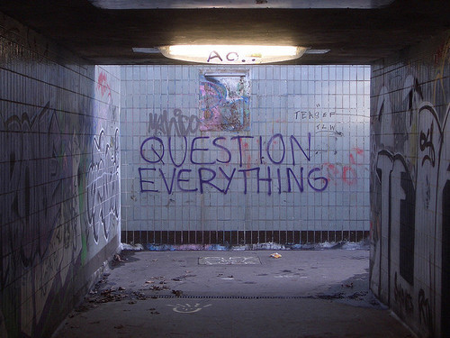

A while a go I was trying to form a research question. That odd process where scientific results are supposed to suddenly appear when you ask the right question. More often than not you find an interesting answer and try to figure out the corresponding question like a lame, dinner time game show. I realised, however, that the way I asked the question pointed me in a certain direction. Asking a question starting with ‘How …’ unfolded a mechanism, a way things worked. 'How did the Second World War start?’ will give you a description of how one event unfolded into another. Compare that with 'Why did the Second World War start?’ or 'What was the start of the Second World War?’ and you’ll begin to see the difference. You’ll get a motivation, or a specification depending on what you ask. With the risk of stating the obvious, but the way you ask a question highly influences the answer you’ll get. So here are seven ways to ask better questions.

**1\. Ask Them** 

If you want to use of the power of questions you’ll have to ask them. As 37Signals founder Jason Fried [paraphrased](http://37signals.com/svn/posts/3225-what-are-questions) Clayton Christensen: "Questions are places in your mind where answers fit. If you haven’t asked the question, the answer has nowhere to go.” To see the answers around you, you’ll have to ask questions all the time. Not necessarily to other people, but also to yourself. Meaningful questions that is. It’s not enough to keep the conversation polite and pleasant, you need a little friction to get somewhere meaningful. That can be confrontational, for yourself as well as your subject.  
  
**2\. Go For The ‘Why?’**

As Simon Sinek [says](http://www.ted.com/talks/simon_sinek_how_great_leaders_inspire_action.html): “It’s not what we do, it’s why we do it”. If you want to get to the core of what’s going on, or find the essence of an idea, don’t ask _what_ someone does, ask _why_ they do it. ‘What’ is the action you take, the preferred tactic, ‘How’ is the justification, the mechanism for going the right way, the strategy for action, but ‘Why’, the question of purpose, is the god we go to war for, the nation we fight for, the beliefs that keep us going where others stop. Why is about ideals, core beliefs, about foundations.  
  
**3\. Lead The Way** 

Whether you’re conducting an interview or have just been introduced to someone at a party, you can use your questions to guide the conversation. There is no clear path however, for all you can do is [go wide or go deep](http://blogs.hbr.org/2012/11/to-have-the-most-impact-ask-qu/). Someone questions are divergent and some are convergent. Questions like ‘What if?’ or ‘Why?’ will urge someone to talk about a broader context. Questions like ‘Where?’, ‘Who?’, ‘When?’, will narrow the scope and ask someone to go into more detail on the subject.  
  
**4\. Too Much Can Kill You**

Although people might still be talking about you, in general you don’t want to end up like the Greek philosopher Socrates, who, famously, got killed for asking too many questions. You can ask _too many_ questions. You can scare people off by bombarding them with your queries, however relevant. Don’t. It’s rude. You don’t want people thinking of you as the guy who just can’t stop asking questions. Combined with the first point however, this means you need to find a balance. So don’t ask people _what you want to hear_, ask them _what they want to tell_. As Dale Carnegie [says](http://en.wikipedia.org/wiki/How_to_Win_Friends_and_Influence_People) in his classic _How to Win Friends and Influence People_ “the only way on earth to influence other people is to talk about what _they_ want and show them how to get it.” People like talking about themselves, so let them.   
  
**5\. Abusing questions for orders** 

“Would you mind grabbing a coffee for me?” is not really a question. All too often we ask rhetorical questions that imply an answer that is already known. “Isn’t the weather beautiful today?” is not an invitation to get into a full blown argument about meteorological pleasantries. It is a search for a common ground, though. You can use these rhetorical questions to relate to someone, but you want to watch out for overdoing it, because you can just as much distance yourself from the other person by overdoing it.  
  
**6\. Listen. No, really.** 

In the negotiation classic [_Getting to Yes_](http://en.wikipedia.org/wiki/Getting_to_YES) Fisher and Ury see communicating properly as one of the biggest hurdles in getting to an agreement. If you want to get the best deal, you have to listen to the other party and fully understand their interests. “Make it your task while listening not to phrase a response, but to understand them as they see themselves.” I won’t deny that I haven’t done my fair share of trying to ask ‘interesting’ questions to impress others, but as long as you’re forming those questions in your head, you’re not listening properly.  
  
**7\. Make it easy** 

Sometimes conversations just don’t go very well. If that’s the case you can try to make life a bit easier for the other party by using analogies. Analogies work well when you try to explain something, that includes explaining who you are. So you can help the person your talking to by asking a question like “Who do you admire?” or “Who’s work do you relate to?”. And then, there are always some easy questions you can use to involve anyone, and let others vent their opinion. Questions like: “Do you also think x is better than y?” Rich Millington from Feverbee has [20 of those question](http://www.feverbee.com/2010/11/increaseactivity.html)s you can ask.

(photo by: [Duncan Hull](http://www.flickr.com/photos/dullhunk/))
