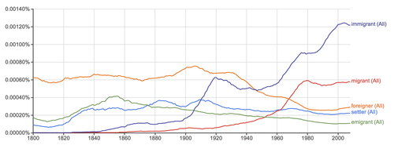

[](https://books.google.com/ngrams/graph?content=settler%2Cmigrant%2Cemigrant%2Cimmigrant%2Cforeigner&case_insensitive=on&year_start=1800&year_end=2008&corpus=15&smoothing=7&share=&direct_url=t4%3B%2Csettler%3B%2Cc0%3B%2Cs0%3B%3Bsettler%3B%2Cc0%3B%3BSettler%3B%2Cc0%3B.t4%3B%2Cmigrant%3B%2Cc0%3B%2Cs0%3B%3Bmigrant%3B%2Cc0%3B%3BMigrant%3B%2Cc0%3B%3BMIGRANT%3B%2Cc0%3B.t4%3B%2Cemigrant%3B%2Cc0%3B%2Cs0%3B%3Bemigrant%3B%2Cc0%3B%3BEmigrant%3B%2Cc0%3B%3BEMIGRANT%3B%2Cc0%3B.t4%3B%2Cimmigrant%3B%2Cc0%3B%2Cs0%3B%3Bimmigrant%3B%2Cc0%3B%3BImmigrant%3B%2Cc0%3B.t4%3B%2Cforeigner%3B%2Cc0%3B%2Cs0%3B%3Bforeigner%3B%2Cc0%3B%3BForeigner%3B%2Cc0)

In his book _Exodus_ Paul Collier notes the following: “between 1810 and 1830 a subtle change occurred in the language used to describe migrants. Around 1810 the term most frequently used in newspapers was “emigrants.” But by 1830, “emigrants” had given way to a new term, “settlers.” I think that this change was not innocuous; the two terms imply radically different narratives”

[Google Ngram confirms this](https://books.google.com/ngrams/graph?content=settler%2Cmigrant%2Cemigrant%2Cimmigrant%2Cforeigner&case_insensitive=on&year_start=1800&year_end=2008&corpus=15&smoothing=7&share=&direct_url=t4%3B%2Csettler%3B%2Cc0%3B%2Cs0%3B%3Bsettler%3B%2Cc0%3B%3BSettler%3B%2Cc0%3B.t4%3B%2Cmigrant%3B%2Cc0%3B%2Cs0%3B%3Bmigrant%3B%2Cc0%3B%3BMigrant%3B%2Cc0%3B%3BMIGRANT%3B%2Cc0%3B.t4%3B%2Cemigrant%3B%2Cc0%3B%2Cs0%3B%3Bemigrant%3B%2Cc0%3B%3BEmigrant%3B%2Cc0%3B%3BEMIGRANT%3B%2Cc0%3B.t4%3B%2Cimmigrant%3B%2Cc0%3B%2Cs0%3B%3Bimmigrant%3B%2Cc0%3B%3BImmigrant%3B%2Cc0%3B.t4%3B%2Cforeigner%3B%2Cc0%3B%2Cs0%3B%3Bforeigner%3B%2Cc0%3B%3BForeigner%3B%2Cc0), although either Collier or Ngram is a couple of years off, which may be attributed to the fact that Ngram uses books instead of newspapers which may delay the change in use of the terms a bit. But when we look in more detail we also see some other interesting facts. We see a [big influx of European immigrants](http://en.wikipedia.org/wiki/History_of_the_United_States_(1865%E2%80%931918)#cite_ref-Census.2C_1976_2-0) from the 1860’s to the 1920’s, this, however, is only picked up in literature after the 1900’s when we start to see books with titles like “_Mentality of the Arriving Immigrant”,_ “_On the Trail of the Immigrant”, and “The Immigrant and the Community”_. I believe this is the start of the contemporary immigration _narrative_ as Collier calls is.
