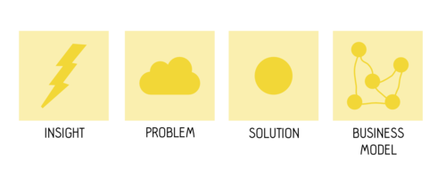
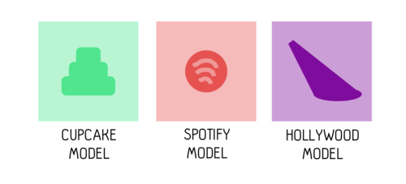
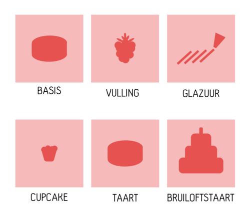

Toen [Bernard Sadow](http://abcnews.go.com/Travel/suitcase-wheels-turns-40-radical-idea-now-travel/story?id=11779469) 40 jaar geleden terug kwam uit Aruba met zijn vrouw en kinderen had hij niet kunnen bedenken dat hij aan de wieg zou staan van de treinladingen _trailer trash_ stedentrippers die dagelijks uit Amsterdam Centraal en alle vergelijkbare aankomst- en vertrekhallen over de hele wereld stromen, hun roze trolley achter zich aan rollend als verlengstuk van hun identiteit. Sadow maakte dit alles mogelijk doordat hij, slepend met de bagage door de aankomsthal van het vliegveld, zich realiseerde dat we 6000 jaar na dato nog steeds niet tot de conclusie waren gekomen dat je wielen ook aan je koffer kunt vastmaken. Na wat prototypes verkocht hij zijn eerste model aan Macy’s. De rest, zoals men zegt, _is history_.

Was Sadow’s uitvinding een innovatie? Misschien niet op de manier zoals het wiel zelf een innovatie was. Tegelijkertijd heeft Sadow ons een oplossing gegeven voor een probleem waarvan we ons niet realiseerden dat het een probleem was. De kern van een innovatie is een oplossing voor een probleem. Dat betekent dat je om te innoveren op zoek moet naar zowel een oplossing als een probleem en dat is precies waar _storytelling_ je bij kan helpen. Ik wil je drie modellen laten zien om storytelling te gebruiken voor innovatie. Drie modellen om Marslandingen en wereldvrede te bereiken, maar voordat we zover zijn wil ik eerst nog even stilstaan bij wat innovatie is.

Nathan Furr en Jeff Dyer [beschrijven](https://hbr.org/2014/12/choose-the-right-innovation-method-at-the-right-time) in _The Innovator’s Method_ welke stappen innovatieve bedrijven nemen om het _coolste_ jongetje van de klas te blijven. Probleem zoekt oplossing is de essentie van innoveren, maar daarmee ben je er nog niet. Furr en Dyer onderscheiden vier stappen: inzicht, probleem, oplossing, en business model. Op elk punt zijn er verschillende methoden om tot vernieuwing te komen, van _design thinking_ tot _agile_ werken tot het _business model canvas._ Het belangrijkste inzicht is echter dat innovatie meer is dan _alleen_ een oplossing voor een probleem vinden. Zonder business model is er geen implementatie. De Apple iPhone was een stuk minder succesvol geweest zonder het business model van de bijbehorende _app store._ Sadow had het inzicht, zag het probleem, maakte een oplossing en wist het aan de man te brengen. Story telling kan je helpen op al die vier punten, _stay tuned!_

## **Het Cupcake-model**

Er zijn [twee manieren](http://blog.intercom.io/start-with-a-cupcake/) om een taart te maken. De standaard manier is alle ingrediënten bij elkaar zoeken, ze stap voor stap op de juiste manier bij elkaar voegen, en aan het eind vragen of het lekker smaakt. De individuele ingrediënten van de taart voegen geen waarde toe voor de eindgebruiker, alleen de taart zelf is waardevol —Ja, ok, ik eet ook wel eens deeg uit de kom, maar _don’t try that at home_. De tweede manier is anders. Je begint met een cupcake, de volgende stap is een taart en de derde stap is een bruiloftstaart. In dit geval bied elke stap toegevoegde waarde voor de gebruiker. Er is echter ook nog een ander voordeel. In het tweede geval kun je makkelijker experimenteren (en dus fouten maken) op kleine schaal en vervolgens succesvol opschalen naar hogere niveaus. De eerste manier is niet slechter dan de tweede, net zo min als dat massaproductie per definitie slechter zou zijn dan een _lean startup._ De tweede manier biedt echter wel meer flexibiliteit en ruimte voor innovatie.

Het cupcake-model is een concept gevat in verhaalvorm, maar biedt een goed houvast voor innovatie. Hoe richt je je processen in? Ben je flexibel en klein, of ga je voor snel en hoge kwaliteit? Sluit het een het ander uit? Als je er bij stilstaat wat je wil bereiken kun je bepalen of je de focus op de ingrediënten wil leggen of juist op de schaal. Ga je taart ontleden en kijk hoe elk ingredient smaakt en zet ‘m vervolgens weer in elkaar in een andere vorm. En vergeet niet: met [BlackBerries](https://www.youtube.com/watch?v=kAG39jKi0lI&spfreload=10) kun je geen taart maken.

 

## **Het Spotify-model**

Bij Spotify is de complete organisatie ingericht op innoveren en dat betekent dat story telling een [essentieel onderdeel](https://labs.spotify.com/2014/03/27/spotify-engineering-culture-part-1/) is. Zij gaan er van uit dat innoveren begint bij de bedrijfscultuur. Waarom? Innovatie, zeggen ze, is het resultaat van fouten maken. Als je sneller fouten kunt maken dan de rest kun je sneller leren van je fouten en dus ook sneller innoveren. Het probleem is natuurlijk dat als mensen bang zijn om fouten te maken dat hele model in de soep loopt. Dus de vraag is: hoe richt je je organisatie zo in dat mensen fouten willen maken? Het antwoord: story telling. Het vertellen van glorieuze fouten is een essentieel onderdeel van het proces. Daarbij gaat het niet om ‘Wie heeft het verkeerd gedaan?’, maar om: 'Wat ging er fout? Wat hebben we geleerd? Hoe kan het anders?’ Door te stimuleren dat daar op gereflecteerd wordt creëer je een organisatie die innovatie stimuleert.

Dat betekent wel dat de architectuur van je organisatie anders wordt. Fouten maken betekent niet ongecontroleerd geld verspillen. Bij Spotify wordt er uitgegaan van een _limited blast radius_, met andere woorden: één experiment gooit niet gelijk je hele product overhoop. Features van de applicatie zijn losgekoppeld van elkaar en losgekoppeld in de tijd. Wat houdt dat in? Ieder team werkt en experimenteert met een klein onderdeel van het geheel en verbeteringen worden geleidelijk uitgerold. Er is niet één grote premiere met een rode loper en champagne, maar er wordt met een kleine groep gebruikers begonnen. Alle kennis die daar wordt opgedaan wordt gedeeld met elkaar door middel van story telling. Er is niet een _wall of fame,_ maar een _wall of fail._

 

## **Het Hollywood-model**

Hoe krijg je iemand zo gek om een paar miljoen in je te investeren om een film te maken? Hoewel gedegen kijkersonderzoek en een goed script kan helpen, is een [pitch](http://www.mtv.com/news/1535928/rewind-sometimes-high-concept-is-just-plain-old-awful/) van drie woorden vaak een beter idee. Wat!? Ja, dat klopt, meer dan drie woorden heb je vaak niet nodig. “_Jaws_ in space” is wat? Juist, dat was de pitch voor _Alien_ (1979). ‘Die Hard on a plane’? _Passenger 57_ (1992). En de uitsmijter: _Snakes on a plane_. De titel is de pitch. Maar wat hebben pitches voor films te maken met innoveren door storytelling? Wat je ziet bij een pitch als ‘jaws in space’ is dat er iets gedaan wordt dat enorm effectief is. Er wordt uitgegaan van een concept (‘jaws’) dat enorme hoeveelheid aan beelden oproept, door tegelijkertijd een ander concept aan te spreken (‘space’) worden die beelden niet alleen gecombineerd, maar ontstaan er nieuwe beelden. Een soort van ideeën seks.

Dat principe kunnen we ook gebruiken om binnen organisatie te innoveren. Een ‘Facebook voor bedrijven’ is een begin, maar je kunt alle kanten opgaan. Wat als je product op een andere locatie gebruikt wordt (onder water, in de woestijn)? Wat als er heel veel of heel weinig van je product is? Gebruik een symbool of plaats dat voor een groter concept staat en je krijgt dingen als ‘Havanna aan de Waal’ (Nijmegen). Elk van deze pitches hebben een enorm verhaal in zich en dat is precies wat je nodig hebt om tot nieuwe inzichten, problemen, oplossingen of zelfs business modellen te komen.
