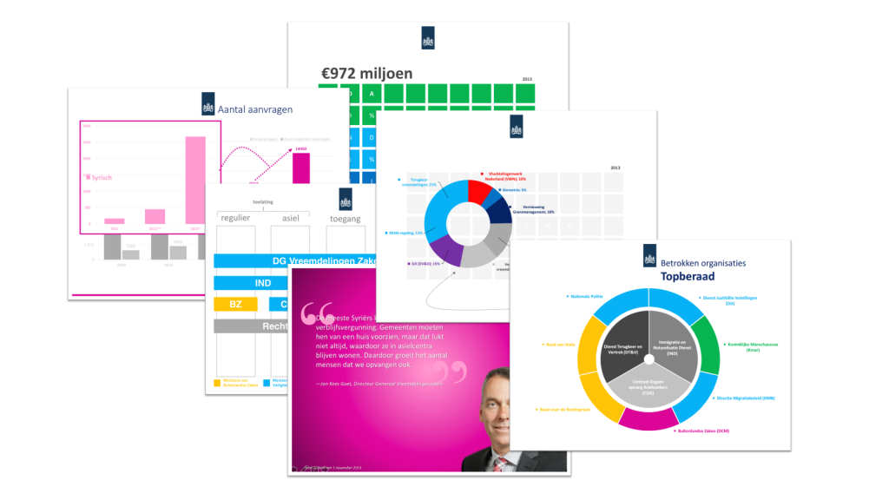

Voor het ministerie van Veiligheid en Justitie bracht ik de vreemdelingenketen in beeld vanuit een behoefte om effectiever en eenvoudiger te kunnen vertellen over de keten. Het resultaat: een _toolkit_ met een presentatie, visualisaties en een verhaal die hoog gewaardeerd werd en nog steeds gebruikt wordt door beleidsmedewerkers.
