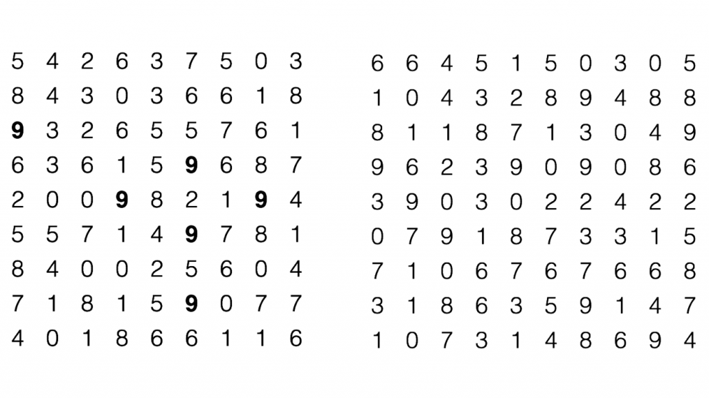
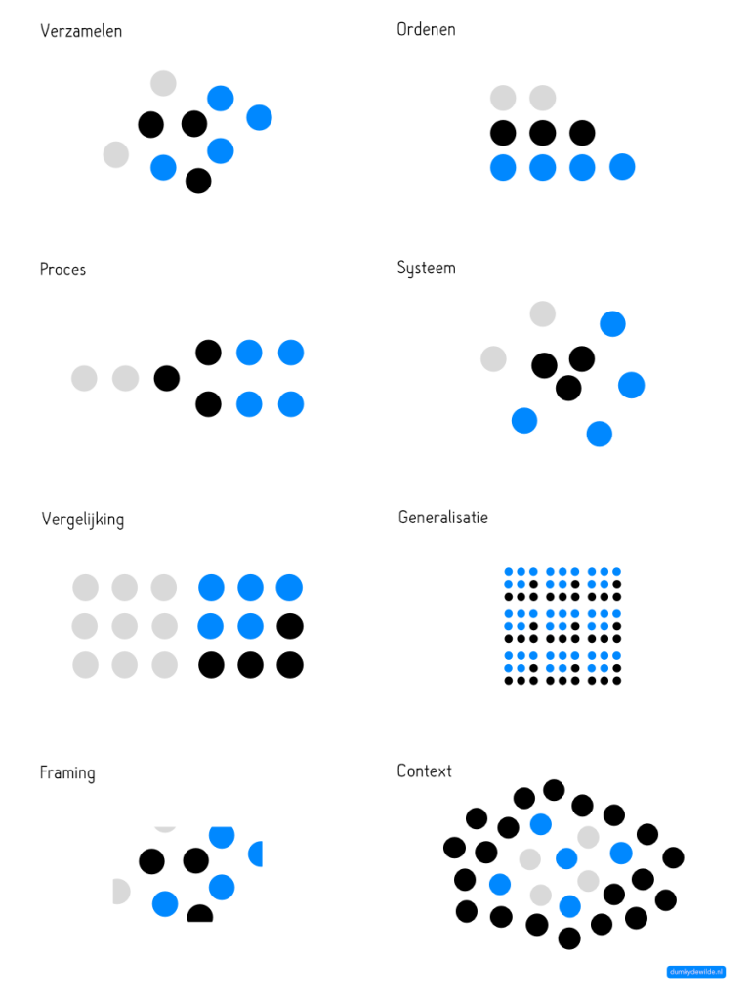

Mocht ik ergens nog hebben gedacht dat feiten voor zich konden spreken dan heeft dit beeld me definitief van gedachten doen veranderen. Als ik je vraag om in een warboel van cijfers alle negens te tellen dan lukt dat uiteindelijk wel, maar je bent even bezig. Als ik je hetzelfde vraag, maar met de negens vetgedrukt, dan kost het geen enkele moeite. Dat beeld maakte voor mij in één oogopslag duidelijk dat je je publiek een handje moet helpen om van informatie naar inzicht te komen. Feiten spreken niet voor zichzelf, dat moet je voor ze doen. Feiten kunnen zich verbergen achter andere feiten. Bij het delen van informatie, zeker in grote hoeveelheden, en bij complexe informatie, is het van belang om stil te staan bij het ordeningsprincipe van die informatie. Ik geloof dat je met de keuze van een ordeningsprincipe je publiek kan helpen de informatie beter te begrijpen. Ik geloof dat elke keuze per definitie minder objectiviteit betekent, maar dat minder tot objectiviteit tot meer inzicht kan leiden. Ik wil je meenemen in een vergelijking van ordeningsprincipes die je hopelijk niet alleen laat zien wat een ordeningsprincipe is, maar ook inzicht geeft in de toepasbaarheid er van.

Dezelfde informatie, een paar gekleurde bolletjes, vertellen een compleet ander verhaal wanneer ze anders geordend zijn. Je geeft je publiek een ander perspectief door een ander ordeningsprincipe te kiezen. Welk ordeningsprincipe je kiest is afhankelijk van het verhaal dat je wil vertellen of het inzicht dat je wil geven. Feit is dat we als mensen bepaalde composities nou eenmaal makkelijker kunnen lezen, we zijn goed in contrasten zien en patronen herkennen, soms zelfs als die er niet zien. Maak een keuze in je ordeningsprincipe zodat de feiten niet voor zichzelf hoeven te spreken, maar er een coherent verhaal ontstaat.

 

* * *

_Het voorbeeld met de cijferreeksen komt [van Stephen Few.](https://eagereyes.org/seminal-papers/treisman-preattentive-processing)_
