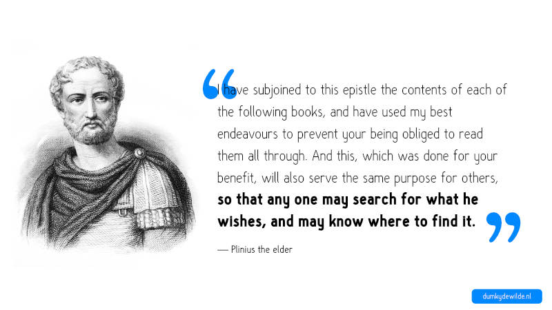

Er moet een moment zijn geweest dat iemand aan het schrijven was en dacht: “Hmm, dit wordt wel erg lang, misschien kan ik vooraan de structuur opschrijven, zodat mensen door de tekst kunnen navigeren.” Ik vind dat fascinerend. Want wanneer komt het punt dat je denkt: “Dit is te veel informatie?” Ik zie een inhoudsopgave als een instrument om de informatie in een tekst op een andere manier te ontsluiten. De inhoudsopgave is een manier van kijken naar de tekst, een perspectief [zoals ik dat laatst beschreef](http://www.dumkydewilde.nl/2016/05/feiten-spreken-niet-voor-zichzelf-perspectieven-in-visuele-communicatie/). Het geeft dezelfde informatie op een andere manier weer, en sterker nog, het geeft je de mogelijkheid om de tekst beter te begrijpen, of juist alleen die stukken te lezen die voor jou interessant zijn. Dat laatste is ook de motivatie voor een van de eerste inhoudsopgaven, opgetekend door Plinius de oudere:

> _“And because the public good requires that you should be spared as much as possible from all trouble, I have subjoined to this epistle the contents of each of the following books, and have used my best endeavours to prevent your being obliged to read them all through. And this, which was done for your benefit, will also serve the same purpose for others, **so that any one may search for what he wishes, and may know where to find it.**”_
> 
> —Plinius de oudere, _Historia Naturalis_

De noodzaak om een boek in chronologische volgorde te lezen verdwijnt daarmee. En de inhoudsopgave was niet het enige instrument, de index achterin volgde, en alle boeken leidden tot bibliotheken, en die bibliotheken hadden weer classificatiesystemen nodig. En dat brengt ons bij het ondergewaardeerde hoogtepunt van informatie instrumenten: een [overzichtspagina van classificatiesystemen](https://en.wikipedia.org/wiki/Library_classification). Ok, dat overzicht is natuurlijk extreem saai, maar het is wel het startpunt van een nieuwe vraag: Hoe blijven we navigeren in een almaar groeiende zee van informatie? We hebben nog steeds inhoudsopgaven, en hoewel je er op kunt klikken op je _Kindle_ is er niet veel aan veranderd.

De grotere vraag is wat de inhoudsopgave van de toekomst wordt. Natuurlijk, we hebben links, we hebben zoekmachines, we hebben [slimme zoekmachines](https://www.wolframalpha.com/), we kunnen een vraag aan onze telefoon stellen (met [wisselend succes](https://twitter.com/dumkydewilde/status/740421850589745152)), maar hoe gaan we film en video indexeren? Hoe ziet een inhoudsopgave in een virtual reality wereld er uit? Wat is de bibliografie van de volgende Snap Chat? En hoe bepalen welke informatie de moeite waard is? Tot de 15e eeuw was een boek een fortuin waard,  en dat fortuin was een maatstaf voor informatie die ook je tijd waard was. Met het verlagen van de kosten van informatie delen tot bijna nul hebben we andere manieren nodig om die informatie op waarde te schatten. En dat terwijl de competitie om een moment van aandacht steeds groter wordt.
