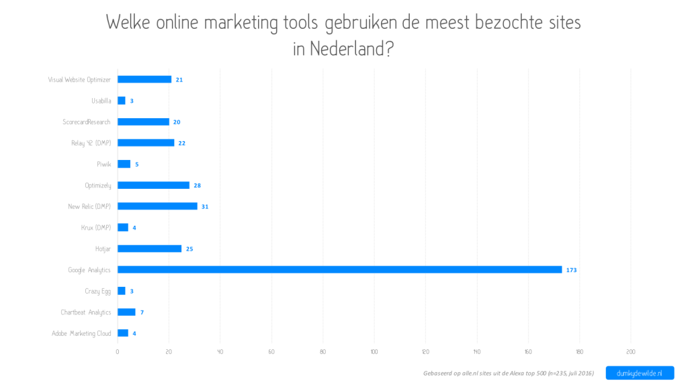

Onlangs was ik me aan het oriënteren op de inzet van een aantal tools voor het optimaliseren van een website. De eerste vraag is natuurlijk wat wil je precies bereiken? Wil je alleen bezoekersgedrag bijhouden? wil je A/B-tests gaan doen? Wil je klanten in hun hele 'journey' volgen met een data management platform (DMP)? Ter inspiratie keek ik even op een aantal andere websites, maar het rechtsklikken en '_inspect'_ wordt al snel vermoeiend. Ik was benieuwd wat de meest gebruikte tools zijn op Nederlandse sites en dan gaan we het met rechtsklikken niet redden.

Om de juiste data te verzamelen moeten we een aantal zaken in acht nemen:

1. Welke sites willen we bekijken?
2. Welke tools nemen we mee?
3. Hoe weten we of een bepaalde tool gebruikt wordt?

Voor vraag 1 heb ik gekozen om uit te gaan van [de top 500 van Alexa.com](http://www.alexa.com/topsites/countries;0/NL). Alleen beantwoord de top 500 niet helemaal onze vraag, maar iets anders: welke sites bezoeken Nederlanders. Om toch de relevante informatie te vinden heb ik ervoor gekozen om alleen de sites met een domein eindigend op '.nl' mee te nemen in de data set. Dat betekent dat we misschien wat sites missen die ook Nederlands zijn, maar geen .nl domein hebben, maar uiteindelijk gaat het er om dat we een beeld krijgen van de meest gebruikte tools. In totaal houden we van de 500 sites dan nog 235 sites over.

De volgende stap is iets lastiger. We willen weten welke tools per site gebruikt worden. De meeste tools analyseren bezoekersgedrag uit via een javascript. Gelukkig voor ons is dat bijna altijd hetzelfde en [is dat proces goed te automatiseren](https://github.com/dumkydewilde/marketing_tools/blob/master/om_tools_analysis.ipynb). De kern van het verhaal is dat we voor een selectie van tools kijken of ze worden aangeroepen in de broncode van de betreffende site. Wat volgt is onderstaand resultaat.

We zien, zoals verwacht, dat Google Analytics ons overal volgt. Alleen een aantal overheidssites (o.a. Belastingdienst.nl en Rijksoverheid.nl) gebruiken Piwik, en een aantal banken gebruiken hun eigen tracking scripts. Wat ik niet helemaal had verwacht was dat New Relic vervolgens op de tweede plek zou staan. Interessant genoeg doet New Relic namelijk iets heel anders dan bijvoorbeeld Optimizely, dat op de derde plaats volgt. Waar New Relic meer gericht is op het monitoren van performance zit Optimizely meer op het optimaliseren door bijvoorbeeld A/B-testen. Dat sluit niet uit dat sommige sites ook beide tools gebruiken, en dat zien we ook terug in de data.

Al met al is dit een leuk eerste overzicht, maar interessanter wordt het als we een grotere steekproef gaan nemen en bijvoorbeeld gaan kijken welke tools samen worden gebruikt.
