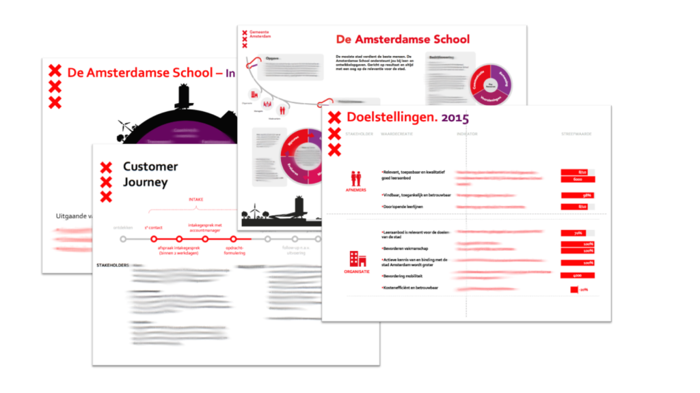

Voor een nieuwe afdeling rondom leren en ontwikkelen bij de gemeente Amsterdam bracht ik het _business model_ en een aantal processen in kaart. Door het organiseren van een aantal workshops rondom resultaatafspraken en een sterk visuele manier van communiceren werden stakeholders betrokken en was het resultaat een helder proces en een behoefte van meerdere afdelingen om deze aanpak te gebruiken.
