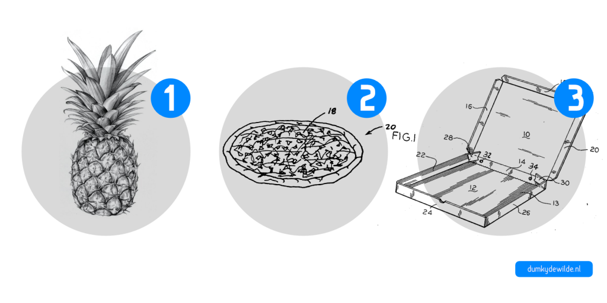

Mijn vader woont in Duitsland. Onderweg naar hem ruik ik de geur van diepvriespizza. De Dr. Oetker fabriek waar de _Ristorante_ pizza’s vandaan komen staat enkele kilometers van zijn huis vandaan. Het is een nietszeggende vierkante doos, zoals zoveel fabrieken, alleen te onderscheiden door het Dr. Oetker logo aan de buitenkant. Aan het eind van hun korte leven worden de pizza’s opgewarmd in de oven en verorberd op de bank voor de televisie of met een stuk of wat bij elkaar op een feestje, naast de tafel met drank. Je zou het niet zeggen, maar de mooiste diepvriespizza, de pizza Hawaii, is het resultaat van tientallen jaren innovatie en procesoptimalisatie. Denk er maar eens over na. Tot begin 19e eeuw werd bijna al het voedsel gegeten op een paar kilometer afstand van waar het werd geproduceerd. De melk, de ham, de kaas, en natuurlijk de ananas, tot enkele tientallen jaren geleden was het überhaupt niet mogelijk om al die ingrediënten tegelijkertijd bij elkaar te krijgen zonder dat ze bedierven —laat staan dat er duizenden pizza’s per jaar van geproduceerd konden worden.

De weg naar de pizza Hawaii begon midden 19e eeuw in Chicago. Vanwege de toegang tot natuurlijk ijs dat aangevoerd kon worden via lake Michigan en spoorlijnen die over het hele continent liepen werd Chicago in die periode ijs-hoofdstad van de wereld. Vlees kon plotseling geslacht worden in Chicago en met koelwagen over het spoor naar New York vervoerd worden, of zelfs verder naar de rest van de wereld, zonder te bederven. Die toegang tot natuurlijk ijs bleef lange tijd belangrijk, zo belangrijk dat Chicago vele warenhuizen voor ijsopslag had, soms met een capaciteit van wel 250.000 ton ijs. Pas na de eerste wereldoorlog was het echt voorbij met de ijshandel en werd ijs eigenlijk overal lokaal, mechanisch geproduceerd. Eerst nog losse brokken in fabrieken, maar later natuurlijk in koelkast die tegenwoordig niet meer weg te denken is uit de keuken. In dezelfde periode na de eerste wereldoorlog zorgde ook een andere uitvinding voor een langzame revolutie in de voedselindustrie: de blikopener. Blik en ingeblikt voedsel werd al sinds begin 19e eeuw geproduceerd, maar een veilige eenvoudige manier om een blik open te maken was er lange tijd niet. De blikopener zoals we die tegenwoordig in de keukenla hebben liggen met twee wieltjes en een draaihendel dateert pas van 1925. De blikopener zorgde ervoor dat voedsel langer houdbaar bleef en dus van grotere afstand kon komen. Die ontwikkeling maakte het mogelijk om een essentiële speler in ons verhaal de gewenste afstand te laten overbruggen: de ananas. Zonder het in te blikken was ananas een stuk duurder, een stuk minder populair, en zou onze pizza Hawaii nooit de klassieker zijn geworden die het nu is.

Alle ingrediënten bij elkaar krijgen is niet genoeg. Dat maakt een interessante pizza, maar de kracht van de pizza Hawaii zit in het feit dat ik nu naar de Albert Heijn kan lopen en voor nog geen drie euro eigenaar ben van een ijskoud exemplaar. Dat is het resultaat van een lange historie van procesoptimalisaties. De eerste pizza’s komen uit het Italië van eind 19e eeuw, maar de pizza Hawaii is een Canadese uitvinding uit 1962. Wat nu misschien normaal lijkt —pizzadozen, thuisbezorging, verschillende toppings— was toen nog onbekend terrein, [zegt uitvinder van de pizza Hawaii George Panopoulos](http://www.atlasobscura.com/articles/the-inventor-of-hawaiian-pizza):

> "There weren’t even pizza boxes for quite a few years; \[they\] used to cut circles out of cardboard boxes he got from a furniture seller next door, place the pizza on top, and wrap the whole thing in aluminum foil.”

Wat mij fascineert aan de pizza is dat die hele keten van pizzadoos tot ananas tot de diepvries in de Duitse Dr. Oetker fabriek het resultaat is van jarenlange procesoptimalisaties. Daarmee is de pizza Hawaii een symbool voor de geschiedenis van managementontwikkeling. Sinds Taylor met potlood en notitieblok de doorlooptijden van zijn medewerkers bijhield zijn we sprongen vooruitgegaan.

Het is natuurlijk deels een technologische ontwikkeling die ons van de pizza in Napels ruim honderd jaar geleden naar het diepvriesvak van de Albert Heijn om de hoek brengt, maar net zo belangrijk is een andere manier van denken. Om van een steenoven in Napels naar massa-productie in Duitsland te gaan vraagt nogal wat. Als je wil concurreren op prijs en tegelijkertijd je kwaliteit hoog wil houden moet je nadenken over elk klein onderdeel van je productieproces: wat besteed je uit en wat doe je zelf? Hoe worden de dozen bedrukt? Hoeveel ananas moet ik op voorraad hebben? Wat is de kans dat de [tomatensausroller](https://www.youtube.com/watch?v=Q2OWpAJxMos) defect raakt? Een nieuwe, snellere machine geeft je misschien even een concurrentievoordeel, maar het werkelijke voordeel haal je uit een proces van continu verbeteren. Medewerkers die inefficiënties herkennen, suppliers die de timing van hun leveringen op jou afstemmen, analyses van de kwaliteit van je producten en de downtime van je machines, en continu procesverbeteringen doorvoeren, dat maakt je processen effectiever. Eet smakelijk!
