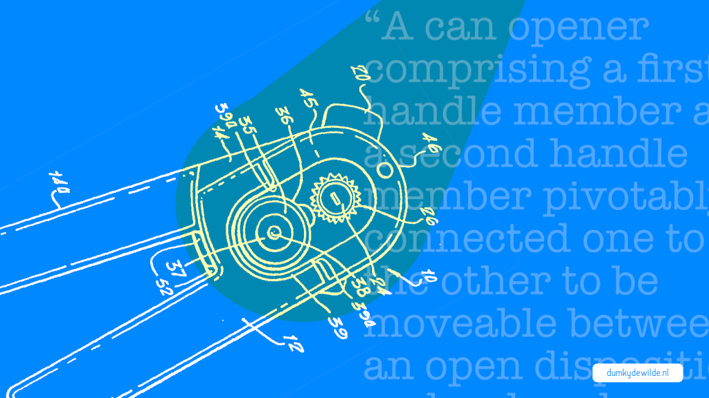

_“De overheid moet geen koploper zijn op technologiegebied.”_ Al tientallen keren heb ik dat argument gehoord als het gaat over investeren in online dienstverlening, of zelfs interne (online) communicatie.  _“Het is niet verantwoord om ambtenaren een Silicon Valley salaris te betalen.”_ Nog zo een. Goedbedoeld, want het idee is om zuinig om te gaan met belastinggeld. Het enige probleem is dat het niet waar is. Het argument gaat ongeveer als volgt:

- Nieuwe, fancy schmancy technologie staat gelijk aan duur en onzeker.
- De overheid moet voor zekerheid kiezen, omdat anders belastinggeld verloren gaat.
- Ergo: De overheid moet niet in nieuwe technologie investeren.

Ok, ik dik het wat aan, maar de kern is dit: bewezen technologie brengt minder risico en kosten met zich mee. Klinkt goed, niet? Helaas, pindakaas. Het probleem zit ‘m in het volgende:

1. Wat is een bewezen technologie? Een blikopener is een bewezen technologie, net als Windows XP. Toch heb je tegenwoordig meer aan het eerste dan het laatste.
2. Er wordt geen onderscheid gemaakt tussen ontwikkelen en implementeren.
3. Organisatieproblemen worden niet opgelost met nieuwe technologie of tools, of die nou bewezen zijn of niet. Alle Yammers, Sharepoints, en Slacks van deze wereld gaan je cultuurprobleem niet oplossen

Een voorbeeld van het eerste punt. Toen in april vorig jaar bekend werd dat een aantal overheidsorganisaties voor miljoenen een deal hadden gesloten met Microsoft om de servicegaranties voor windows XP te verlengen dacht ik dat Microsoft zich kapot lachte. Zonder iets te doen verdienden ze bakken met geld. Totdat ik iemand van Microsoft sprak die vertelde dat ze ook daar niet blij waren met de deal. Natuurlijk, het leverde genoeg op, maar Microsoft wist ook dat de technologie en gebruikerservaring al lang niet meer paste bij de servicestandaard die ze willen laten zien. In feite zeggen ze: “We hebben allang een product dat beter is voor je organisatie en voor je gebruikers, maar als je wil dat we een ervaring leveren die niet aan onze eigen standaarden voldoet, dan moet je daarvoor betalen.” Het ‘bewijs’ voor het functioneren van een technologie loopt altijd achter bij de ontwikkeling van die technologie. Een bewezen technologie is per definitie een verouderde technologie. Dat betekent niet dat het erg is —een blikopener is een verouderde technologie, maar functioneert nog prima—, maar het betekent wel dat die technologie is afgestemd op een specifiek moment in de tijd en niet op een onbekende toekomst. Met andere woorden, als je wacht op bewijs, zal je technologie verouderd zijn voordat je klaar bent met implementeren. Als je wacht op bewijs zijn je medewerkers en je klanten je al vooruit.

Waar het echt misgaat in de argumentatie is dat vergeten wordt dat er twee kanten zijn aan technologie: de ontwikkeling en de implementatie. Een analogie vinden we in medicijnen. Het ontwikkelen van een nieuw medicijn is onzeker en kost vaak veel geld. De implementatie, dat wil zeggen het gebruiken van het medicijn, brengt ook onzekerheid met zich mee, maar minder dan bij de ontwikkeling. Bij het ontwikkelen gaat het over vragen als: Is er überhaupt een oplossing voor dit probleem? Kunnen we het rendabel maken? Bij de implementatie gaat het over: Werkt dit in mijn specifieke situatie? Zijn de verschillen met mijn situatie groter dan de overeenkomsten? In beide situaties is er een bepaalde mate van onzekerheid waar we rekening mee moeten houden ten opzicht van de baten die we kunnen verwachten. Het probleem is dat een ‘bewezen’ technologie niet direct betekent dat dit ook makkelijk te implementeren is en op de specifieke situatie van jouw organisatie toe te passen is.

Neem het ontwikkelen van nieuwe technologie. Dat kan net als bij medicijnen hoge kosten met zich meebrengen met onzekere opbrengsten. De vraag is of dat een overheidstaak moet zijn. In veel situaties niet. Productiviteitstools heeft elk bedrijf nodig, dus die komen er zonder overheidsinterventie ook wel. Maar hoewel ruimtemissies nu ook steeds vaker door commerciële partijen worden gedaan, was er zonder overheidsinterventie waarschijnlijk geen man op de maan geweest. Een man op de maan is een extreem voorbeeld, maar waar het om gaat is dat er verandering plaats gaat vinden, en dat die verandering geld gaat kosten. Door verandering —en daarmee implementatie van nieuwe technologie— te accepteren als onderdeel van je bedrijfsvoering behoud je de flexibiliteit om keuzes te maken in technologische ontwikkeling. Dat betekent op de korte termijn misschien meer kosten, maar niks doen is uiteindelijk duurder weten we van het XP-debacle.

Tot slot moeten we duidelijk zijn waar we nieuwe technologie voor willen inzetten. Als we niet nadenken over de implementatie en hoe een nieuwe technologie binnen de organisatie past is het bij voorbaat al gedoemd te mislukken. Een tool, een nieuwe techniek is geen oplossing voor je organisatieprobleem. Als je wil dat je medewerkers meer onderling contact zoeken moet je ze daar op afrekenen en een voorbeeld geven. Een Yammer-account aanmaken of Slack installeren gaat je daar niet bij helpen. Wat wel helpt is het onderdeel maken van een functioneringsgesprek of een weekstart. Het aanzetten van de tool is niet genoeg. De complexiteit zit ‘m in het aanpassen van beoordelingen, de juiste prikkels creëren, bekendheid krijgen, en uiteindelijk de bereidheid van de mensen waar je mee werkt om zich aan te passen. In de praktijk betekent dat, dat je implementatie waarschijnlijk meer kost dan de tool of nieuwe technologie. Als je dat geld niet tot je beschikking hebt moet je je afvragen of je wel de juiste tool hebt en misschien met minder functionaliteiten en poespas genoegen nemen. Tegelijkertijd vergemakkelijken sommige tools de _on boarding_, het proces van overstappen naar de nieuwe werkwijze, en zijn ze daarmee hun investering dubbel en dwars waard.

Nee, de overheid hoeft niet als eerste een zelfrijdende auto te bouwen, maar dat betekent niet dat er niet flink geïnvesteerd moet worden in nieuwe technologie. Die investering zit echter vooral in het vergroten van de flexibiliteit van organisaties om mee te liften op nieuwe technologieën en ze onderdeel te maken van de bedrijfsvoering. Ja, dat betekent dat het voorbij moet zijn met het blokkeren van Facebook op werkplekken, en dat medewerkers soms onder werktijd Twitteren. Ja, dat betekent dat er een keer een half dossier van een Nederlander op een Amerikaanse server terecht komt, net zoals er ook USB-sticks met 700.000 belastingaangiften in de trein blijven liggen. Het is beter er van uit te gaan dat de verandering niet te stoppen is en je er op voor te bereiden, dan proberen om het tegen te houden en er achter te komen dat je geen backup plan hebt. Desalniettemin moeten we ons realiseren dat veel ‘innovaties’ niet spannend zijn. Een van de grootste innovaties voor nieuwssites als de New York Times en Vox.com is de nieuwe content managementsystemen die ze gebruiken. Daar zien we niks van, het is niet zelfrijdend, maar het zorgt er wel voor dat nieuwsartikelen net iets sneller online kunnen komen en dat er net iets beter samengewerkt wordt. De winst in het investeren in technologie voor de overheid zit ook veel meer in dat soort incrementele verbeteringen dan in grootse vernieuwing. Het probleem is dat ze alleen vaak niet van elkaar te onderscheiden zijn. Daarom is er een proces van doorlopende vernieuwing nodig, niet een incidentele verandering.
