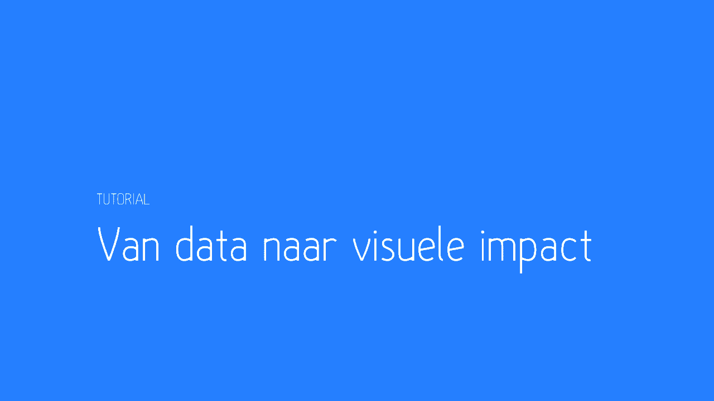
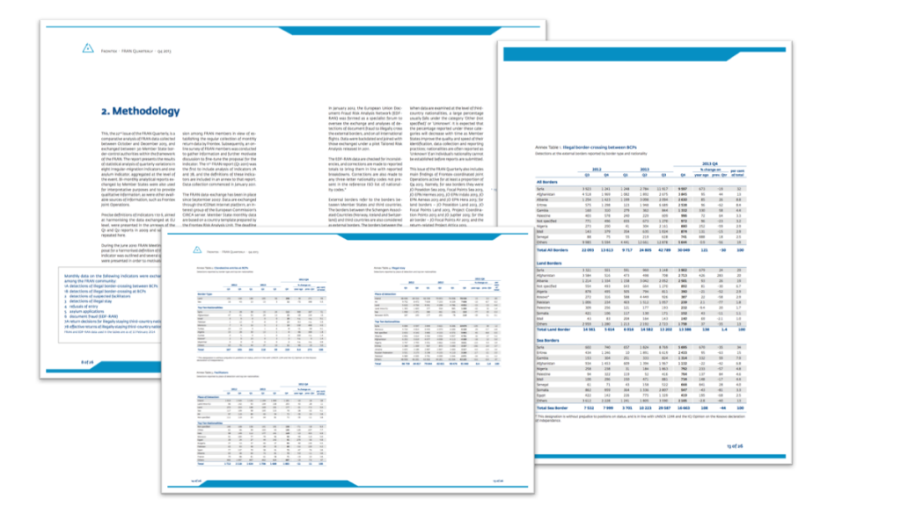
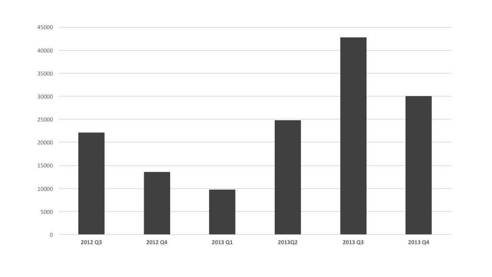
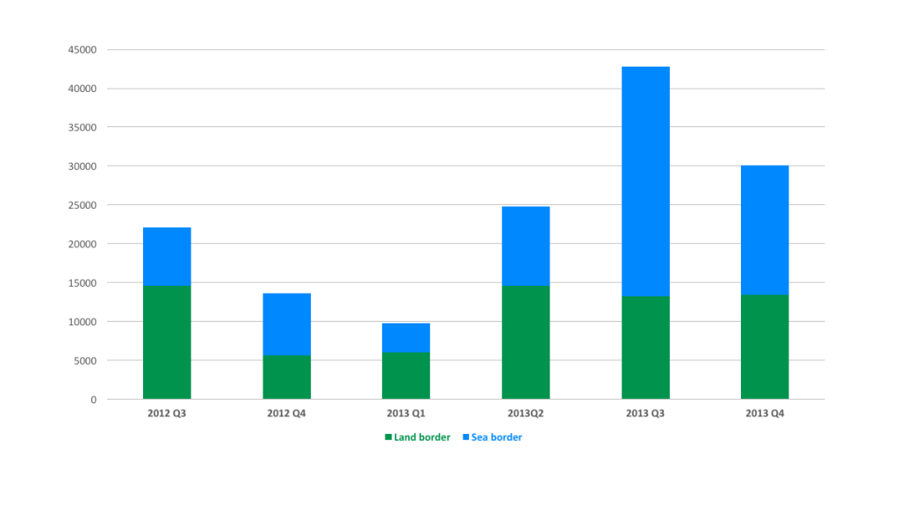
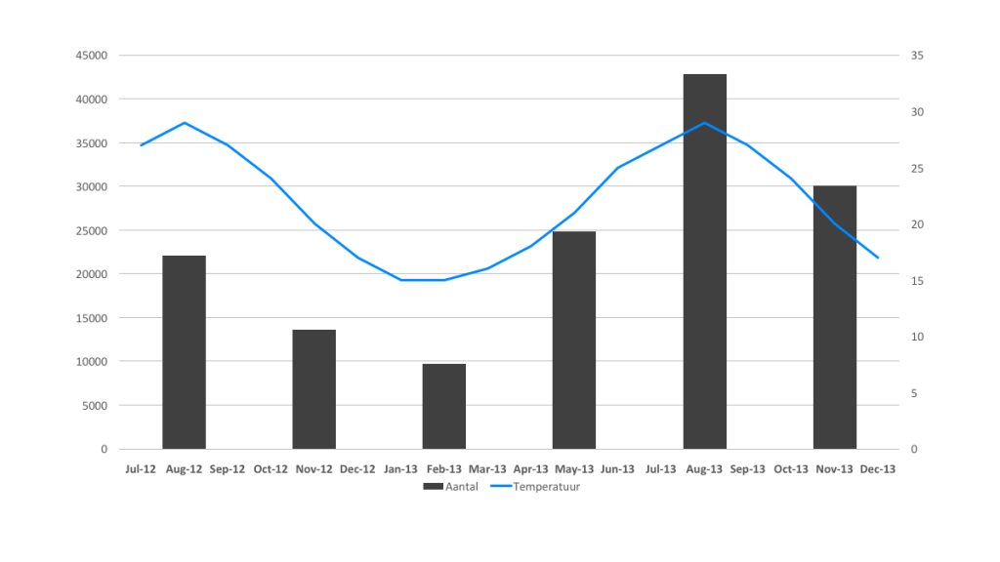
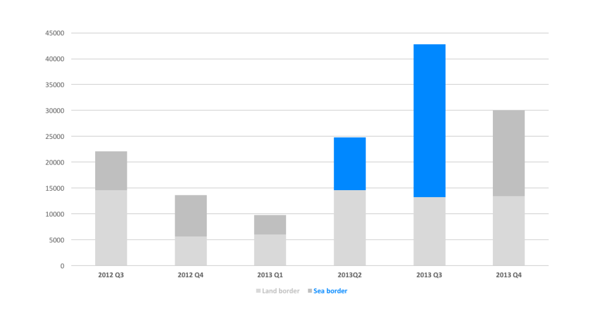
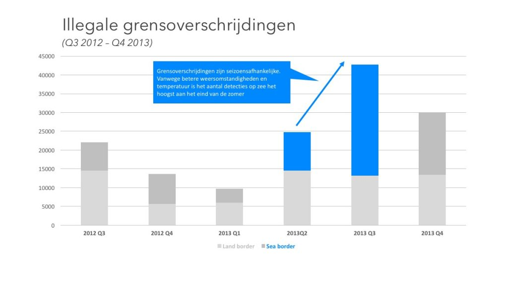

Je kent het wel, een tabelletje met verkoopcijfers ergens op slide 18 in presentatie met kwartaalcijfers. Of tabel 6 in dat artikel op pagina 33 dat op pagina 25 besproken wordt. Te vaak wordt data —bewust of onbewust— op zo’n manier gepresenteerd dat afbreuk wordt gedaan aan het verhaal. Soms is het een gebrek aan analyse en inzicht, soms is het een bewuste keuze om de trends in de data minder zichtbaar te maken. Ik wil je vandaag een voorbeeld geven van zo’n verschil. Een verschil dat je laat zien wat de impact van een visualisatie kan zijn. Je hoeft geen expert te zijn in data visualisatie om je eigen impact te vergroten. Met de juiste aanpak en een beetje PowerPoint kom je al een heel eind. Dat geeft je niet alleen de mogelijkheid om indruk te maken op je manager, maar ook om te doorzien waar anderen kansen laten liggen of bewust informatie achterhouden.

Ok, op naar het voorbeeld. Elk kwartaal publiceert Frontex, de Europese organisatie die zich bezighoudt met het bewaken van de Europese grenzen een overzicht van het aantal mensen dat illegaal de grens over wil steken. Dat kan bijvoorbeeld via de Middellandse Zee of via Griekenland. Tot voor kort was dat niet veel meer dan een lap tekst met een tabel. Ik weet niet of het een bewuste keuze was, en ondertussen hebben ze hun informatievoorziening en visualisaties gelukkig een stuk verbeterd, maar het was duidelijk dat je van een tabel met cijfers niet veel wijzer werd. In een aantal stappen wil ik je laten zien hoe je met eenvoudige stappen de aandacht van je publiek op zo’n manier kan leiden dat het verhaal achter de data duidelijk wordt zonder dat je je publiek misleidt of de transparantie vermindert.

## Stap 1: Waarom? En Wat?

De eerste stap is de vraag stellen wat er überhaupt aan de hand is. Waarom is deze informatie belangrijk? Wat zien we precies? In dit geval zien we een tabel met cijfers per kwartaal over het aantal illegale ‘grensoverschrijdingen’. Die cijfers zijn opgedeeld per landgrens en zeegrens. De lezers van deze publicaties zijn over het algemeen beleidsmedewerkers, medewerkers van NGO’s of academici. Waarom lezen ze dit? Om te zien of er iets veranderd is sinds de vorige keer dat ze de rapportage lazen, zodat ze weten of er iets in hun beleid aangepast moet worden. Ze zijn niet geïnteresseerd in de vraag of het om 20.383 of 20.379 detecties ging. Ze zijn geïnteresseerd in de grote lijnen. Als we goed naar de tabel kijken zien we wel dat er wat grote veranderingen lijken te zijn in de aantallen, maar wat kunnen we doen om dit met impact te vertellen? Je hoeft geen data genie te zijn of powerpoint wizard om toch met een aantal eenvoudige stappen je verhaal met meer impact te vertellen.

## Stap 2: Visualisatie kiezen

De eerste stap is de aantallen ten opzicht van elkaar visualiseren. Er zijn een aantal keuzes die je hierin kunt maken, maar met een beetje slim nadenken kom je een heel eind. We hebben al gezien dat het gaat om data over een bepaalde tijdsperiode. Als het over tijd gaat zijn we gewend om van links naar rechts te lezen, of dat nou de prijs van een aandeel is, de temperatuur van de afgelopen week of het jaarlijkse aantal auto-ongelukken in de afgelopen decennia. Als we kiezen voor tijd op de x-as betekent dat automatisch dat we aantallen op de y-as laten zien. Dat kan in de praktijk op twee verschillende manieren: een line-chart of een bar-chart. Voor beide valt iets te zeggen. Een lijn suggereert dat de aantallen doorlopend zijn. Dat klopt in dit geval omdat er ook doorlopend detecties zijn. Eigenlijk is de weergave per kwartaal niets anders dan de som van het aantal detecties in dat kwartaal. Of je dat per uur, dag, maand of kwartaal laat zien is afhankelijk van het abstractieniveau dat je kiest of de vergelijking die je wil maken. In dit geval kies ik voor een bar-chart. Deels om te laten zien dat we het over een samenvatting op kwartaalniveau hebben, deels omdat we zo zullen zien dat een bar-chart ons de mogelijkheid geeft om nog meer diepte aan de visualisatie te geven. 

## Stap 3: Het aantal dimensies kiezen

Ook beleidsmedewerkers zijn net gewone mensen, dus ook zij hebben moeite met het lezen van tabellen. Onze eerste visualisatie met een bar-chart geeft al een duidelijker beeld van de totale verschillen per kwartaal. Nu wordt de vraag wat we precies willen laten zien aan ons publiek. Wat mij opvalt in onze eerste grafiek is dat er een grote piek in het derde kwartaal van 2013 is. Als we in de tabel kijken zien we dat dat vooral voortkomt uit het aantal detecties bij de _sea border_. Dat is iets dat ik wil laten zien in m’n grafiek. In dit geval is de bar-chart perfect omdat we heel mooi de samenstelling kunnen laten zien tussen de twee onderdelen. Een visualisatie bestaat, net als de dataset, uit meerdere dimensies. We hebben nu twee dimensies —tijd en aantallen— geplot op de x-as en de y-as. Als we meer dimensies —en dus meer informatie— willen laten zien moeten we dat op een andere manier oplossen. Kleur is dan een goede volgende stap.

In dit geval laten de kleuren, die ook nog eens aansluiten bij ons beeld van land en zee, mooi de verhoudingen zien. In plaats van de tabel waar we de hele tijd heen en weer moeten kijken tussen het ene cijfer en dat vergelijken met het andere cijfer zien we hier in een oogopslag dat er in Q3 2013 een groot blauw blok is. Dat is al een grote vooruitgang, maar kunnen we het nog verder verbeteren? Een visualisatie als deze geeft ons ook weer meer inzicht in het verhaal dat we eigenlijk willen vertellen. Het is niet zomaar een blok of een cijfer. Elk aantal staat voor de detectie van mensen die de Europese buitengrens over wil steken. Dat betekent dat de stijging niet alleen kwantitatief is, maar ook kwalitatief: er zit een reden achter. In dit geval is dat niet alleen onrusten in het midden-oosten, maar ook nog een veel concretere reden: temperatuur. Aan het eind van zomer is de temperatuur van het zeewater het hoogst en wagen de meeste mensen de oversteek naar Europa. Dat is het verhaal achter de cijfers, en dat is wat we eigenlijk willen laten zien.

## Stap 4: De aandacht leiden en het verhaal vertellen

Om de aandacht te vestigen op het de stijging van het aantal detecties van _sea border crossings_ en de achterliggende reden te laten zien is het belangrijk om de aandacht van ons publiek te leiden. Dat betekent niet misleiden —we willen wel de volledige data laten zien— maar het betekent wel een focus verschuiving. Soms is de truc niet meer toe te voegen aan je grafieken, maar juist de belangrijkste elementen er uit te laten springen door meer weg te halen. In dit geval halen we de kleur weg en gebruiken we die kleur om juist de focus te leggen op wat we belangrijk vinden: het verschil tussen Q2 en Q3 2013. 

Afhankelijk van de situatie kunnen we of het verhaal toelichten als we een presentatie ter plekke geven, of op de grafiek zelf een toelichting geven. De tekst bij de data geeft betekenis. Het laat zien dat het meer is dan alleen een grafiek en dat er in dit geval een verhaal achter zit van mensen die een oversteek over de Middellandse Zee maken. Dat is een verhaal dat je naar voren kunt brengen zonder afbreuk te doen aan de data of de context van de data. Door slim na te denken over wat je wil vertellen, welke visualisaties je daarvoor kunt gebruiken en aan welke dimensies je invulling wil geven kun je je publiek helpen om die data beter te begrijpen. Op die manier zijn het niet alleen droge cijfers, maar zorg je ervoor dat je impact maakt. En meer dan een beetje PowerPoint of Excel heb je niet nodig.

_Bronnen:_

- [Frontex - FRAN Quarterly Q4 2013](http://frontex.europa.eu/assets/Publications/Risk_Analysis/FRAN_Q4_2013.pdf)
- [EuroMeteo: Gemiddelde maandelijkse temperatuur Lampedusa, Italië](http://www.eurometeo.com/english/climate/city_LICD/meteo_lampedusa%20italy)
