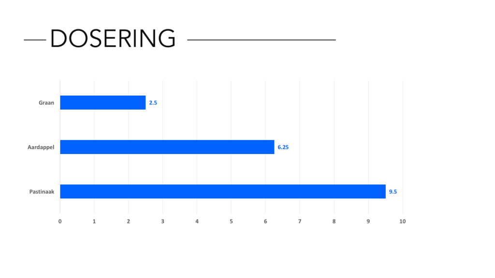
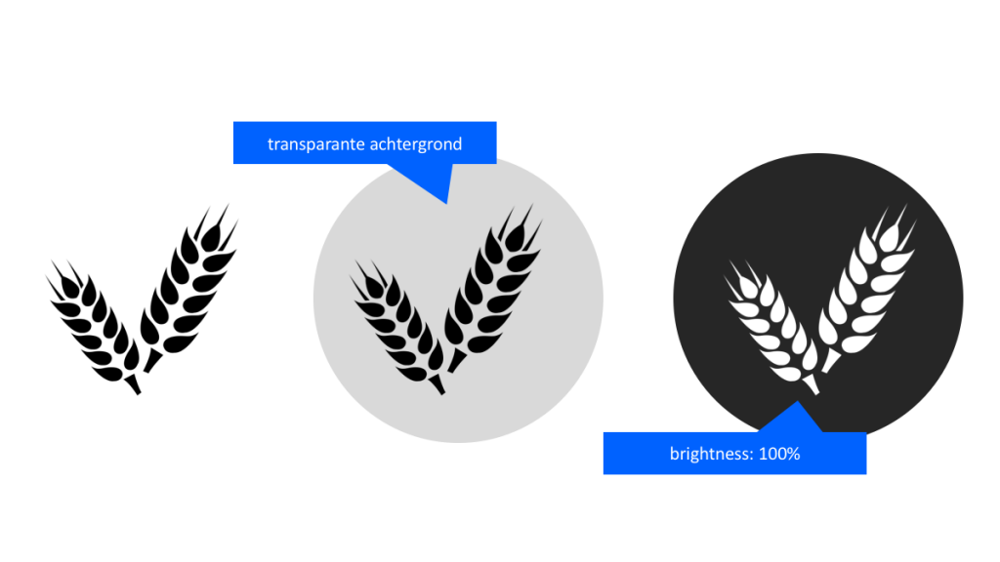
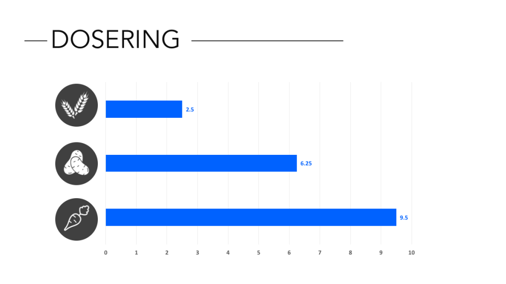
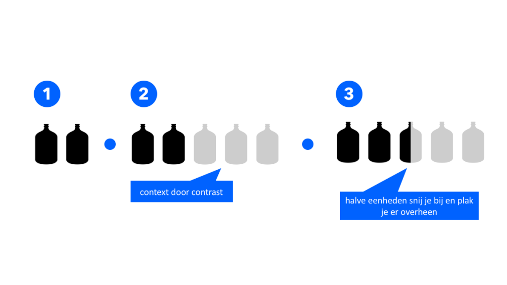
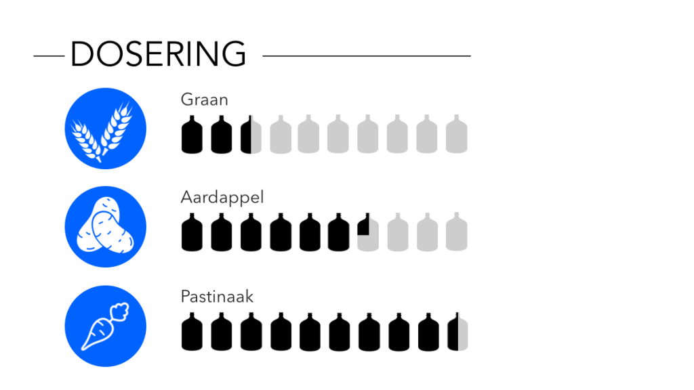

Hoe enthousiast wordt jij van het cijfer 9? En van 13.5 miljoen? Wat vindt je ervan dat er afgelopen jaar een stijging in de omzet is geweest van 12.3%? Als het aan mij ligt ben ik ondertussen meer geïnteresseerd in de manier waarop de beamer aan het plafond is opgehangen als ik nog niet in slaap gevallen ben... Als je echt impact wil maken met je verhaal moet je betekenis geven aan je data. Een cijfer op zichzelf spreekt niet tot de verbeelding, totdat je het betekenis geeft. Je kunt natuurlijk de cijfers kiezen op basis van het verhaal dat je wil vertellen — [Mailchimp doet dat mooi in hun jaarverslagen](https://mailchimp.com/2016/). Maar soms moet je het doen met de data die je hebt. Gelukkig is er een makkelijke manier om je data levendiger te maken, betekenisvoller.

Stel ik zit opgescheept met een saai stukje over de dosering van een bepaald gewasbeschermingsmiddel per gewas. Natuurlijk, een horizontale barchart maakt de vergelijking duidelijk, maar ik moet nog wel even de moeite nemen om er naar te kijken en te begrijpen wat het nou precies betekent. Dat kan beter. De eerste stap is simpel. Het gaat om gewassen waar we ons iets bij kunnen voorstellen. Waarom laten we ze niet gewoon zien.

 

Het is vaak niet meer dan dat. Een icoon van het onderwerp waar je mee bezig bent. [Een beetje Googelen](https://www.google.nl/search?q=wheat+icon&source=lnms&tbm=isch&sa=X&ved=0ahUKEwiRt7ynttPRAhWKAxoKHQgMAYEQ_AUICCgB&biw=1422&bih=752#q=wheat+icon&tbm=isch&tbs=ic:gray) is vaak genoeg om een geschikt icoon te vinden. We hebben in dit geval 3 verschillende gewassen, en dus drie verschillende iconen. Om te laten zien dat ze visueel bij elkaar horen creëren we een context. Een soort mini huisstijl voor je iconen. De meeste iconen hebben een transparante achtergrond, dus dat betekent dat je ze makkelijk op een eenvoudige vorm kunt plakken om ze in een zelfde context te plaatsen. Als ze een kleur hebben kun je ze vereenvoudigen —en dus meer op elkaar laten lijken— door de helderheid en het contrast aan te passen.

Dat is al iets beter. Maar er zijn nog steeds een aantal problemen met deze grafiek. Misschien moeten we ons publiek toch helpen met de namen van de gewassen. Graan en aardappels, OK, maar niet iedereen zal weten hoe een pastinaak er uit ziet. Maar het grootste probleem is dat de kern van de grafiek, de dosering, nog steeds betekenisloos is. Wat betekent een dosering? Eigenlijk niets meer dan de hoeveelheid van het product, dus de vraag is: Hoe verbeelden we het product? In dit geval zal het waarschijnlijk in een fles of doos zitten. 

Ook voor de fles [vind ik weer makkelijk een icoon](https://www.google.nl/search?q=wheat+icon&source=lnms&tbm=isch&sa=X&ved=0ahUKEwiRt7ynttPRAhWKAxoKHQgMAYEQ_AUICCgB&biw=1422&bih=752#tbs=ic:gray&tbm=isch&q=bottle+container+icon). De flessen op zichzelf zijn nog een beetje verwarrend. Natuurlijk, ik snap dat twee flessen meer zijn dan één, maar we hebben nog niet echt de link gelegd naar doseringen. Een dosering is een verhouding, en dat betekent dat onze context ook de verhouding moet laten zien. In dit geval willen we laten zien hoe de drie gewassen zich onderling verhouden. Waar we voor een grafiek een schaal kiezen, kunnen we dat hier ook doen. Om de verhouding te laten zien kies ik ervoor om de 'schaal' te laten bestaan uit grijze varianten van de iconen. Als je dit in bijvoorbeeld PowerPoint wil doen is het niet meer dan een kleurcorrectie kiezen of de helderheid/contrast aanpassen. Doordat we halve eenheden gebruiken wordt nog duidelijker dat we het over een abstractie van de dosering hebben. 

Het eindresultaat geeft ons een goed overzicht van de benodigde doseringen. Het lijkt iets ingewikkelder dan de eerste grafiek, maar in de praktijk zijn de visuele cues zo opgebouwd dat ze elkaar aanvullen en versterken. We kiezen voor tekst en beeld in de verschillende gewassen, en beeld en lengte bij de dosering. Zo zijn in een oogopslag de verschillende doseringen te zien.
