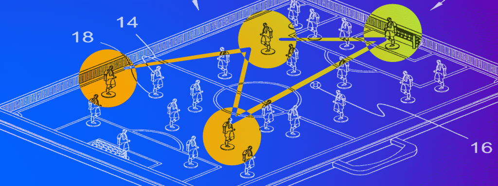

I remember running on an English soccer field a few years back. We were playing 7-a-side, I think. What I like about 7 or 5 a-side games is that the pace is a lot faster than the usual 11-a-sides. With the 11-11 you can often take your time if you’re in the back and the game is taking place up front, on the smaller field with the smaller teams, the gameplay can switch in an instant. I remember this particular moment very clearly, because I had a sudden realisation. I saw my team mate picking up speed, passing one of the opponents. I noticed an empty space up front where I could break open the game for my team. I sprinted in to where I thought the ball and I could meet. As it came toward me on the right, I picked it up with my feet, took it along for a few meters, looked up to where our striker was, passed it, and in under the minute this all took place we had scored a goal. I remember this moment, because my realisation was: “This is what we’re supposed to do as humans”. Maybe that's the downside of playing soccer with other academics: you think to much. But what I mean is not necessarily that we’re made to play soccer all day. What I mean is make use of our ability to sprint at 20 miles per hour for a short moment, predict where another object coming in from the side traveling at a similar speed will be in two seconds, observe the situation and all the relevant elements, and then make a split-second decision. We are not the only animal that can run fast and predict where objects will be, but we are extremely good at combining that with a mental map of the situation and using it to cooperate with others.

I believe that the power of those mental maps should not be underestimated. These maps, like a kind of situational snapshots help us run simulations in our head of what the future will look like. What’s interesting is that just like with regular maps, the value comes from what is left out. In a game of soccer the relevant elements are the movements of other players, the movement of the ball and the location of the goal. I don’t need a detailed assessment of the humidity of the grass, the colours of the other players socks, or the way a couple of threads are woven through the fabric of their shirts to form the logo of a specific sports brand. No, I need just the relevant information to make my decision. In my mental map I filter out all these irrelevant details to have just the elements I need. Maybe it’s knowing I can pass the ball behind me without looking, because I saw one of my team mates moving in from behind, or maybe I notice the striker running to an empty space up front. I notice these things because they are significant changes in relation to my mental representation of things. I defined the important elements and they help me make the right decisions. 

When it comes to office life, we seem to have forgotten all about maps. I’m not talking about maps of the world showing your company's presence, or military maps of famous battles hanging on your CEO’s wall. I’m talking about the general idea of mapping complexity to a visual representation to enhance decision making. I mean, we talk about ‘road maps’ or ‘time lines’, but these are often just one dimensional representations of text. What we do most often, however, is even worse. We write up the complex arrangement of elements to inform decision making in a longwinding ‘proposal’ or ‘plan’ and expect others to just understand the direction we’re going in or what we have to do. Imagine a general writing a project plan stating that “To enhance our overall strategic position we believe it is of the utmost importance to proactively terminate our counterpart's continued supply of goods through the means of a connecting elevated overpass.” The easy part would be to point to a bridge on the map and say: “I want that bridge bombed, so they’ll run out of supplies”. There’s a reason ("stop the supply”) and a method of choice (“bomb the bridge”).

Now, obviously we can all do a better job at writing. That would definitely bring a big improvement in most business situations, but the core problem is not bad writing. The core problem is that _we were not made for reading_. Language has been the next best thing since fire and all, but writing is just a means to bring about a mental representation. Sometimes that representation can be sound or color, but most of the time it’s visual-spatial. In other words: a map. Now, let me be clear, when I say “map”, I don’t necessarily mean roads and mountains and water, I mean a two dimensional spatial representation of a situation. Latitude and longitude are just one of millions of possible configurations of maps. You can think of axes to represent customer value, time, money, state of development, priority, visibility, adoption, you name it. In essence the value of a map is in a configuration of two axes that allows you to say: "I believe element x is going in that direction, therefore we should do y”. It allows you to have a discussion on whether x is truly going in that direction, and whether y is the right solution for the problem.

One solution I’ve used a few times in recent months is using a [Wardley map](https://www.youtube.com/watch?v=NnFeIt-uaEc). They are a solution to the strategic business problems of our time, invented —for lack of a better word— by Simon Wardley, who talks about them way more eloquent and definitely funnier than I could ever hope. The Wardley map takes the evolution of a product from invention (genesis) to commodity, and maps it to customer value through a value chain. This gives us a way to talk about business problems similar to the way we talk about physical problems. We can talk about movement, position, barriers, points of entry. They are excellent in group settings, because they can engage everyone's mental capacities and foster interaction —I’ve had one to many meeting discussing a policy change for n-th time where I could hardly keep from hanging myself with the power cable from the projector out of sheer boredom.  It’s not a solution to all the worlds problems, but it is a way to visualise complexity in business settings in a better way than I’ve seen so far. Even something like the Business Model Canvas, which is helpful in its own way because of its level of abstraction, has trouble identifying movement. We see the Canvas in a two-dimensional space —a piece of paper or a screen—, but in reality it is mostly one-dimensional. In reality it is a bunch of different concepts arranged in a certain order designed to make sense of (business) life precisely because of their ordering. It is a very helpful tool, but still, if we think about movement or change with regard to the Business Model Canvas we have to do that by creating a mental representation. I believe if we want to become more effective in our business strategies, we have to outsource those mental models to paper or screens so we can free up space to think about their direction, movement and impact. Maps are an excellent way to start. And if all else fails we can always go out on the football field
