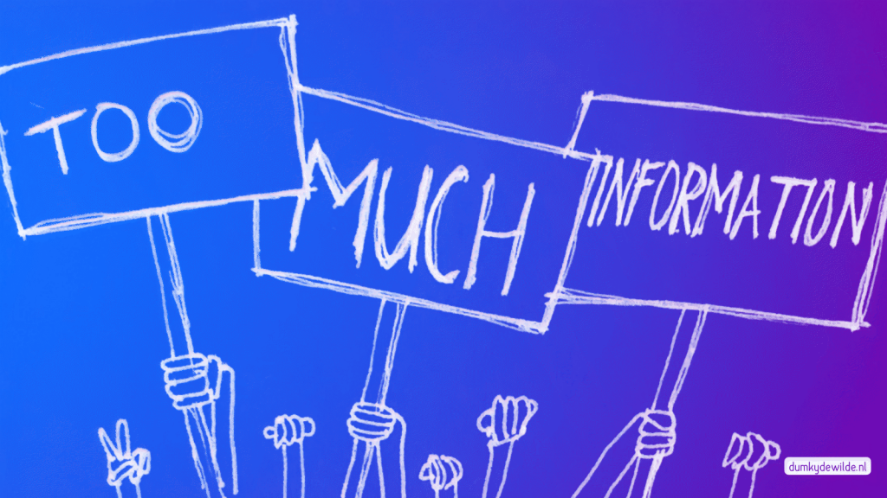
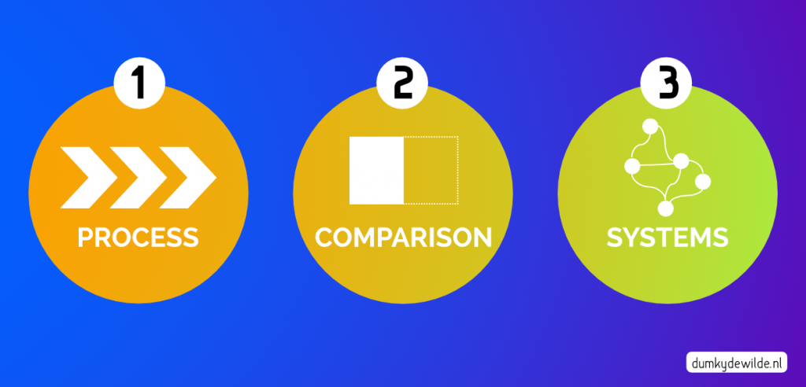

I believe we are built to distinguish signal from noise. It’s not just the fake news on Facebook, the hipsters on Instagram, or the kittens on YouTube that we are able to filter out (or not…). It is a general ability to, in an instant, understand what is important and what is not. Despite the fact that in recent years the all-encompassing interwebs has created a collective attention deficit disorder, our ability to distinguish signal from noise has not changed. It’s just that there’s more noise and more signal. It’s not something just humans do —though, yes, you are special, but I’ll get to that later. It’s an ability a lot of animals have when we say they can smell fear, or hear danger coming. That ability to filter out the noise has helped us survive for millions of years. I think we can use it even more and even better.

So what do I mean? What’s this weird stuff about animals on Facebook? Sit still and listen. What do you hear? Voices outside? A washing machine? The kettle? Cars? Noises? Sit still and look? What do you see? A table? Your hands? Your shirt? The colours and the fabric it’s made of? The little threads? There is so much to see, so much input. Yet most of the time we have little or no problem navigating the millions of stimuli that are thrust upon us. We know exactly what’s important and what’s not. That’s what I mean. Think of the story of the tortoise and the hare. The hare is a lot faster, so he sees more right? But what if the tortoise takes more time to really look closely? Doesn’t she see more than the hare because she has more time to see? We as humans have the unique ability to be both the tortoise and the hare. We can choose whether we want to focus intensely on one thing or go fast and see a little of a lot.

I am interested in enhancing our skill of filtering out the signal from the noise. I am interested in making it easier for others to filter out what’s important and what’s not. Our whole lives are basically a collection of signals and noises. We see faces, not just collections of skin, eyes and hair. Also in a much larger sense, our days are mostly filled with chatter, chores and water cooler talk, but when we look back we remember the signal, the important stuff: nights out with friends, meeting the love of our live, the birth of a child. Now, we don’t need all this signal/noise stuff to find the true meaning of life —don’t worry, I’m a philosopher, I’ll let you know when I’ve found it. But we do need it because something has changed over the last decades.

What has changed is the massive amount of information that we have to deal with. I’m always reminded of something Barack Obama said in an interview with Michael Lewis during his time as president. Obama said that his ability to make good judgements on decisions was limited. The number of important decisions he had to make during any given was so high that inevitably a ‘decision fatigue’ would set in. His remedy was to limit the number of decisions as much as possible. One thing he did was make sure he would always have the same set of suits hanging ready in the morning so he would not have to spend time considering what to wear and spend his ‘decision energy’ on something as trivial as that. This tells me one important thing: even for top performers there are limits to the amount of information that they can process. So what does that mean for us, mere mortals, when it comes to understanding the world. Our ability to truly understand the world is only a fraction of what it is for Obama —I know mine is, considering the amount of time I spend watching Netflix instead of being handed the latest intelligence reports in my oval office\[1\].

So there we are, stuck in our interconnected world, bombarded with information, while our processing power is only slightly above that of our prehistoric ancestors. All we can do, is what set those same ancestors apart from their primate counterparts: use their tools! Luckily we are no longer stuck with sticks and stones, but we have evolved more sophisticated tools crucial to our survival like SWOT-analyses, Net Promotor Scores, and Myers-Briggs Type Indicators to make sure our teams are performing at their best hunting those deer.

\[THE END\]

No but seriously, after the iron age, we have now entered the mental age where tools are made of thoughts, concepts and ideas that help us filter the world around us. Looking at the world through the eyes of someone only using sticks and stones, would be very different from the way we look at —and filter— the world today. We have evolved from being the man with the hammer who sees only nails, to people who know that we have inherent biases in our view of the world. People who know that our past shapes how we look at the present. People who know we fear loss more than we appreciate gains. People who know that we should change our choice of doors when the show host opens the one with the goat —although I’m still not sure how that is ever going to help me out.

It’s the mental tools that help us process the increased amount of information and distinguish the signal from the noise. There are three that I want to single out for now, because not only will they help us better understand the world, they’ll also help us make better data visualisations and presentations. They are:

- Goal setting
- Visual abstractions
- Algorithms

What these three tools have in common is that they help us see what is important and what is not, they help us see a pattern in the data that we are presented with. Let’s start with goal setting. Goal setting may sound a little weird as a mental tool, but I assure you it is maybe the most important of the three. You see, when we look at the world we do not just observe —that takes years of practice in a Buddhist Monastery—, but we see the world with a specific purpose in mind. We’re looking for something even if we’re not always sure what exactly. Setting a goal will fine-tune our pattern matching to actually see what we need to see. Now, this works on all kinds of different scales and levels. It can be the post-it on your computer screen that helps you get your priorities for the day straight, or the memorable line that helps thousands of employees make the right decision everyday. It can be public and bold (remember that one about putting a couple of guys in a fuel tank and shooting them to the moon within the decade), or it can be private and modest (I try to floss 5 days a week. There, I’ve said it).

Visual abstractions are interesting because they bridge the mental and the visual aspect. Obviously visual stimuli are a big part of what distracts us — I’m looking at you Netflix! Aaargh. Must. Watch. Series.—, but we can also use them to our advantage. By visualising abstract problems we help ourselves understand them better. Sometimes the visualisation is just a new perspective, sometimes it’s pure genius. I find that three of these visual abstractions can explain most of your problems:

1. _Process_: Whether a road, or a journey, or just a line, a lot of situations can be explained or looked at from one step following the other.
2. _Comparison_: This can be a contrast like black and white, or before and after, or it can be something like three alternatives, but the power is in showing the differences.
3. _Systems_: A system can be a simple interaction between elements, or a complex set of second order effects. The power of visualising a system is that it can show interaction and change without necessarily using a linear fashion like a process

Thirdly, algorithms are interesting because they do a lot of the work for us. They are a tool for condensing information in a way that helps us make more sense of it. In it simplest form it can be something like sorting a list in chronological order. A little more complex is a linear regression which helps us see a pattern in what might otherwise look like noise. At it’s most complex, when we employ multiple neural networks for example, only the outcome is meaningful to us.

* * *

\[1\] In case you were wondering, I do not have an oval office, I have part of the living room…
