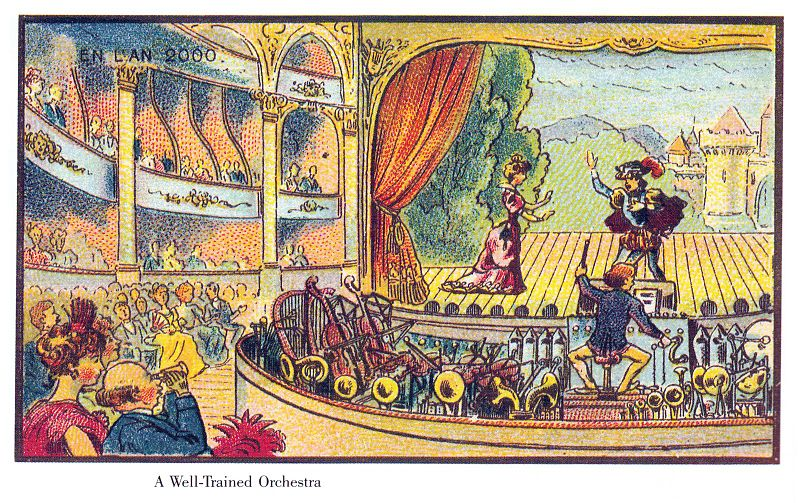

It is stuck away all at the end of a letter. One of the many Isaac Newton wrote to his adversary Robert Hooke. Their disputes over their work, inventions, and science are still visible in the written words, but they also show a difference in attitude. They show a difference in view of how science works, how innovations come about. Where Hooke was known for his hubris and claimed ownership over inventions that were supposedly still stuck in his brain somewhere, having not yet found their way out, Newton showed more humility as to where his ideas came from. It is at the end of a letter to Hooke dated February 5th, 1675 that he writes: “If I have seen further it is by standing on the sholders of Giants.”\[note\]James Gleick has an excellent biography of Newton's life that also discusses this quote\[/note\] That quote, used so widely nowadays, signifies a fundamental difference between the two. A belief in science and innovation as pure originality and genius or science as building on a ladder of existing ideas. Newton believed firmly in the latter and the idea that you could take ownership over an idea, claiming originality, was madness to him. Yet, centuries later we often still have trouble acknowledging that we stand on the shoulders of giants.

That notion of a giant’s shoulder is however one of the most powerful ways of thinking of innovation, evolution and the spread of ideas. Every product we use nowadays is built on shoulders. No one in their right mind would start with mining the copper needed for electrical plugs when they want to build a new iPhone app. No, there is a whole framework of not only code libraries and cloud computing power, but also years and years of innovations and developments that have made a device like the iPhone possible. Think only of the tiny screws that hold it together. Before the 18th century every screw was hand made, they idea of standardised components didn’t exist yet. It wasn’t until guns were made in large volumes and with interchangeable parts that the idea of a standardised component took hold. And after that it took several decades before Maudsley’s screw cutting lathe would allow for the mass production of standardised nuts and bolts.

We use what is available to us as a commodity to add value where we can. That idea is based on a principle that stands at the basis of how evolution works. It is based on the idea that “life exists at the edge of chaos”\[note\]It is discussed at length in a talk with Stuart Kauffman at [edge.org](https://www.edge.org/conversation/stuart_a_kauffman-the-adjacent-possible). For a great introduction to the principles behind and surrounding it Melanie Mitchell's _Complexity: A Guided Tour_ is an excellent starting point.\[/note\] It is what biologist Stuart Kauffman has called the ’adjacent possible’. Life, or the evolution of life, uses all that is available in exploring new possibilities. The same goes for ideas. Steven Johnson, author of _Where Good Ideas Come From_, writes that we should think of the adjacent possible as a house with a blueprint we don’t know yet, but every door we open leads to new doors. You go into one and find yourself in a room with four new doors. Before you know it you have built a palace as you keep exploring the boundaries of what’s possible. With that mindset we need to stop thinking of the lone genius inventor and solitary scientist who come up with truly original ideas from their basements. We have to acknowledge that we are indeed building on an existing framework, and that means there are limited possibilities within that framework. It is because we build on what came before that multiple people can come up with the idea of a telephone or battery at around the same time. Johnson writes:

> “You can see the fingerprints of the adjacent possible in one of the most remarkable patterns in all of intellectual history, what scholars now call “the multiple”: A brilliant idea occurs to a scientist or inventor somewhere in the world, and he goes public with his remarkable finding, only to discover that three other minds had independently come up with the same idea in the past year.”\[note\]Johnson, Steven. Where Good Ideas Come From: The Natural History of Innovation (p. 34). Penguin Books Ltd. Kindle Edition.\[/note\]

There is a great series of illustrations from the late 19th century that is a great illustration of the adjacent possible. The series is called “L’an 2000” (The year 2000) and it was made for the World Exposition in Paris to show a vision of the future. You can find mailmen flying their personal peddle-powered aircraft, children listening to headphones attached to some kind of book shredding-stereo machine, and my personal favourite: a mechanical contraption for one person to play an entire symphony orchestra on his own. It is funny now, when we know that all of these things would be surpassed by far superior technology, but it does show what a world looks like when you can only see one iteration of the adjacent possible further. We laugh at these kinds of illustrations, like we now laugh at the executives who tell us that “This 'telephone' has too many shortcomings to be seriously considered as a means of communication” or that “There’s no chance that the iPhone is going to get any significant market share.” We now know that both the original telephone as well as the iPhone have disrupted the market and that those who couldn’t adapt suffered the same fate as dinosaurs: extinction.

The million dollar question of course is: how do we know which innovation will be successful and which won’t? It seems almost impossible at first. How could the manufacturer have known that I was interested in a kitchen stove with touchscreen? Why do glasses that give me directions fail, while everyone is excited about windshield wipers that automatically turn on when it rains? Simon Wardley has an answer to that question. To understand the answer, however, we must first understand that there are two different types of innovation. There are the continual changes and incremental improvements, and then there are the truly market changing disruptive innovations. Both of which can put your company out of business. As with all models, I will tell you right now that this is one wrong —there are many different ways to look at innovation—, but it is useful for our purpose here nonetheless.

The first type of innovation is the result of constant change and supply side innovation. For any kind of product that has shown enough demand, a race on competitive advantage will arise on the supply side. As Wardley writes:

> “In any industrial ecosystem, novel and new things constantly appear as a consequence of the desire for companies and individuals to gain an advantage over others. Those things that are useful will be copied. They will spread until the once novel and new becomes commonplace. Yesterday’s wonders are destined to become today’s discounted special offers. \[…\] Competition and the desire to gain an advantage not only creates change, it spreads it and forces companies to adopt it.”\[note\]From Simon Wardley's work-in-progress book, which can be found and followed [on Medium](https://medium.com/wardleymaps/finding-a-path-cdb1249078c0).\[/note\]

It is at the end of that journey from novel to commonplace that we can find the second type of innovation, because any commodity opens a door to a new adjacent possible. It is the commodity that becomes the next shoulder to stand on, until the cycle can repeat itself as the novel becomes commonplace once again and itself becomes a shoulder to stand on. That is the pattern. An idea turns into a product, and a product, or market of products slowly turns into a commodity. Upon this new commodity new ideas and products are build and the pattern repeats. But there is also another pattern. For every new idea with the potential to become a commodity there will be many who declare its imminent failure, while praising the ‘old’ way of doing things. It is not ‘natural’, people will not change, it has too many shortcomings, it’s a fad, a waste of time —those were respectively said of artificial ice, the television, the telephone, the car, and alternating current (AC). And they are true, until, that is, they are not, and they’ve been overtaken by history while slow driving in the left lane. These patterns are what’s recognisable. It may be hard to predict which product will be better than the next, but if you can identify a shoulder to stand on you’ll be part of an entire market going upward.
