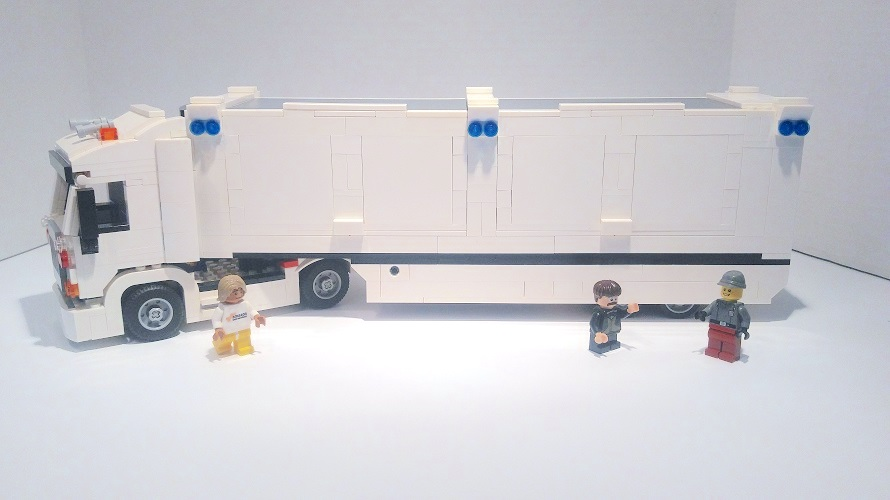

What is the fastest way to transfer 100 petabytes to the cloud—that is to say, about 200 thousand times your laptop’s capacity? Who has that much information, you ask? Plenty of companies with years of digital documents, movie studios, government agencies, you name it. If you think your fiberoptic cable will help you out, think again. At this size and even with the fastest connection we are still talking multiple years of uploading data\[note\]You can play around with [this download speed calculator](http://www.t1shopper.com/tools/calculate/downloadcalculator.php)\[/note\]. So what is the fastest way? It’s driving. [Amazon has a large truck](https://www.wired.com/2016/12/amazons-snowmobile-actually-truck-hauling-huge-hard-drive/) that functions as a single giant harddrive which will upload your archive to the cloud in less than 10 days. With so much information wirelessly available we tend to forget that that information, or the data behind it does actually have a physical component. A truck like that shows you exactly that we have certainly not left the physical realm yet and that the logistics of connecting information and people will not be going away soon.

\[caption id="attachment\_443" align="aligncenter" width="890"\] [According to Amazon](https://aws.amazon.com/blogs/aws/aws-snowmobile-move-exabytes-of-data-to-the-cloud-in-weeks/) data centers are like LEGO: plug and play.\[/caption\]

And it has been around for a while too. Imagine it is the year 2000BC and two Sumerian farmers have a dispute over the ownership of a piece of land. Luckily a new piece of technology has been around for a few years to settle their dispute: the clay tablet. So they head to the archive to find an grumbling archivist: he now has comb through thousands of tablets to find and compare land deeds that may not even exist. This must have been the cradle of our modern day bureaucracies, but though we associate bureaucracies with slow speeds, uncertainty, and frustration they definitely were a big improvement in their first three thousand years. Bureaucracies allow for a more effective connection between people and information. If you think about it, our lives are build around archives well protected by seasoned bureaucrats: from getting a passport, to buying a house, and from marrying the love of your life, to cancelling your cable subscription —and preferably not the other way around, though some cable companies can make you feel that way. The question of connecting people and information as effectively as possible may be more physical than we realise in a world that has turned so virtual.

You may know from your job that many hours can be spend on finding the work you know someone else has already done only to find out it wasn’t the work you needed in the first place. Our archives may have turned into email servers, Sharepoint sites and Google Drives, but that doesn’t mean the information can find its way to the right person more efficiently. Like driving a truck full of harddrives is still the fastest internet connection there is, walking over to a colleague is often the fastest way to get the right information. Which is why designing the right physical experience for your employees, or what we call an office building in plain English, can give you the edge over other companies. Though we have digitised more and more information, in the quest to unlock the information stored in peoples head one solution has been to tear out the walls and doors and replace them with a vast landscape of desks and computers: the open office plan.

The open office plan was supposedly born out of the idea that easier physical access meant better collaboration. Meaning it was easier to walk up to Aaron or Betty and get the information you needed. In theory a lively discussion would then occur from which would spring new, original and creative ideas and both you and Aaron and Betty would walk away inspired. It also had the added benefit for managers of seeing their employees ‘in action’. What sounded good in theory, however, turned out to be a total mess in practice. A [recent article in the Wall Street Journal](https://www.wsj.com/articles/why-you-cant-concentrate-at-work-1494342840) notes that:

> "All of this social engineering has created endless distractions that draw employees' eyes away from their own screens. Visual noise, the activity or movement around the edges of an employee's field of vision, can erode concentration and disrupt analytical thinking or creativity. \[…\] **Benefits of enhanced 'ease of interaction' were smaller than the penalties of increased noise level** and decreased privacy resulting from open-plan office configuration.” \[my emphasis\]

The truth of our open office plan workspaces is that not only do they not increase collaboration, they are actually detrimental to productivity. According to [an article in The Guardian](https://www.theguardian.com/money/work-blog/2014/sep/29/open-plan-office-health-productivity) “office workers are losing 86 minutes a day due to distractions” and “employees surveyed who worked in open-plan offices took over 70% more sick days than those who worked from home.” Here's some free advise: kill your open office plan. There, I just saved you €100K on strategy consulting. While almost three-quarters of the workspaces in the US are open office plans\[note\]According to [this BBC news article](http://www.bbc.com/capital/story/20170105-open-offices-are-damaging-our-memories)\[/note\] many companies, at least in the technology sector, are adding privacy to their offices again or at the very least enabling their employees to work from home more frequently.

Getting your offices right means getting the flow of information right, so there is great power in creating the perfect building. Ed Catmull is the president of Pixar, of _Toy Story_, _Monsters, Inc._ And _Finding Nemo_ fame. Catmull looks like your stereotypical computer science professor with his rimless glasses, a scruffy grey beard and a short-sleeve shirt that is just a little too big for his slender frame. He is in fact a computer scientist, though not a professor. He also wrote a book on creativity and his work at Pixar that has become an instant classic: _Creativity, Inc._ We would like to think that creativity is something artists are born with and that the ingredients for a master piece are something like a disturbed childhood, an assortment of paintbrushes, and plenty of solitude. If you are Catmull, however, you need to make sure you have a constant stream of creativity from 500 people to create quality digital films. That means you need to bring process and structure to something that we like to think of as the opposite of structured. Considering the many awards, views, and —maybe even more telling— laughter and tears that Pixar films have received, I would say his work has been a success.

Though he describes the many components of productive creative teams in his book —from individual responsibility to the talents of people to the role of managers— a big part of his quest has been to create the right physical space for his employees. Catmull says that people are often envious of the energy, collaboration and creativity they feel when they enter the Pixar building. Almost like something’s missing in their own work life. A big part of that is the freedom people have to turn their workplace into something that is truly their own place, like a home at work:

> “They spend their days inside pink dollhouses whose ceilings are hung with miniature chandeliers, tiki huts made of real bamboo, and castles whose meticulously painted, fifteen-foot-high styrofoam turrets appear to be carved from stone.”

That creates a physical feeling of safety and is a visual reminder as you walk through the building that you and everyone there has the right to express themselves. Creating that physical feeling of safety is only part of the deal though, because the complexity of any building is always to enable deep, solitary, creative work, while at the same time enabling chance encounters and serendipity. That is what open office plans try to do, but fail at. Catmull has, together with Pixar’s founder Steve Jobs, created a building that encourages these kinds of encounters in a variety of ways. Catmull recounts how Jobs laid down his vision for the building:

> “He didn’t want perceived barriers, so the stairs were open and inviting. He wanted a single entrance to the building so that we saw each other as we entered. We had meeting rooms, restrooms, a mailroom, three theaters, a game area, and an eating area all at the center in our atrium (where to this day, everyone gathers to eat, play ping pong, or be briefed by Pixar’s leaders on the company’s goings on). **This all resulted in cross-traffic—people encountered each other all day long, inadvertently, which meant a better flow of communication and increased the possibility of chance encounters.** You felt the energy in the building**.”** \[My emphasis\]

Just consider how different that is from the office buildings that many of us go to every day. We feel trapped in grey cubicles, go out for lunch because the cantina is depressing, and quickly escape from the little kitchen when we grab a coffee, because with two people it’s already cramped. Though not every office building is like that, neither are they truly designed with the employees in mind in the way that Pixar’s is: physical safety and happy accidents. Though many executives often like to err on the side of efficiency, many architects have known for a long time that efficiency in functions is only part of what makes a good building:

> “A building’s circulation—where people walk—should interconnect the program spaces \[specific to the company\] with the stairs and elevator lobbies in a way that is both logical and interesting: the circulation system has to work both efficiently (particularly in event of fire) and aesthetically, offering pleasant surprises, unexpected vistas, intriguing nooks, agreeable lighting variations, and other interesting experiences along the way.”
> 
> —Matthew Frederick, _101 Things I Learned In Architecture School_

Setting an information strategy for your company is not just about implementing a Sharepoint solution, or getting a Dropbox account for your team. It is thinking about how technology, as ancient as brick walls or as modern as cloud storage can enable your teams to cooperate more effectively so people and information can be connected in a way that makes everybody happier —no more double work, anyone? And you may not even need a hard drive on wheels to achieve that.
