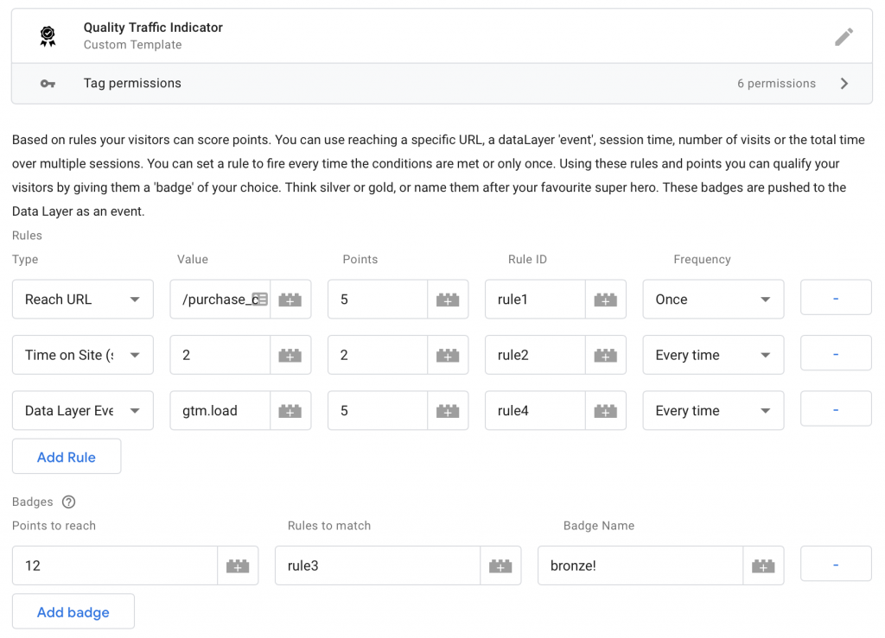
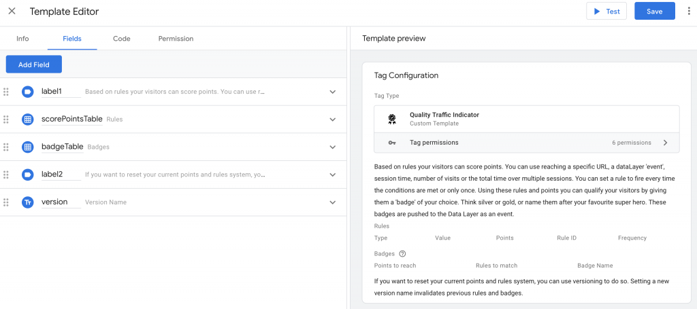

_Just looking for the template? You can find it_ [_on Github_](https://github.com/dumkydewilde/gtm-quality-traffic-template)_._

Recently [Google Tag Manager](https://marketingplatform.google.com/intl/en_uk/about/tag-manager/) introduced custom templates. Custom templates are a way to make tag management even more manageable and scalable. A great and effective example is a custom template for the [Facebook Pixel](https://www.simoahava.com/analytics/create-facebook-pixel-custom-tag-template/). In a way GTM’s custom templates can seem very limited, since they’re built on a very restricted, sandboxed version of JavaScript. There's much potential in custom templates, but it helps to think about the fundamentals of tag management when you start building your own custom template. In this post I’ll show you my thinking behind a custom template for building a frequent-flyer style tag to track user behaviour as an attribute.



An example of a custom template in Google Tag Manager (GTM)

So what is it that GTM actually does? There are many ways to use (and _abuse_) the tool, but in essence it simplifies tracking _user behaviour_ and _user attributes_ and communicate those with other services. Think about it. A Google Ads tag is nothing more than sending ‘this user triggered a purchase event and came from an ad with ID X’ to the Google Ads server. A Hotjar tag is nothing more than sending ‘a user visited these pages at these times’ to the Hotjar server. Of course Hotjar then turns this into a nice heat map or visitor recording giving us _insights_ and not just data. The value of the tool actually comes from what’s left out, not from the fact that they have data that others don’t have. 

That brings us to the goal of tracking. It is nice to be able to simplify tracking, but tracking user behaviour and user attributes doesn’t make sense if it doesn’t serve a purpose. For 99% of websites or businesses that purpose is either _selling more_ (of your product, service or idea), or _selling more effectively_. If you have an Ecommerce business you can think of the first as increasing the number of transactions and the second as increasing your conversion rate. So now the question becomes: how can custom templates help us track user behaviour or user attributes that help us sell more or sell more effectively? 

The first use case is simply finding a third party to forward your data to. This is exactly what the Facebook Pixel does —or any kind of affiliate pixel for that matter. The second use case is tracking new user _behaviour_ on your site. One of the first things I tried was to simplify tracking forms. That however turned out to be a dead end as the Custom Templates API is, for now, very strict and there’s currently no way to get elements from a page into your sandboxed custom template (unless they’re already tracked in the dataLayer or other JavaScript object on the site that you can access, but that of course defies the actual ‘simplification’ of things). So that brings me to the third use case: tracking user _attributes_ in a new way. 

A user attribute can be anything: the browser language, the actual language, the revenue to date, the screen size. A colleague of mine made a nice custom template that tracks a user’s IP address, queries it against a list of company IP addresses and returns whether the user is a customer or employee without having to actually store to IP address (which of course is personally identifiable information). When thinking about what user attributes could be worth tracking or manipulating in a way that adds new insights, I had an insight of my own.

I realised that _aggregated_ user behaviour is itself a user attribute. Let me explain. Say, you fly for work about once every month from London to New York and you build up your frequent flyer miles. Your behaviour is nothing more than the flights you've taken measured by the number of miles you've flown or points accumulated. But when you hit a magical number and get your 'silver' status suddenly that number becomes an _attribute_. In other words, it becomes a trait that is part of you as a user of the frequent flyer program. That means you can group users of that program in a different way and sent out promotional content based on aggregated behaviour.

But enough for the conceptual stuff, how do we build a frequent flyer program for GTM? The first part is, unfortunately for you, still conceptual. If you start just creating a custom template, you might learn a lot, but you'll also spend way too much time going in the wrong direction. My first step was to stand back and consider what the essential elements were:

- A way to score behaviour like: visiting specific pages, time on site, number of sessions or specific data layer events.
- A way to measure combinations of behaviour and turn them into badges —e.g. silver or gold, weekly visitor, or loyal reader.
- A way to store and share those rules and badges —e.g. pushing an event to the data layer when a badge is received.

When I outlined the basic code I would need I started with the following:

```javascript
function checkPoints () {
  var currentPagePath, timeOnSite, dataLayerEvent;

  // read the rules from the tag setup and check if they match the current variables
  
  return hasScoredNewPoints;
}


function checkBadges() {
  // read the rules from the tag setup and check if they match a badge
  
  if (badgeQualification) {
    dataLayer.push(
      'event' : 'badgeReceived',
      'eventData' : {
        'badge' : badgeName
    });
  }
  
  return hasReceivedBadge;
}

function updateAndSave() {
  // store behaviour data in a cookie (unfortunately localStorage is not yet available in custom templates)
}
```

I'd need some logic for checking rules, checking for badges and storing relevant information in some way. I took me a while to figure out that there's a lot more to take into account that I hadn't initially thought of.

- You don't want to fire each rule (e.g. 10 seconds on site) every time, but that means you need a way to keep state, i.e. store that rules that have fired in a cookie.
- What do you do when you change the rules? You need a way to be able to update cookies stored in your user's browser, i.e. some kind of version control
- If you want to use number of sessions, but you're not using Google Analytics, you'll have to come up with your own definition of what a session is and how to distinguish them.
- If you learned JavaScript in 2002 —like me— then you need to spend time understanding the benefits of ES6 and apply them the next time you build a custom template...

In the end I managed to make everything work like a charm. So let me take you through the actual template. The first part is setting up the fields you need. I decided on two main fields based on tables: one for rules and scoring points, on for badges that can be received. Rules are stored by a unique identifier which you can also use as a requirement for receiving a badge.



The first part of the code is setting the required module that are specific to GTM's sandboxed JavaScript. Right away we also set some default variables that we'll use a lot like the current time and our definition of a session.

```javascript
var log = require('logToConsole');
var getUrl = require('getUrl');
var makeInteger = require('makeInteger');
var getCookieValues = require('getCookieValues');
var setCookie = require('setCookie');
var getTimestamp = require('getTimestamp');
var makeString = require('makeString');
var createQueue = require('createQueue');
var copyFromDataLayer = require('copyFromDataLayer');

// Set some default variables
var dataLayerPush = createQueue('dataLayer');
var sessionDuration = 30*60*1000; // in milliseconds
var currentPagePath = getUrl('path');
var currentTime = getTimestamp();
```

Next up, we define a method of storing all the necessary information. We retrieve information that's already stored, or set a new cookie when there is no existing cookie. We also use a form of version control and overwrite an existing cookie when the version is different from the current version. We also have a function to update our cookie after points have been received.

```javascript
var qtiCookie = function qtiCookie() {
  // Map the cookie values to an object or set a new cookie if no cookie exists
  var qtiCookieNames = ['version', 'firstInteraction', 'sessionStart', 'lastInteraction', 'totalTime', 'numVisits', 'sessionPoints', 'totalPoints'];
  var cookie = getCookieValues('_qtiInteraction')[0];
  if (!cookie || cookie.length === 0) {
    cookie = [data.version, currentTime, currentTime, currentTime, 0, 1, 0, 0].join('|');
    setCookie('_qtiInteraction', cookie);
  }
  
  var cookieObject = {};
  cookie.split('|').map(function (e, i) {
    cookieObject[qtiCookieNames[i]] = e;
    return cookieObject;
  });
  
  //check for new version
  if (cookieObject.version != data.version) {
    cookie = [data.version, currentTime, currentTime, currentTime, 0, 1, 0, 0].join('|');
    setCookie('_qtiInteraction', cookie);
    cookie.split('|').map(function (e, i) {
    cookieObject[qtiCookieNames[i]] = e;
    return cookieObject;
  });
  }
    
  return cookieObject;
};

function updateCookie () {
  qtiCookie.lastInteraction = currentTime;
  
  var cookieUpdateValues = [];
  log(qtiCookie);
  for (var key in qtiCookie) {
    cookieUpdateValues.push(qtiCookie[key]);
  }
  cookieUpdateValues = cookieUpdateValues.join("|");
  
  var cookieOptions = {
    'expires' : currentTime + 1000*60*60*24*365
  };
  
  setCookie('_qtiInteraction', cookieUpdateValues, cookieOptions);
  return cookieUpdateValues;
  }
```

We continue by defining the main logic of our code: checking for points.

```javascript
function checkPoints () {
  /*
  Check if eligable for points based on scoring table. Update point total afterwards.
  */
  var pointsTable = data.scorePointsTable;
  var currentHitPoints = 0;
  for (var i = 0; i < pointsTable.length; i++) {
    // Check if points have already been handed out for rules set to 'once'
      if(pointsTable[i].once === true && checkPointsReceived(pointsTable[i].ruleId)) {
	      continue;
       }
    
    // type: URL, sessionTime, totalTime, totalVisits
    if (pointsTable[i].type === 'URL') {
      if (pointsTable[i].value === currentPagePath) {
        currentHitPoints = currentHitPoints + makeInteger(pointsTable[i].points);
        setRuleFired(pointsTable[i].ruleId);
      }
    }
    if (pointsTable[i].type === 'sessionTime') {
      var sessionDurationSeconds = (currentTime - makeInteger(qtiCookie.sessionStart)) / 1000;
      if (makeInteger(pointsTable[i].value) <= sessionDurationSeconds) {
        currentHitPoints = currentHitPoints + makeInteger(pointsTable[i].points);
        setRuleFired(pointsTable[i].ruleId);
      }
    }
    if (pointsTable[i].type === 'totalTime') {
      if (makeInteger(pointsTable[i].value) <= (makeInteger(qtiCookie.totalTime) / 1000)) {
        currentHitPoints = currentHitPoints + makeInteger(pointsTable[i].points);
        setRuleFired(pointsTable[i].ruleId);
      }
    }
    if (pointsTable[i].type === 'totalVisits') {
      if (makeInteger(pointsTable[i].value) === makeInteger(qtiCookie.numVisits)) {
        currentHitPoints = currentHitPoints + makeInteger(pointsTable[i].points);
        setRuleFired(pointsTable[i].ruleId);
      }
    }
    if (pointsTable[i].type === 'eventName') {
      var eventValue = copyFromDataLayer('event');
      if (pointsTable[i].value === eventValue) {
        currentHitPoints = currentHitPoints + makeInteger(pointsTable[i].points);
        setRuleFired(pointsTable[i].ruleId);
      }
    }

  }
  qtiCookie.totalPoints = makeInteger(qtiCookie.totalPoints) + currentHitPoints;

  return currentHitPoints > 0;
}
```

As a kind of helper function we have two functions to check if a rule has already fired or to store the firing of a rule. These functions are both convenient for checking if points can be received (when the rule is set to fire only once), if a requirement for receiving a badge is met, and for storing rules that have fired. This uses a second cookie with all the rules that have fired.

```javascript
// Check if rule is already executed
function checkPointsReceived(ruleId) {
  var cookie = getCookieValues('_qtiRules')[0];
  if (!cookie) {
    return false;
  }
  var rules = cookie.split("|");
  
  if (data.version != rules[0]) {
    // Check for old version
    return false;
  }
  
  if (rules.indexOf(ruleId) > 0) {
    return true;
  }
  return false;  
}

function setRuleFired(ruleId) {
  var cookie = getCookieValues('_qtiRules')[0];
  var cookieOptions = {
      'expires' : currentTime + 1000*60*60*24*365
      };
  
  if (!cookie || cookie.length === 0) {
    setCookie('_qtiRules', data.version, cookieOptions);
    cookie = data.version;
  }
  
  var rules = cookie.split("|");
  
  if (data.version != rules[0]) {
    // Check for old version
    rules = [data.version];
  }
  
  rules.push(ruleId);
  setCookie('_qtiRules', rules.join("|"), cookieOptions);
}
```

After all that we of course also need to check if the requirements for receiving a badge have been met.

```javascript
function checkBadges() {
  // Badge is received when you have [n] points AND ruleId's match
  var badgeTable = data.badgeTable;
  for (var i = 0; i < badgeTable.length; i++) {
    if (makeInteger(badgeTable[i].points) >= makeInteger(qtiCookie.totalPoints)) {
      log('not enough points' + badgeTable[i].points + " - " + qtiCookie.totalPoints);
      continue;
    }
    
    var rulesMatch = true;
    log('Rules req: ' + badgeTable[i].ruleIds);
    var rulesRequired = badgeTable[i].ruleIds.split(",");
    for (var j = 0; j < rulesRequired.length; j++) {
      if (!checkPointsReceived(rulesRequired[j])) {
          rulesMatch = false;
          }
    }
    
    if (rulesMatch) {
      // output to dataLayer
      return dataLayerPush({
        'event' : 'qtiReceiveBadge',
        'badge' : badgeTable[i].output
      });
    }
  }
}
```

And finally we bring it all together, we do a quick check to see if we're in a new session, execute the various functions, and push the current points total to the data layer:

```javascript
// Check for new session every time the tag runs
if (currentTime - makeInteger(qtiCookie.lastInteraction) > sessionDuration) {
  qtiCookie.sessionStart = currentTime;
}

// Update total time on site for all visits: add current time - last interaction unless a new session has started
if (!currentTime - makeInteger(qtiCookie.lastInteraction) > sessionDuration) {
  qtiCookie.totalTime = makeInteger(qtiCookie.totalTime) + currentTime - makeInteger(qtiCookie.lastInteraction);
}

checkPoints();

checkBadges();  

updateCookie();

// return current points and total points to dataLayer
dataLayerPush({
  'event' : 'qtiPoints',
  'eventData' : {
    'totalPoints' : qtiCookie.totalPoints
  }
});
```

You can find the entire template file [on Github](https://github.com/dumkydewilde/gtm-quality-traffic-template).
