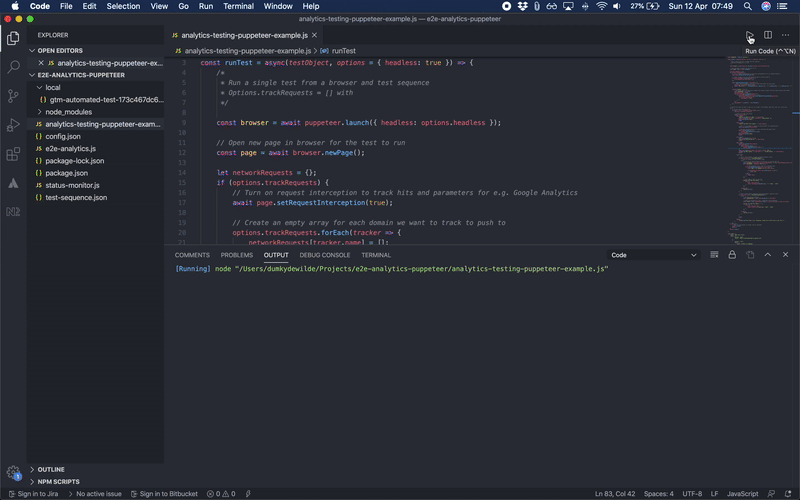

Testing your analytics setup regularly can help you prevent uncomfortable situations with your boss or client when there's been another change on the site and suddenly all your campaigns and goals have zero conversions. I [recently wrote about testing your analytics setup with Cypress](https://www.dumkydewilde.nl/2020/04/analytics-and-tag-testing-with-cypress/) as part of the development process. This time however, we will look at how to test the actual requests that are being sent to Google Analytics, Facebook, or any other place you have your tags pointed at.

To do that we have to automate the browser experience a user has with a 'real' browser. [Puppeteer](https://developers.google.com/web/tools/puppeteer) allows us to do just that. It's an automated version of Chrome that can run headless and serverless. In other words, all we need is a bit of JavaScript in a Google Cloud Function and we can run as many tests as often as we want. Puppeteer allows us to navigate, click, type and basically do anything we want a browser to do without the need for a display driver (unlike Cypress).



So let's get started with some testing! After a `npm install puppeteer` we can get started by launching a browser and opening a page as follows.

```javascript
const puppeteer = require('puppeteer');

(async () => {
    const browser = await puppeteer.launch({ headless: false });
    const page = await browser.newPage();
    await page.goto("https://www.dumkydewilde.nl")
    await page.screenshot({path: 'homepage.png'});
    await browser.close();
});
```

## Intercepting requests

This already gives us a lot to work with. We've set the headless option to false so we can see what's going on while we play around with Puppeteer. Now that we're navigating to a new page in our automated browser, we're also expecting that page to send one or more requests to Google Analytics. Luckily Puppeteer also allows us to intercept specific requests and check their parameters. Before the `goto` method we can intercept requests as follows.

```javascript
await page.setRequestInterception(true);
page.on('request', req => {
    const requestURL = req.url();
    if (requestURL.indexOf("google-analytics.com/collect") > -1) {
        console.log("Intercepted: " + requestUrl);
        req.abort();
    } else {
        req.continue()
    }
});
```

What we do here is that for every request that gets made, whether it's loading an image or getting data from an API, we check the origin of the request. If it contains the Google Analytics collection endpoint, we grab the request URL and abort the request —so we don't fill up our analytics with unnecessary noise. Else, we just continue the request as usual. Now the real interesting stuff for us in the request are the parameters that get send along. To extract those we'll use a simple function to turn them into a JavaScript Object.

```javascript
const requestUrlParamsToJSON = requestURL => {
    // Split request parameters and store as key-value object for easy access
    let params = requestURL.split('?')[1];
    return JSON.parse('{"' + decodeURI(params).replace(/"/g, '\\"').replace(/&/g, '","').replace(/=/g, '":"') + '"}');
}
```

We can then use that function to create a log of all the different requests with their parameters.

```javascript
    let GARequests = [];

    await page.setRequestInterception(true);
    page.on('request', req => {
        const requestURL = req.url();
        if (requestURL.indexOf("google-analytics.com/collect") > -1) {
            GARequests.push(requestUrlParamsToJSON(requestUrl));
            req.abort();
        } else {
            req.continue()
        }
    });

// Return the value of GARequests as part of the function we created earlier
return GARequests
```

Now we have an array of objects containing the parameters for each Google Analytics request that we can actually test for the data we want it to contain. To make our lives easier, we of course want to write a simple function for that. That function should allow us not just to look specific data but also allow for broad matches so we can check, for example, whether a product ID matches the product SKU format we use on our site.

```javascript
const requestMatchRegex = (requestsObject, testKey, testValue) => {
    try {
        const matchRegex = requestsObject.map(item => {
            // If the parameter exists, test for a matching value
            if (item.hasOwnProperty(testKey)) {
                const regex = new RegExp(testValue);
    
                if (item[testKey].match(regex) != null) {
                    return true
                }
            } else {
                return false
            }
        });
        
        return matchRegex.indexOf(true) > -1 ? "PASS" : "FAIL"
    
    } catch (e) {
        console.error(e);
    }
}
```

With this test function we can write simple automation test. For example if we fire a Google Analytics event with the name 'add\_to\_cart' we could do `requestMatchRegex(GARequests, "ea", "add_to_cart")`. But of course we could also be a bit more elaborate and say we want the first product ID in an ecommerce impression hit to match the following regular expression: `requestMatchRegex(GARequests, "il1pi1id", "[a-z0-9]{5}")`.

## Automating test instructions

This is all quite nice, but to really be able to automate our setup, we don't just need a few tests, we need instructions to tell our program what to do and when to test. A simple set of instructions to, for example, go to the GA Demo Store and start the checkout could look like this.

```javascript
{
    testName: "Demo Store Typing Test",
    steps: [{
            action: "goto",
            value: "https://enhancedecommerce.appspot.com/checkout"
        },
        {
            action: "click",
            element: "#start-customerInfo"
        },
        {
            action: "type",
            element: "#first_name",
            value: "Jason"
        },
        {
            action: "type",
            element: "#last_name",
            value: "Bourne"
        }
    ]
}
```

And test instructions for the test we did earlier could look like this.

```javascript
{
    "action": "test",
    "test": {
        "name": "Product Impressions on homepage",
        "description": "Check whether the first product's ID on the homepage matches the general format for product ID's",
        "for": "GoogleAnalytics",
        "type": "requestMatchRegex",
        "match": {
            "key": "il1pi1id",
            "value": "[a-z0-9]{5}"
        }
    }
}
```

Of course now that we have defined certain actions like "click", "goto", "type" and "test". We have to also make sure that we are able to distinguish the right course of action for those instructions in our program. To do that we can write a simple switch statement based on the instructions we feed into our program. So after launching the browser and opening a new page, we'll do something like this.

```javascript
// Execute the steps you want to take e.g. go to page, click element, type text, wait, etc. one by one
try {
    // Go over every step one by one
    for (let i = 0; i < testObject.steps.length; i++) {
        let step = testObject.steps[i];

        // Execute the right step action
        switch (step.action) {
            case "goto":
                console.log("### Go to page: " + step.value);
                await page.goto(step.value, { waitUntil: 'networkidle0' });
                await page.waitFor(1000);
                break;

            case "click":
                console.log("### Click element: " + step.element);

                // Wait for the element to appear on screen (useful for asynchronicity)
                await page.waitFor(step.element);

                // Use page.evaluate because it's more consistent than page.click()
                await page.evaluate((e) => {
                    document.querySelector(e).click();
                }, step.element);
                await page.waitFor(1000);
                break;

            case "wait":
                await page.waitFor(step.value);
                console.log("### Waiting for: " + step.value);
                break;

            case "type":
                await page.waitFor(step.element);
                if (step.clear) {
                    await page.evaluate((e) => {
                        document.querySelector(e).value = ""
                    }, step.element);
                }
                await page.type(step.element, step.value, { delay: 200 });
                console.log("### Typing '" + step.value + "' - on DOM element: " + step.element);
                break;

            case "test":
                requestMatchRegex(requestsObject[step.test.for], step.test.match.key, step.test.match.value);
                break;

            default:
                console.log("This step is not recognised, please use a valid step in your test.");
        }
    };
} catch (e) {
    // Make sure the browser is closed, even on time-outs 
    browser.close();
    throw e;
}
```

Of course this way it's easy to also distinguish different tests by type. We could not just check for requests, but also for objects in the dataLayer for example. And with our `test.for` we can distinguish requests to Google Analytics from, say, requests to Facebook.

This is of course only a start. You can think about where you want to pull your testing instructions from: in a file or from a database for example. You can also write the program to run from a Google Cloud Function and trigger it every day or maybe include it in a build process for your site. The possibilities are endless, but for now you can [find the full code on Github](https://github.com/dumkydewilde/analytics-testing-puppeteer/blob/master/analytics-testing-puppeteer-example.js) and also [ready for use as a cloud function](https://github.com/dumkydewilde/analytics-testing-puppeteer/blob/master/index.js).
