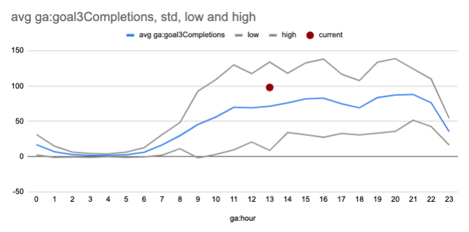

Whether it's because you don't want your business to lose money or because you just like to watch videos on YouTube, automating your analytics monitoring can help you sit back and relax knowing that everything's under control. This time we'll look at how a simple Google Sheet can help you check your analytics on the fly with the Google Analytics Real Time Reporting API.


The Google Analytics Real Time Reporting API allows you to get data in —you guessed it— real time, instead of waiting for up to 72 hours as is the case with the regular reporting API. Obviously we don't want check our Google Analytics views every 5 minutes, so we'll get a script to do it for us. There are a few tricky things to remember though.

- The Real Time API only has data for the last 30 minutes every time you call it
- Combining data from previous calls is not possible since you don't know which hits overlap in the results you get back from your calls to the API
- The Real Time API is still in limited beta as a 'developer preview' — so not intended for production use (yet).
- You will need a Google Cloud project and [request access to the API](https://docs.google.com/forms/d/e/1FAIpQLSc9OpoDGB3tBD7oy1OG9fyum8KBIxs-2ihPCsHp13WTnM-SSQ/viewform) via that project

That being said, we can still make a very useful monitoring application with it. To get to the end result we have to tackle the following issues.

- Access the Analytics Real Time API
- Get data in and out of our Google Sheet
- Monitor results from the Real Time API and decide if they make sense.
- Notify us when anything's wrong

## Accessing the Google Analytics Real Time Reporting API

Anytime you want to access a Google API like the Google Analytics Reporting API, you have to authenticate. This way Google makes sure you can only access what you're allowed to. Luckily when we use Google Apps Script in our Google Sheet all that authentication is happening behind our backs because we're already logged in to the big G ecosystem.

You can start a new script at `script.google.com` or in a Google Sheet go to Tools > Script Editor. That will open a new tab with a JavaScript editor that allows us to easily access all kinds of Google services like Analytics, Gmail, Drive, etc. If we want to access the GA Real Time API we can do so with a simple function.

```javascript
function getRealtimeReportData(profileId, metrics, options={}) {
  var tableId = 'ga:' + profileId;
  var results = Analytics.Data.Realtime.get(
    tableId, metrics, options);
    
  if (results.totalResults > 0) {
    return results.getRows();
  } else if (results.totalResults == 0) {
    return 0
  }
  else {
    throw new Error('No views (profiles) found');
  }
}

var results = getRealtimeReportData(12345678, 'rt:goal1Completions', {'dimensions': 'rt:minutesAgo'});

Logger.log(results);
```

There are a couple of things to point out. The `profileId` is the ID of a view you have access to. You can find the ID by looking in the view selector at analytics.google.com. Or by looking at the URL of your Google Analytics report where it will show up as the number after `p` like in `/a13456w123456p12345678/` where `a` is your account ID, `w` is the ID of the web property and `p` your view ID. The results you get back from the function are formatted as an array of arrays with the dimensions and metrics in the order you requested them. So for our example the result could be something like:

```javascript
[
[1, 5],
[2, 6],
[3, 4],
...
[29, 3],
]
```

For our example we're using Google Analytics goals, but you could also use events or pageviews. If you want to monitor transactions you'll have to tie it to a pageview or event as actual transactions need more time to process.

## Getting data in and out of our Google Sheet

Now that we can access the API we still need to process that data and make it easily accessible. To do that we need to take a few variables from our spreadsheet like the profile ID and the goal ID we want to check and return the results based on those variables in the same spreadsheet. Preferably we want to also be able to query multiple analytics goals.

We can access and set values in a sheet in two ways.

- Define a range, for example `[row 3, column 2, 5 rows, 5 columns]`. Note that we define the starting row and column and then the total number of rows and columns of the matrix.
- Name our (selected) range by right clicking on a cell and entering a name in 'Define named range'.

In our script this will look like this.

```javascript
// Get the sheet to which the script is tied; SpreadsheetApp is the default object for accessing the Google Sheets service.
var sheet = SpreadsheetApp.getActiveSpreadsheet();

// Get a range by its index (the sheet index starts at 1, not at 0)
var byIndex = sheet.getSheetByName('Sheet1').getRange(3,2,5,5).getValues();

// Get a range by its name
var byName = sheet.getRangeByName('email').getValue();

// To write a value to our sheet we can just do
byName.setValue('my@email.address');
```

## Monitoring Real Time Analytics Results

To actually make sense of the results we get from the real time API we have to think about when we want to create an alert. The number of goal completions in itself is meaningless. And even goal completions per minute for the last half hour doesn't really mean anything. Maybe if it's zero? But then it only works on sites with a large audience or goals that aren't too specific. What if we compare it to the previous call we did to the real time API? That could be interesting if, say, we poll the API every 30 mins or every hour.

Of course to really get a baseline, we'll need to have some historical perspective as well. For this application I decided to go with the regular analytics reporting API to get historical data to compare our measurement against. There are a gazillion ways to do [anomaly detection](https://en.wikipedia.org/wiki/Anomaly_detection) and you can add as much machine learning as you like to the mix —or just add statistics and call it machine learning. I decided I wanted to take a few things into account for my alerts.

- I shouldn't get too many alerts so they don't become meaningless or end up in my spam, i.e. the anomaly detection shouldn't be too sensitive.
- Considering that my audience in this case is from a specific time zone, I wanted to take into account the 24-hour cycle of website traffic
- I didn't care as much about weekdays vs. weekends in this case, but maybe you do if you have business users for example.
- I don't want to take too long of a look-back window as that might downplay trends that have been happening in the past few days that can wreak havoc (e.g. a recent spike in traffic can be discounted when comparing to averages or standard deviations over a 6-month period).



The above graph shows you a simple example of how a sample at a certain point in time can have different consequences (so make sure you also double check your time zone settings). In this case it falls within the normal bounds, but if we had the same measurement at say, 3am, we 'd want to create an alert.

First of, we need to also be able to get the historical data in.

```javascript
var CONFIG = {
  // Set configuration defaults based on the sheet
  nDaysHistorical: sheet.getRangeByName('nDaysHistorical').getValue()
};

function getHistoricalReportData(profileId, metrics, options={}) {
  var tableId = 'ga:' + profileId;
  var results = Analytics.Data.Ga.get(
    tableId, getLastNdays(CONFIG.nDaysHistorical + 1), getLastNdays(1), metrics, options);

  if (results.totalResults > 0) {
    return results.getRows();
  }
  else {
    throw new Error('No views (profiles) found');
  }
}

function getLastNdays(nDaysAgo) {
  // Simple helper function to get the right date format for GA
  var today = new Date();
  var before = new Date();
  before.setDate(today.getDate() - nDaysAgo);
  return Utilities.formatDate(before, 'GMT', 'yyyy-MM-dd');
}
```

This allows us to get data for a period up to a day ago. I choose not to include the current day as often the data for the current day can be delayed. You want to make sure you're not too dependent on the last few days in case the data processing is delayed, but depending on the amount of traffic you have for your goal 7-28 days of data or so should be fine.

Now we get to the actual processing and combining of all the data.

```javascript
// Defaults & Options
var CONFIG = {
  firstDataRow: 10,
  totalDataRows: 20,
  firstDataColumn: 2,
  totalDataColumns: 13,
  profileId: sheet.getRangeByName('profileId').getValue(), // The id of the GA view you want to monitor
  nDaysHistorical: sheet.getRangeByName('nDaysHistorical').getValue(),
  emails: sheet.getRangeByName('emails').getValue().split(","), // The id of the GA view you want to monitor
};

function main() {
  try {
    currentTime = new Date();
    
    // Get data rows from the sheet
    var rowsToCheck = sheet.getSheetByName('Overview').getRange(
      CONFIG.firstDataRow, CONFIG.firstDataColumn,
      CONFIG.totalDataRows, CONFIG.totalDataColumns).getValues();
    
    rowsToCheck.forEach(function(r, i) {
      var newRow = r; // create a new row with the same size
      
      // r[0] is the first column and contains the goal ID
      if (r[0] > 0) {
        var goalMetric = "goal"+r[0]+"Completions";
        var rtData = getRealtimeReportData(CONFIG.profileId, "rt:"+goalMetric);
        
        // For historical data we also want to consider the day and time of day for comparison 
        var histData = getHistoricalReportData(CONFIG.profileId, "ga:"+goalMetric,{'dimensions': 'ga:date, ga:hour'});     
        
        // Create a seperate array with only results for the current hour / time of day
        var currentHourResults = histData.filter(function(x) { return parseInt(x[1]) == currentTime.getHours() });
        
        // Remember, each row from the result is an array with [date dimension, hour dimension, goal completion metric]
        var avg = histData.reduce(function(agg, cur) { return agg+parseInt(cur[2]) }, 0) / histData.length;
        var avgHour = currentHourResults.reduce(function(agg, cur) { return agg+parseInt(cur[2]) }, 0) / currentHourResults.length;
        
        // Calculate the standard deviation to create upper and lower bounds (mean +/- 2 times the standard deviation)
        var std = Math.sqrt(histData.map(function(x) { return Math.pow(x[2]-avg,2) })
                                .reduce(function(agg,cur) { return agg+cur })/histData.length);
        var stdHour = Math.sqrt(currentHourResults.map(function(x) { return Math.pow(x[2]-avgHour,2) })
                                .reduce(function(agg,cur) { return agg+cur })/currentHourResults.length);
        
        newRow[6] = avg;
        newRow[7] = avgHour;
        newRow[8] = std;
        newRow[9] = stdHour;
        
                
        
        if (r[1] !== "") { // If a value from the last check is present move it to the 'last observation' column
          newRow[2] = r[1];
        }
        
        newRow[1] = rtData;  
        
        // Tests (+/- 2* STD / hour)
        newRow[11] = parseInt(rtData) < avgHour+2*stdHour || parseInt(rtData) > avgHour-2*stdHour;          
        
        sheet.getSheetByName('Overview').getRange(
          CONFIG.firstDataRow + i, CONFIG.firstDataColumn,
          1, CONFIG.totalDataColumns).setValues([newRow]);
      }
    });
 
    sheet.getRangeByName('lastRun').setValue(currentTime.toDateString());

  } catch(error) {
    Logger.log(error.message);
  }
```

## Setting up notifications

Now that we have our script up and running all that remains is to make sure we get notified when something's off. Google Apps Script has a handy `MailApp` object. It's not quite the same as the Gmail API, because it can only send mail and not read your mail, but that makes it easier to use and requires less permissions. The result of whether our check is within the bounds of what we accept is in index 11 of the row array we created above, so creating an alert is as simple as checking whether that's true or false.

```javascript
        if (newRow[11] == false) {
          // Alert!
          CONFIG.emails.forEach(function(email) {
            MailApp.sendEmail(email, "Alert for Goal " + r[0] + " on account " + CONFIG.profileId, sheet.getUrl());
          });
        }
```

And that's it really. There's a lot more to improve upon, but this should give you a basis to get started with monitoring your Google Analytics setup in real time. A couple of final remarks:

- You can set up triggers for your script to run (e.g. every hour) in your project settings at script.google.com. If you don't rung it every five minutes you should be more than fine in terms of quotas and limits.
- You can create a simple button to click and run the script from the sheet by going to Insert > Drawing in the sheet and then right clicking the object you've made to attach the script function `main` to it.

_You can [view the sheet and make your own copy here](https://docs.google.com/spreadsheets/d/1y1eXQAxR9VOg6wGKHbfKt6abpixF-gmaDgsyKYE66AY/edit?usp=sharing)._
