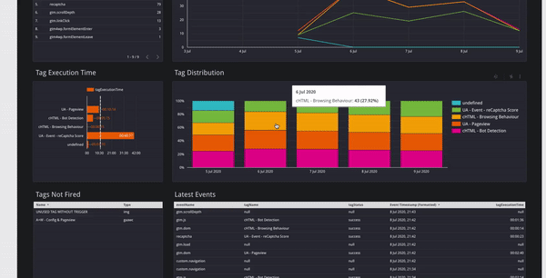
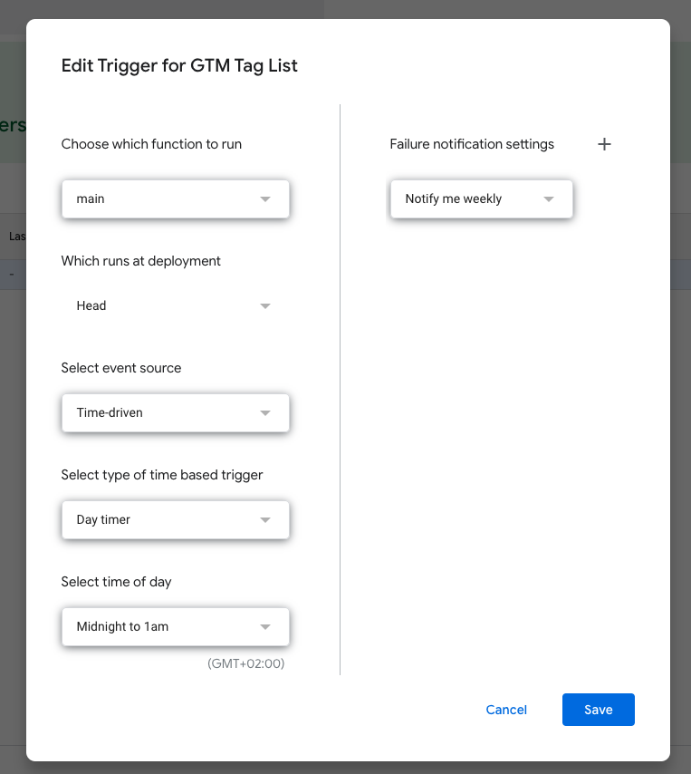
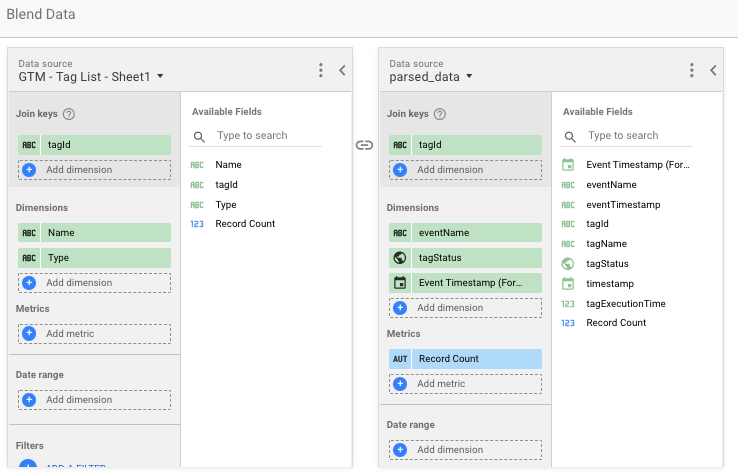

Do you know if all your tags are used in Google Tag Manager or if you can remove some? Do you know if they work for all your users? Or if they fire on the right dataLayer events and how long they take to execute? Follow along for a complete solution to monitor your Google Tag Manager implementation [including a dashboard](https://datastudio.google.com/u/0/reporting/3f3c1024-3646-42ae-8589-8666b2113557/page/2EuWB). Tag monitoring will allow you to understand if important tags are actually firing for real users on your site and see when they break down.



This solution relies heavily on [Simo Ahava's and Mark Edmondson's post on building a tag monitoring solution](https://www.simoahava.com/analytics/google-tag-manager-monitor/). It uses Google Tag Manager, GTM Custom Templates, Big Query, Google Sheets and a Data Studio dashboard. We'll make things a little bit easier though, and also make sure we can also measure which tags are _not_ firing. We need the following components to make everything work.

- A [custom template](https://tagmanager.google.com/gallery/#/owners/gtm-templates-simo-ahava/templates/google-tag-manager-monitor) to send tag information to a receiving endpoint
- A 'receiver' to handle the tag information being sent.
- A Big Query database to store the information
- A Google Sheet (or Big Query database) to store all the tags present in the current version of your tag manager container
- A dashboard for analysis

I won't go over the first three parts, as that's handled brilliantly by Simo and Mark in their article, but I will add a quick solution to figure out which tags are not actually firing. To do that we'll open up an empty Google Sheet and open up a new Apps script under Tools > Script Editor.

In the script editor we get easy access to the Google Tag Manager API without too much authentication hassle. Now all we have to do is get the live version of your container and read out all the tags and their ID's to match them with the input from our Big Query table.

```javascript
// CONFIG
const gtmContainerPath = 'accounts/**YOUR_ACCOUNT_ID**/containers/**YOUR_CONTAINER_ID**';

function main() {
  const sheet = SpreadsheetApp.getActiveSpreadsheet();
  
  // Retrieve the live container
  const liveVersion = TagManager.Accounts.Containers.Versions.live(gtmContainerPath);

  // Grab only the necessary information
  const tagList = liveVersion.tag.map(t => {
            return [t.tagId, t.name, t.type]
             });
  
  // Set headers
  sheet.getActiveSheet().getRange(1, 1, 1, 3).setValues([["tagId","Name", "Type"]]);
  
  // Fill the tag list
  sheet.getActiveSheet().getRange(2, 1, tagList.length, 3).setValues(tagList);   
  
}
```

Next up we set up a trigger in our Apps Script project to fire every day (or more often if you change your tags that much). This way we'll always have an up to date list.



Now we can head over to our dashboard and join the data together based on the Tag ID. By doing this we can see which tags are present in the list, but not in the Big Query dataset containing data from live users.



Of course this is just a start. If you want a more robust solution it'd be perfect to actually also do this on Google Cloud. You can set up a Cloud Function to query the tags list and store them in Big Query partitioned by day so you know which tags to expect in which date range.

Now we have [a beautiful dashboard](https://datastudio.google.com/reporting/3f3c1024-3646-42ae-8589-8666b2113557) to keep track of our tags and especially the ones that have fallen through.
