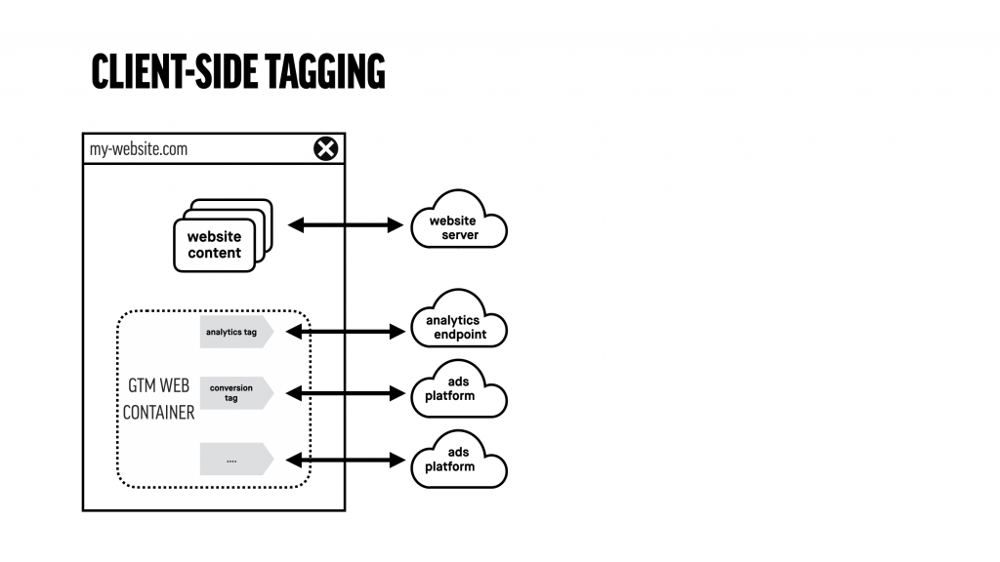
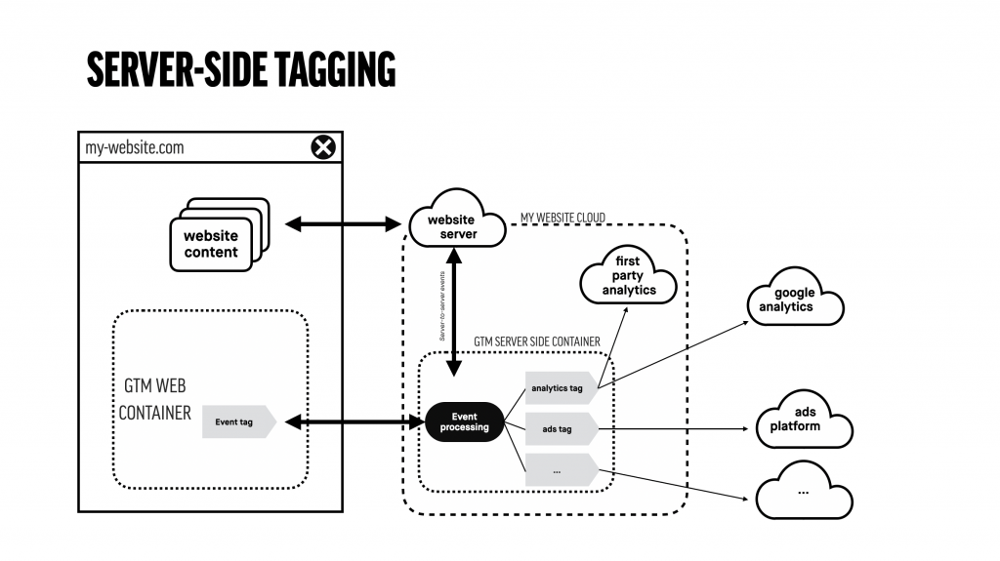
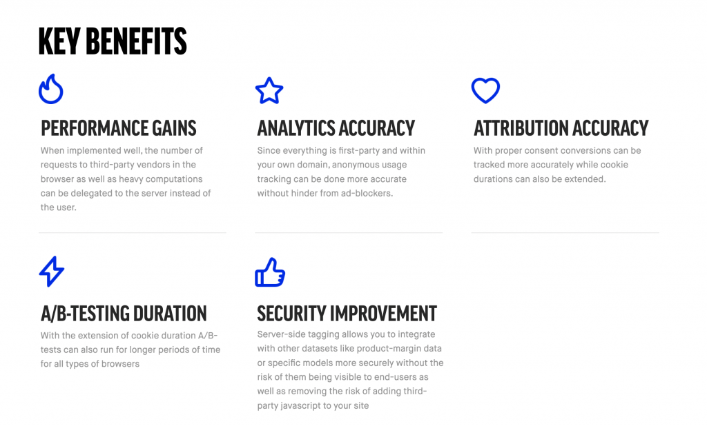

Just a few days ago Google released a new version of their tag management system: Google Tag Manager Server-Side. Here’s why it’ll have a massive impact on analytics, advertising, A/B-testing, privacy and Google’s own cloud solutions. But first things first. What on earth is server-side tagging and why do I need it?  
  
Tagging, the practice of adding small pieces of script and code to your website for —mostly— advertising and conversion tracking, has mostly been done by adding all that code to the website itself. A tag management system (TMS), like Google Tag Manager, Tealium, or Tag Commander makes this very easy for the marketing department because your developers only have to add the code for the TMS once and the rest is handled within the TMS interface by marketeers. In fact it has been so easy that most ecommerce websites are riddled with hundreds of lines of script from Facebook, Google, LinkedIn, Criteo and all other major advertising platforms, with Google Tag Manager (GTM) being the weapon of choice for most marketeers.  
  
Not only is this detrimental to the user experience because it can massively increase load times, it can also be a huge security and privacy trap for both end users and companies. Google Tag Manager Server-Side is about to end that. When implemented well it can increase the accuracy of your analytics and conversion tracking, the reliability of A/B-testing and personalisation and help you with retargeting users who have consented to share their data with you, and all of this at minimal costs. When implemented poorly it’s expensive and a huge black box for privacy.  
  
So how can this work in practice? With GTM server-side, instead of sending lots of data and cookies to multiple vendors when a users adds a product to their cart, you send only one hit to your own server which Google will help you setup with one click on their Google Cloud Platform (GCP). This hit contains information about the event (add-to-cart) but potentially also about the user’s consent or identifiers from other platforms (e.g. Facebook or Google). This way the server has enough information to send everything onward to these platforms for conversion tracking without polluting the user’s browser —and yes that means it can also be a huge blow for online privacy because ad blockers lose their magic. On the plus-side though, the site is no longer loading cross-site javascript from vendors, but only sharing data that is deliberately chosen.

Server-side tagging solutions have been around for a while. Tealium and Segment are the first examples that come to mind. What’s revolutionary about GTM server-side though is the flexibility and ownership that you get. You can fully manage the container itself on your server or platform of choice, map everything to your own domain (even the loading of Google Analytics or GTM for web), fully customise how you handle incoming events from a multitude of sources, and all of that at the price of running a production server (~€100-200/month for most sites). Too good to be true? Well, consider that Google’s aim is to get more people on their cloud platform and if you’re ok with that you should be good.

