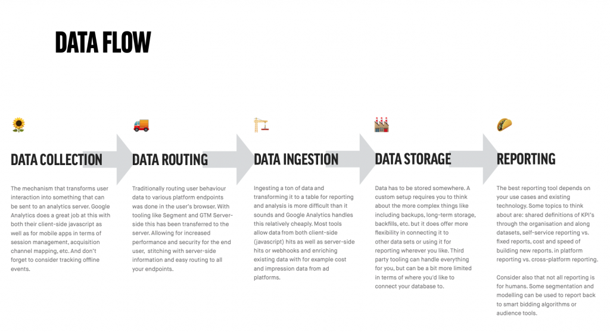

When we think of analytics we think of tools like Google Analytics, Mixpanel or even Tableau or PowerBI. But analytics is not just a tool. When we understand the mechanisms behind these tools we are ready to see what each of them brings to the table and how they might solve the problems for the unique snowflakes that we are.

I'm known for being abstract and longwinding —blame the MA in philosophy— so let me try to break down what I mean by 'understanding the mechanisms'. If we take a tool that we're all familiar with like Google Analytics, we see that it does a few things at once that can potentially be done in other ways. It:

- collects data on your website with a little script
- sends it to a server for ingestion and processing
- stores it in tables with a specific schema
- formats it into neatly formed reports ready to be consumed by hungry C-level executives all over the world

Those interchangeable parts —collection, storage, visualisation, etc.— are mechanisms that serve a specific purpose to facilitate added value for the business or individual running GA. Now let's take a look at what each of these steps does and what you should take into consideration when choosing the right tool for the job.

## 1\. Data Collection

Data Collection is the mechanism that reads any kind of change or information and sends it as an event or property to an endpoint for processing. This can be any kind of user interaction, but also non-user interactions like page load times or even non-browser events like making a restaurant reservation in person. Different sources will require vastly different types of trackers.

We tend to forget that a lot of data processing is actually done by the collector before it even gets ingested by an endpoint. Usually this is a good thing because often this helps us avoid unwanted data. Consider these situations and think about the role of a tracker or data collector and if the behaviour is what you want.

- The Google Analytics tracking script uses JavaScript, so anything that doesn't use JavaScript is (usually) not tracked. That includes for example the "bot" that generates link previews for Twitter, a 'read later'-tool like Pocket as well as potentially screen readers for the visually impaired.
- The HotJar tracking script allows you to track user interaction on such a level that you can replay mouse movements of individual users. What type of tracking is necessary to facilitate that and how does the tracker make sure that the user's network is not overloaded with data?
- For industrial machinery (e.g. a CNC-mill) there are usually a lot of sensors to monitor the state of the machine. These sensors generate massive amounts of data every second. What happens when we send all that data over a network and what kind of processing and monitoring can we already do in the sensor itself?

As you can see different types of analytics require different types of data collection and the role of the tracker or collector must not be underestimated. Often times analytics tools come with their own collectors (be it scripts, APIs or SDKs) as these have to closely match the requirements of the endpoint that does the actual data ingestion. Often times there are also generic collectors, e.g. to allow for tracking changes through web hooks, and sometimes you can use an existing collector for a different purpose —e.g. using the Google Analytics collector to send hits to Snowplow.

## 2\. Data Routing

The process we described above for Google Analytics was pretty straightforward. Although according to every SaaS-description ever made your favourite tool will likely be able to both generate reports _and_ launch rockets into space simultaneously, in real life a tool never stands on its own. Analytics tools are almost always part of a bigger landscape. To facilitate the peaceful co-existence of tools we've invented tag managers. Tag management systems solved one problem —the fact that marketing and IT departments couldn't communicate very well— but created another one: a portal to utter chaos, unfettered access, and years of undocumented bloat and legacy.

Data routers solve both of these problems by allowing you to use a single data collector and then dispatch incoming events to whatever endpoints you please. This allows you to minimise the load for the end user visiting your website while at the same time giving you a centralised place where you can enforce standards and definitions for your data, like naming conventions for example. Segment and Google Tag Manager Server-Side are some of the better know data routing tools.

## 3\. Data Ingestion

A lot can go wrong at the point where data is ingested and wrangled into a database model. The number of requests your ingestion server has to handle depends of course on both the number of simultaneous users as well as the number of events for each individual user and the amount of data you're transmitting. There are so many small details to take care of:

- What if the connection with the user drops?
- Do events come in one by one or in batches? How do we handle batches?
- Are events processed as they come in or are they stored in a queue?
- How do we prevent (un)intentional abuse?
- Do we have to preserve the order at which events come in or not?
- How big can the event payload be? Why?
- How do we scale horizontally (geographically) and vertically (compute power)?

One interesting observation between the new Google Analytics 4 and the old (Google) Universal Analytics is in the design choices that where made for ingesting data. Universal Analytics has a lot of constraints on things like the size of product names or the way in which tables and dimensions can be combined. This is due to the fact that the entire tool creates efficiency in reporting and querying by building database schemas around the pageview. But the pageview is an outdated concept. You watching Netflix on your iPad and then continuing on your phone generates a ton of analytics data without ever generating a pageview in the traditional sense.

The new Google Analytics 4 allows for way more flexibility in the database schema —or rather the schema itself allows for that flexibility—, but the downside is that a lot of the reporting suffers from that flexibility. And we haven't even started talking about enriching data (like adding cost and impression data from marketing channels or adding product data for ecommerce sites) or allowing data from a variety of sources (apps, webhooks, SDKs) all the while guaranteeing a >99.99% up time. Trust me, building a data ingestion systems is not for the faint-hearted.

## 4\. Data Storage

You might think storage is easy: isn't everything just "in the cloud"? Well, here are some things to think about when you want to store a lot of data fast.

- If you have ~1000 visitors at the same time on your site, each generating ~50 events/minute, can you handle the 50.000 requests/minute?
- What if you also want to track very precise mouse movements and browsing behaviour like time on site or tabs open? Can you handle inserting 500 or 5000 events/visitor in your database?
- Do events have to be processed in the order they are received? Most likely not for web analytics, but they might be for certain transactions. What about losing certain events? Is that bad?
- Is the incoming data structured or unstructured? Are all parameters known beforehand or are there user generated parameters for example?

There are a dozen different types of commonly used databases that you can pick from. Some have strict schemas they enforce, some are NoSQL, document-style databases that allow any kind of input. Some allow streaming inserts for events coming in, others only allow updates in batches. Some are consistent all the time, while others are 'eventually' consistent, meaning there can be a period in which reading a record from the database after an update will not give you the updated record.

Let's give an example of that and at the same time show you why one might need so many different databases. Picture the YouTube like button of a recent video you watched that was popular. There's a good chance that the number of likes you see next to the button is different from the number of likes someone else will see next to that button. And when actually click the thumbs up there's a chance you won't even see the actual number of likes at that point in time. Why? Just consider what a database has to handle if every person watching requests the number of likes for that video. There are databases that can handle this, because they are optimised for many reads and little writes. That comes at a cost however, and that cost is 'eventual' consistency instead of just 'consistency'. In other words, the writes and reads to the database may not be processed in the order that they are received in.

That brings us to our next question for data storage: querying. Like the example above, reading and writing to databases are two entirely different things and interestingly for analytics databases there can be both an enormous load on the writing and insertion side as well as on the reading side. Especially for time-series data like analytics data, you have to consider the amount of detail you want to be able to read, because when you start comparing year over year for example the amount of data that needs to be processed can be humongous.

To solve that problem we can aggregate certain data. For example we can aggregate by minute or hour or day and have default reporting tables for those aggregations. Default aggregations also means faster reporting because the aggregation can happen in the background and not at query time. Of course we can also aggregate by country or device type or other kind of grouping. And if that doesn't solve our needs we can still query those 83 zetabytes of data for our year over year comparison by nano-second of the day. Just make sure to cache the queries so you don't have to read the entire database again when you run the same query.

## 5\. Visualisation (or Reporting)

Getting from numbers to something that is [a meaningful and impactful visualisation](https://www.dumkydewilde.nl/2017/01/tutorial-in-4-stappen-van-data-naar-visuele-impact/) is never straightforward. What works in one situation might not work in the next one. One of the big benefits of a tool like Google Analytics (and some of the other analytics tools out there) is that they have a few specific use cases (e.g. e-commerce) and they have the right metrics and visualisations to match those use cases. That means that if you fit the use case you're in luck, but if you don't you need to find a different way to visualise your metrics.

Those metrics themselves, by the way, are also the end product of some choices. Just consider [the definition of a session in Google Analytics](https://support.google.com/analytics/answer/2731565?hl=en). There are a lot of assumptions in there (new UTM tag equals new session) as well as some quirks (when the clock strikes midnight, new session). Nonetheless, a session can be a useful and meaningful concept to aggregate usage statistics: no one likes looking at raw timestamp and event data.

## The right tool for the job

Now that we've distinguished the different roles an analytics tool can play, you might see how different tools accomplish different goals. To give you an idea:

- **[Segment](http://segment.com)**: collection, ingestion, routing (and temporary storage)
- **[Google Analytics](https://marketingplatform.google.com/about/analytics/)**: collection, ingestion, storage, routing (google ads only) and visualisation
- **[Adobe Analytics](https://www.adobe.io/apis/experiencecloud/analytics.html)**: collection, ingestion, (some) routing, and visualisation
- **[Google Tag Manager Server-Side](https://developers.google.com/tag-manager/serverside)**: routing only
