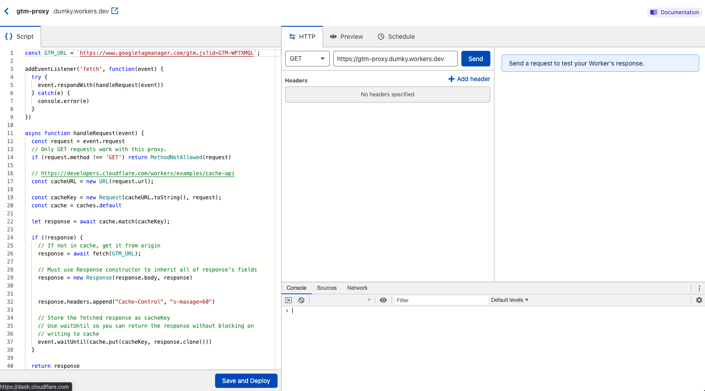
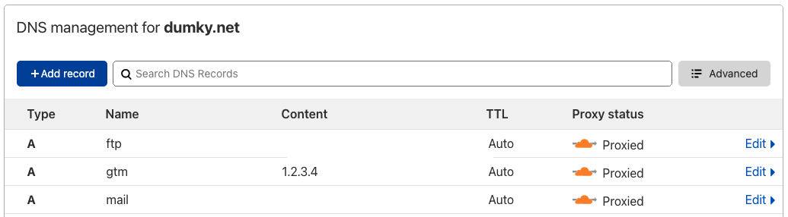
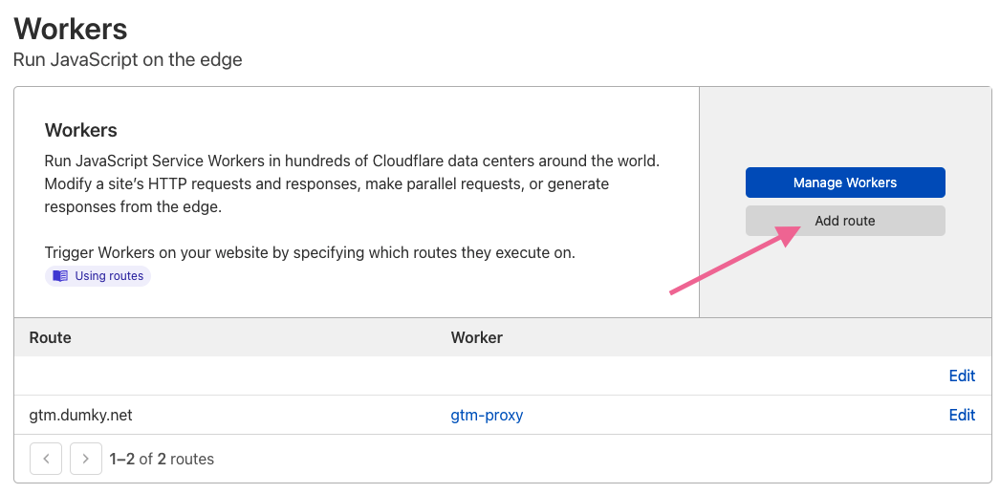

"Google Page Speed says GTM is slowing down my site, can we remove it?" I've lost count of how many times I've heard that. I wrote about [some best practices to improve performance](/posts/8-ways-to-optimise-google-tag-manager-gtm-for-speed-and-performance/#server-side) before, but let me show you how to use GTM and still get that coveted [100/100 score on Google Page Speed Insights](https://developers.google.com/speed/pagespeed/insights/?url=https%3A%2F%2Fwww.dumky.net%2F&tab=desktop). We'll do so by setting up a proxy with a cache and serve Google Tag Manager from that cache instead of from the (slower) Google Tag Manager servers. This has two benefits:

- **It can be as fast as we want.** In this case we are using Cloudflare —more on that in a bit— which has data centres all over the world (more than Google) and is focussed on delivering content as fast as possible.
- **It is more secure.** We will use our own subdomain `gtm.my-domain.com` to point to the exact location of our GTM container. That means the site can not, for example, be manipulated to use a different GTM container for a cross-site scripting attack. (If you're into CSP's, it means [you don't have to add the GTM domain to your CSP](https://www.dumky.net/posts/using-gtm-with-a-content-security-policy-csp-and-impress-your-devops-team-in-the-process/))


## What's a proxy anyway?

Normally with the GTM script, we load the GTM container from a URL that points to `[www.googletagmanager.com](http://www.googletagmanager.com)` . Google's servers are very fast, but they also have to account for the fact that you want instant updates when you publish your container and they have to decide how to distribute your container script across the globe. In contrast Cloudflare is a service that helps you protect your site from attacks, manage traffic as well as serve content as fast as possible. It's free for most low traffic (personal) sites. Cloudflare also has way more data centres than Google, so chances are your users are closer to a Cloudflare data centre than they are to a Google data centre. And shorter distances mean faster load times.

Cloudflare, like a lot of other content delivery networks (CDN's) offers options to cache data. But they also offer the option to point your own domain to a so-called 'Worker' in their data center. A worker is basically a little piece of JavaScript that can do some magic in between requests. So when someone requests our `[gtm.my-domain.com](http://gtm.my-domain.com)` that URL will point to our worker and our worker will do the hard work of checking whether our container is available in the cache or if it has to be requested from `[www.googletagmanager.com](http://www.googletagmanager.com)`. And that's exactly what a proxy does.

If you're using Google Tag Manager server-side, there is actually a function that helps you serve the GTM container by using your GTM server-side domain as a proxy. That's great for security, however if you're looking for speed, you also need to make sure that your own servers are fast enough to handle the load and you're still not caching the actual GTM container.

## Let's build a Proxy with Cloudflare Workers

To make our plan work we need to complete a few steps:

1. Build a Cloudflare worker that can return a GTM container
2. Cache the GTM container for 10-60 seconds so it can be served faster while still allowing near real time updates.
3. Set up a subdomain to serve our GTM container from
4. Map the subdomain to the worker
5. Update our GTM snippet to serve the container from our subdomain

### 1. Building a Cloudflare Worker to return a GTM container

If you have a Cloudflare account, you can go to the Workers Overview to create a new worker. This will give you an area to add your script as well as test and debug it. If you deploy your worker, you'll get a URL on the worker domain that you can use. Mine is `[gtm-proxy.dumky.workers.dev](http://gtm-proxy.dumky.workers.dev)` for example.



I'm not going to pretend I'm a genius developer. I've used a few of the examples from the Cloudflare worker documentation that show you how to use a worker to [respond with another site](https://developers.cloudflare.com/workers/examples/respond-with-another-site)  and [how to use the Cache API](https://developers.cloudflare.com/workers/examples/cache-api). Those examples do exactly what we need, so I've combined them to serve our purpose.

```jsx
// Change to your own GTM container
const GTM_URL = `https://www.googletagmanager.com/gtm.js?id=GTM-WP7XMQL`; 
const CACHE_EXPIRY = 30; // cache timeout in seconds

// Listen to any incoming requests and apply our function
addEventListener('fetch', function(event) {
  try {
    event.respondWith(handleRequest(event))
  } catch(e) {
    console.error(e)
  }
})

async function handleRequest(event) {
  const request = event.request

  // Only GET requests work with this proxy.
  if (request.method !== 'GET') return MethodNotAllowed(request)

  // https://developers.cloudflare.com/workers/examples/cache-api
  const cacheURL = new URL(request.url);

  const cacheKey = new Request(cacheURL.toString(), request);
  const cache = caches.default

  let response = await cache.match(cacheKey);

  if (!response) {
    // If not in cache, get it from origin
    response = await fetch(GTM_URL);

    // Must use Response constructor to inherit all of response's fields
    response = new Response(response.body, response)

    response.headers.append("Cache-Control", `s-maxage=${CACHE_EXPIRY}`)

    // Store the fetched response as cacheKey
    // Use waitUntil so you can return the response without blocking on
    // writing to cache
    event.waitUntil(cache.put(cacheKey, response.clone()))
  }

  return response
}

// Use the following when the request is not a valid GET request
function MethodNotAllowed(request) {
  return new Response(`Method ${request.method} not allowed.`, {
    status: 405,
    headers: {
      'Allow': 'GET'
    }
  })
}
```

That also includes step 2 on our list so we can go straight to number 3.

### 3. Set up a subdomain to serve our GTM container

In order for the Cloudflare Worker to actually be able to use our subdomain we have to set it up in our Cloudflare DNS management. We need to create an A-record, a record that points to an IP address. "But I don't *have* an IP address!?" That's right. The Cloudflare Worker will intercept the request before it'll actually reach the IP address, so we need to set up a fake IP address like `1.2.3.4`.



### 4. Map the worker to the subdomain

Mapping the worker to the subdomain is as simple as just going to the workers tab in your Cloudflare dashboard and adding a route that says `[gtm.your-domain.com](http://gtm.your-domain.com)` and uses the `gtm-proxy` worker we created earlier.



### 5. Updating the GTM snippet

Lastly, we need to point the GTM snippet on our site to the new subdomain. That means we'll have to adjust the code a little bit. The normal code points to `[googletagmanager.com](http://googletagmanager.com)` + `GTM-CONTAINER-ID` + `dataLayer name`. 

```jsx
<!-- Google Tag Manager -->
<script>(function(w,d,s,l,i){w[l]=w[l]||[];w[l].push({'gtm.start':
new Date().getTime(),event:'gtm.js'});var f=d.getElementsByTagName(s)[0],
j=d.createElement(s),dl=l!='dataLayer'?'&l='+l:'';j.async=true;j.src=
'https://www.googletagmanager.com/gtm.js?id='+i+dl;f.parentNode.insertBefore(j,f);
})(window,document,'script','dataLayer','GTM-WP7XMQL');</script>
<!-- End Google Tag Manager -->
```

In our case we don't really need all that, so we can just change `j.src=
'https://www.googletagmanager.com/gtm.js?id='+i+dl;` in to `j.src='https://gtm.your-domain.com';`. We could even leave out the GTM container ID altogether and make it a bit harder to easily scrape it from our page. 

```jsx
<!-- Google Tag Manager -->
<script>(function(w,d,s,l,i){w[l]=w[l]||[];w[l].push({'gtm.start':
new Date().getTime(),event:'gtm.js'});var f=d.getElementsByTagName(s)[0],
j=d.createElement(s),dl=l!='dataLayer'?'&l='+l:'';j.async=true;j.src=
'https://gtm.your-domain.com';f.parentNode.insertBefore(j,f);
})(window,document,'script','dataLayer','GTM-XXXXX');</script>
<!-- End Google Tag Manager -->
```

And that's it! Turn it on and you'll have a blazingly fast Google Tag Manager container. 

## Final thoughts

Is it worth it, though? Well, that depends. You'll probably be able to shave off a few milliseconds, but the GTM servers are actually pretty fast already —I mean, they have to be, right? However, the added security benefit of being able to not have to include the googletagmanager.com domain in your [content security policy](https://www.dumky.net/posts/using-gtm-with-a-content-security-policy-csp-and-impress-your-devops-team-in-the-process/) and potentially allow other containers to be loaded is worth it for me.