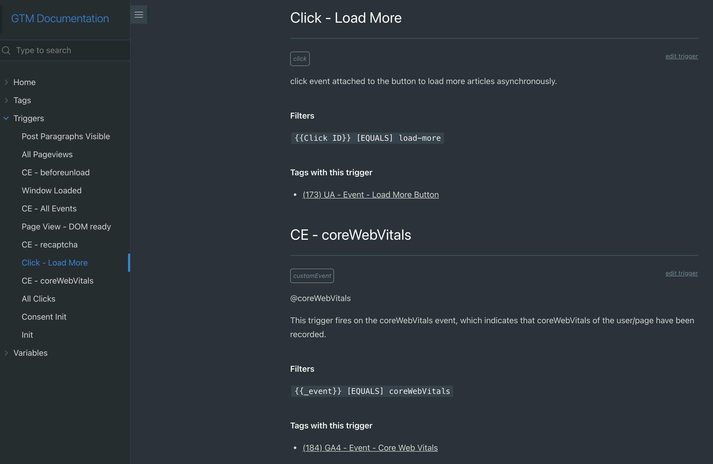
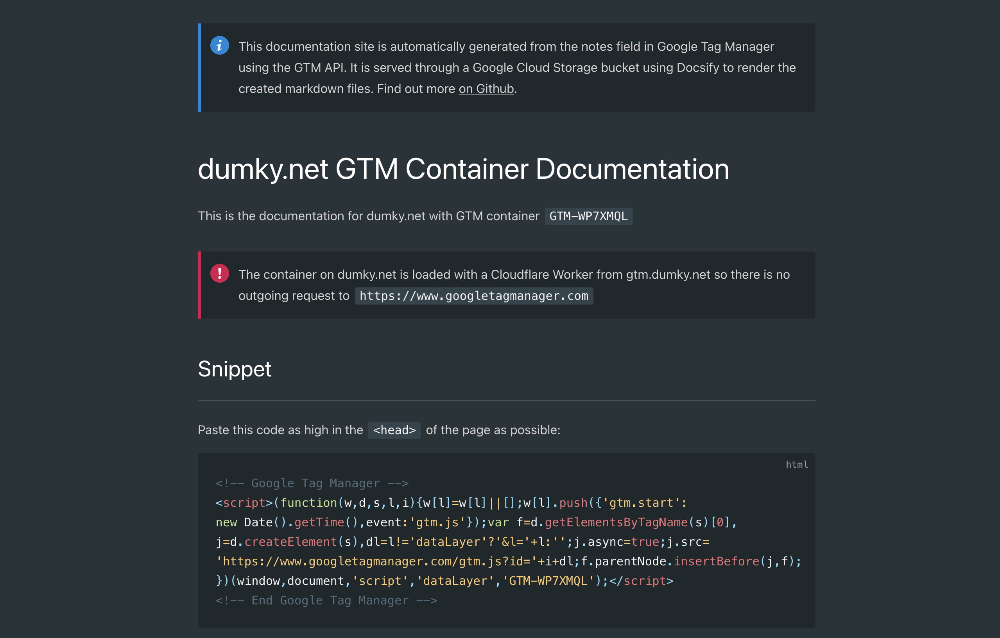

*If you're just looking for the code and a quick start, you can [find everything on Github](https://github.com/dumkydewilde/gtm-doctags) and you can find a live demo at [docs.dumky.net](http://docs.dumky.net).*

Google Tag Manager is a great tool when you first get to know it: you can finally track that button in Google Analytics without having to wait 6 months on your dev team, hurrah! But after a few years reality kicks in. Now you're three agencies and two interns in and your container is starting to show it: five similar looking pageview triggers, 300 tags of which half seems to. be for pages from before your website migration to a new platform and the other half for the agency you fired but that still pushed the tags for each of their unique display campaigns from DV360 to GTM.

So, you're looking for some structure, eh? Some guidance? Maybe some... documentation? You have a Google Sheet with a half-baked measurement plan, but it's outdated and no longer useful and it never contained all the tags in the first place. What you need is an intern who would just copy all the notes from your GTM container to a nice looking documentation site. WAIT WHAT?!? We can AUTOMATE that without an intern?

[](http://docs.dumky.net)

GTM has a neat feature called "notes" that's hidden behind the ominous three dots and that nobody ever seems to use. But what if we could leverage that to make it *actually* useful? Lucky for us, the notes field is exposed through the API so we can work our magic on it. Here's what we'll do to generate a beautiful documentation site for our container using [Docsify](https://docsify.js.org/) that always contains the latest version.

- Create a script that connects to the [Google Tag Manager API](https://developers.google.com/tag-manager/api/v2) and generates markdown files with the information we need
- Place those markdown files in a Cloud Storage bucket and enable that for static hosting
- Add a little magic called [Docsify](https://docsify.js.org/) to our Cloud Storage bucket
- Point our `docs.` subdomain to that bucket for easy access

Sounds good? Have a look at the [live demo](http://docs.dumky.net) or let's go build it!

## Using NodeJS to access the Google Tag Manager (GTM) API

The brains of our operation is a script to make ourselves practically useless by automating our job away (that's always good to strive for, just don't tell your boss and you'll have more time to spend on [Measure Slack](https://www.measure.chat/)). I won't go through it in full as you can [find the code on Github](https://github.com/dumkydewilde/gtm-doctags), but we'll do the highlight reel for the most important stuff.

Our script has two main purposes:

- Fetch all the data we need from the GTM API: tags, triggers, variables, folders, and of course, notes.
- Format the data in a way that we can render it on our documentation site. That means not just adding names, IDs and notes, but also adding fancy things like a 'pause' status for paused tags, add links to edit directly in GTM, and find out which variables and triggers are use where in the container.

### Authenticating and fetching data from the Google Tag Manager (GTM) API

First up is connecting to the API. This is easy if you've done it before —feel free to skip this part if you have— but can be daunting if you haven't done anything like this before. Basically we want to allow server-to-server access to our GTM container so our script can access the container independently. To make that possible we need one server to run our script —we'll use Google Cloud Functions here— and access to the GTM server through the API. For access to the GTM API we'll add a so called service account email address to our list of GTM users. This service account will have view access so it can get the details of our container, but not publish anything.

Take these steps to set everything up:

- Go to your (new) Google Cloud project on [console.cloud.google.com](http://console.cloud.google.com/)
- Search for the Google Tag Manager API on the [Marketplace](http://console.cloud.google.com/marketplace/product/google/tagmanager.googleapis.com) and enable it
- Go to 'Service Accounts' under 'IAM & Admin'. You can either use the existing App Engine default service account (`my-project@appspot.gserviceaccount.com`) or create your specifically for use with Google Tag Manager. If you choose the latter make sure to also add it to your Cloud Function permissions.
- Give the service account email address access to your GTM container in the GTM admin panel

Now your cloud function is able to access the GTM container, but it's nice to also be able to find out if everything works locally. I like to use Google Cloud Function framework. There's [a nice codelab from the big G](https://codelabs.developers.google.com/codelabs/local-development-with-cloud-functions#0) on how to set that up with the VS Code editor. You can then add use this line from `package.js` to just `npm start` your cloud function in your own console: `"start": "npx functions-framework --target=containerToMarkDown --signature-type=event"`

With everything setup we can start with the first few lines of code. Inside our asynchronous function we first authenticate with the service account and then fetch 

```jsx
const ACCOUNT_ID = process.env.ACCOUNT_ID;
const CONTAINER_ID = process.env.CONTAINER_ID;
const CONTAINER_PATH = `accounts/${ACCOUNT_ID}/containers/${CONTAINER_ID}`;

exports.containerToMarkDown = async(event, context) => {
				// Authenticate with readonly scope
				const auth = new google.auth.GoogleAuth({
            scopes: ["https://www.googleapis.com/auth/tagmanager.readonly"]
        });
        const authClient = await auth.getClient();
				
				// connect to the GTM API
        const tagmanager = google.tagmanager({
            version: 'v2',
            auth: authClient
        });

        // Get container details
        const containerVersionInfo = await tagmanager.accounts.containers.versions.live({
                parent: CONTAINER_PATH
            });

        // Get workspaces (for linking tags/triggers to edit in the latest workspace)
        const workspaces = await tagmanager.accounts.containers.workspaces.list({
            parent: CONTAINER_PATH
        });
...
}

```

### Creating a markdown file from the GTM API with NodeJS

In the code you'll see three functions that do very similar things:`getTriggerList()`, `getTagList()`, `getVariableList()`. They all return the necessary information for that specific part of the container which we'll then format into a markdown file. Let's take `getVariableList()` as an example.

```jsx
// Get the data structured based on the container and workspace data: 
const variableList = getVariableList(containerVersionInfo.data, workspaces.data);

// Format each variable 'v' into markdown with a few html <span>'s
const variableMD = variableList.map(v => {
	return `\n## ${v.name} :id=variable-${v.id}` + // Header (start with a newline just in case)
		
		// Get the type, folder and link to edit
    `\n*<span class="variable-type ${v.type}">${v.type}</span>* ${v.folder} <span class="edit variable link"><a href="${v.link}">edit variable</a></span>` +
		
		// Add our documentation from the GTM notes field
    `\n${v.notes}\n` +

		// If it's a custom javascript variable, format the code as javascript
    (v.type === "jsm" ? ("#### JS Content\n\n```javascript\n" + v.content + "\n```\n") : "") +

		// If it's a different variable type, just show the content/value
    (v.type !== "jsm" && v.content !== undefined ? ("#### Value\n`" + v.content + "`\n") : "")
	}).join("") // Turn the array into a string of text

// The storage object is the '@google-cloud/storage' package interface
await storage.bucket(STORAGE_BUCKET).file('variable/README.md').save(variableMD, (err) => {
    (err && console.error(err)) || console.log('succesfully uploaded variables file');
});
```

You'll see it's a little messy as we're mixing code and markup/style in one place, but it'll have to do for now. Of course we also have to do some gymnastics in our `get[x]List()` functions to actually get the data in a workable format. Let's look at some of the quirks of the GTM API.

### Working with the GTM API: finding folder names, firing triggers and variable values

First up, we need to match folder names to folder IDs as variables, trigger and tag entities only have folder IDs. We'll use a simple reduce function to create a mapping of `ID : Folder Name`

```jsx
const folderNames = containerVersion.folder.reduce((agg, cur) => {
        agg[cur.folderId] = cur.name;
        return agg
    }, {})
```

Next, one quirk of variables (and the API in general) is that all data types (e.g. dataLayer variable, custom Javascript, constant) have different names/keys for their "value". So we'll try and fetch any 'interesting' value and save that:

```jsx
variableValue = v.parameter.map(p => {
	if (p.key === "value" || p.key === "defaultValue" || p.key === "name") { 
		return p.value 
		}
  }).filter((p) => p !== undefined)[0]
```

Similarly for triggers we can have different types of filters (e.g. when you filter on page path or custom dataLayer event name), so we'll filter differently for `customEventFilter` and `autoEventFilter.`

```jsx
const filterInfo = (t) => {
	if(Object.keys(t).indexOf('filter') > -1) {
	  return t.filter.map(f => {
	    return `${f.parameter[0].value} [${f.type.toUpperCase()}] ${f.parameter[1].value}`
     }).join(",\n")

	} else if (Object.keys(t).indexOf('customEventFilter') > -1) {
		return t.customEventFilter.map(f => {
			return `${f.parameter[0].value} [${f.type.toUpperCase()}] ${f.parameter[1].value}`
		}).join(",\n")

	} else if (Object.keys(t).indexOf('autoEventFilter') > -1) {
		return t.autoEventFilter.map(f => {
			return `${f.parameter[0].value} [${f.type.toUpperCase()}] ${f.parameter[1].value}`
		}).join(",\n")

	} else {
		return ""
		}
}
```

Finally one interesting thing for triggers is to find out where they are actually used as a firing (or blocking) trigger. To do that we have to —for each trigger— go through all tags, see if it has `firingTriggerId`'s and then add that tag to a list for that specific trigger. We can then add it to a formatted (markdown) list with the tag's name and ID. And with more time we can do the same for `blockingTriggerId`.

```jsx
return containerVersion.trigger.map(t => {
    const firingTags = containerVersion.tag.filter(v => {
    if (Object.keys(v).indexOf("firingTriggerId") > -1) {
        return v.firingTriggerId.indexOf(t.triggerId) > -1
    } else {
        return false
    }
});

const firingTagsPrettyList = firingTags.map(tag => {
	return `- [(${tag.tagId}) ${tag.name}](tag/?id=tag-${tag.tagId})`
}).join(",\n");
```

## Deploying and triggering our Cloud Function
While our script above can run from our test environment we obviously also want to deploy and schedule it. We can just use [the gcloud CLI](https://cloud.google.com/functions/docs/quickstart) (e.g. `gcloud functions deploy containerToMarkDown --runtime nodejs14 --trigger-http --allow-unauthenticated`) or use the web interface. I like [the web interface](https://console.cloud.google.com/functions/list) in this case as it'll be a one time thing only and it makes it easy to set runtime variables and select the deployment region. 

When we setup the cloud function, we'll also have to decide how to trigger it. As a very basic setup you could trigger it to run every day or even at set times every day. You can use Cloud Scheduler to do that by creating a new job (e.g. `0 */4 * * *` will run 4 times a day) and trigger a pub/sub topic that. You can then use that pub/sub topic as a trigger for your Cloud Function. But if you want something more fancy, you can also have a look at my [post on setting up a GTM status monitor](/posts/monitor-google-tag-manager-version-status-and-send-notifications-to-slack-the-easy-way-zapier-and-hard-way-gcp/ ) and have it run whenever there's a new version of your container.

## Sprinkling Docsify fairy dust over our markdown files
Now that the mechanics are out of the way, we can continue to the actual magic. Docsify is a documentation generator that consists of an `index.html` with some JavaScript to parse and render markdown files into a beautiful documentation site. It is not a static site generator like Hugo or Vuepress although you could use Docsify for server-side rendering if you wish. The problem with static site generators is that they require an extra step to generate the site —duh... 🤦‍♂️. In practice though, that means having an extra processing 'unit' and extra complexity (e.g. Cloudflare Pages, Netlify, Github Actions, ...). Docsify needs nothing more than a simple file server to run the site on (our Google Cloud Storage bucket in this case).

The `index.html` file itself is extremely small: some styles (not shown), a `div` element to hook onto, some settings and the docsify JS  with some plugins (search, theme)

```html
<body>
  <div id="app"></div>
  <script>
    window.$docsify = {
      homepage: "home.md",
      loadSidebar: true,
      subMaxLevel: 3,
      name: 'GTM Documentation',
      repo: '',
      search: 'auto',
      requestHeaders: {
        'cache-control': 'max-age=60',
      }
    }
  </script>
  <!-- Docsify v4 -->
  <script src="//cdn.jsdelivr.net/npm/docsify@4"></script>
  <script src="//cdn.jsdelivr.net/npm/docsify/lib/plugins/search.min.js"></script>
  <!-- docsify-themeable (latest v0.x.x) -->
	<script src="https://cdn.jsdelivr.net/npm/docsify-themeable@0/dist/js/docsify-themeable.min.js"></script>
</body>
```

In the `home.md` file you can also add some extra information about your container like the container snippet for example.



I encourage you to [look through the Docsify documentation and showcases](https://docsify.js.org/#/?id=docsify)!

### Enabling Google Cloud Storage for access

To finalise our Documentation site, we only need a few more steps. First up we need to go to the permissions tab in our Cloud Storage bucket and add `allUsers` as a so called principle and give the Cloud Storage viewer access. This will enable the bucket for public access.

Next, if you want to point a (sub)domain like [docs.example.com](http://docs.example.com/) to your storage bucket, make sure to name your bucket [docs.example.com](http://docs.example.com/) and point your CNAME (DNS) record to [c.storage.googleapis.com](http://c.storage.googleapis.com/). (that includes a `.` at the end). To edit DNS records you'll need access to the hosting admin panel for your website (e.g. Cloudflare). Google, again, has a nice overview on [how to set up hosting on cloud storage over HTTP](https://cloud.google.com/storage/docs/hosting-static-website-http) it is also possible to use HTTPS, but that requires adding a load balancer and certificates (i.e. more complexity).

> 👉  If you're playing around with static hosting on GCP Cloud Storage you might want to set `index.html` as the default page by clicking the three dots after your bucket in the bucket browser and clicking `Edit website configuration`. To see your changes appear live, you may also want to set the `cache-control` in the metadata of the `index.html` file (and other files) to something like `max-age=60` (i.e. one minute) instead of the default `max-age=3600`.


And that's it for now. If you want the full code, you can [find that on Github](https://github.com/dumkydewilde/gtm-doctags) and if you want to see the demo again, just browse to [docs.dumky.net](http://docs.dumky.net).