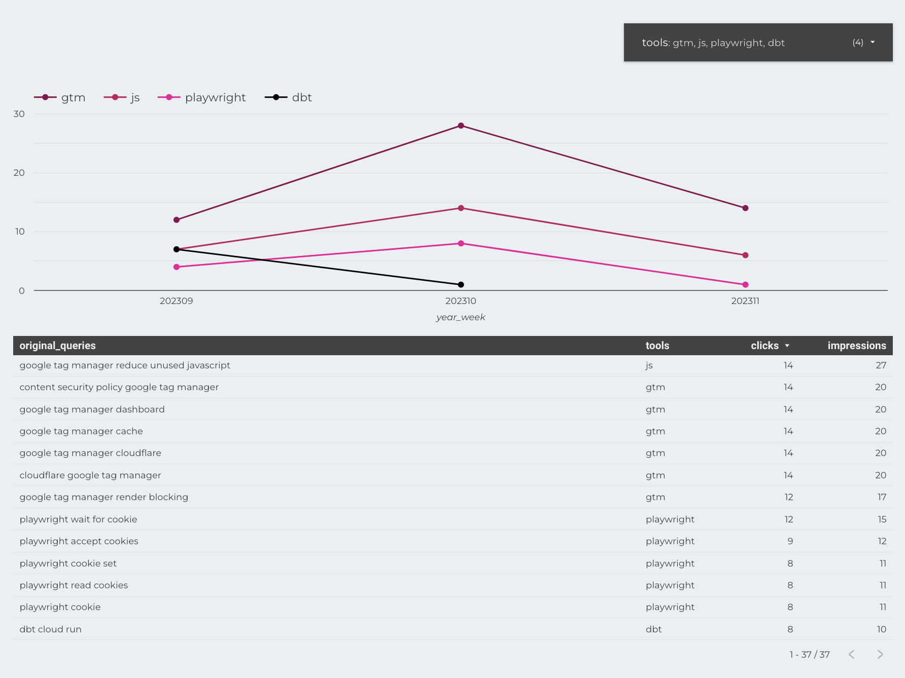
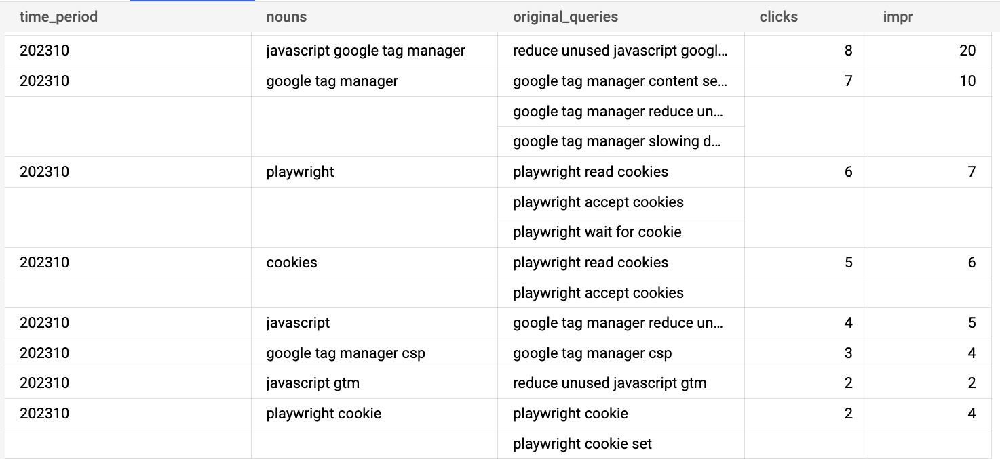

With the recent update to Google Search Console (GSC) allowing us to export search console data to BigQuery it becomes 
very easy to do some fun stuff. BigQuery has a ton of capabilities to process and slice data. To better understand the 
trends of certain topics over time, we'll extract those topics from the search queries directly so we can see how clicks
and impressions for those topics evolve over time. With a little bit of black magic —that's what some would call using 
JavaScript functions in SQL— we can make these crazy charts tracking topics and their underlying queries over time.
 


To get our project up and running we'll use SQL and a little bit of JavaScript along with the following steps.

1. Make sure our [Search Console data is exported to BigQuery](https://developers.google.com/search/blog/2023/02/bulk-data-export).
2. Create a custom SQL function to extract topics from text
3. Use those extracted topics to aggregate our search console metrics to see the evolution over time.

We'll skip the first step as Google does a better job explaining that then I can. But needless to say you'll need at 
least access to a domain in Google Search Console. So on to number two!

## Custom SQL function (UDF) for topic extraction
BigQuery (and some of the other cloud datawarehouses too) will allow you to write JavaScript directly into a custom 
function (UDF). That makes it really easy to do things that are usually are hard in SQL, like using `for` loops or
parsing JSON for example. Before we dive 🤿 into full-on text processing, let's look at a simpler example first. The 
following is a totally useless fuction —What, you don't need to know if the number of characters is odd or even on a 
daily basis?— but it does show some of the fun JavaScript stuff that would be really hard with SQL.

```SQL
CREATE TEMP FUNCTION even_odd_characters(arr ARRAY<STRING>)
RETURNS ARRAY<STRING>
LANGUAGE js 
AS 
r"""
return (arr || []).map((el, i) => {
    if (i === 1) {
      return "second item!" // Index based loops in SQL? ❌
    } else {
      return el.length % 2 ? "even" : "odd" // Ternary operator 🤯
    }
})
""";

WITH test_cases AS (
  SELECT NULL as s UNION ALL
  SELECT ['foo', 'bar', 'fizz', 'buzz', 'quetzalcoatl'] as s
)

SELECT
  even_odd_characters(s)
FROM test_cases
```

Simple enough right? You'll see that it doesn't handle JSON arrays properly, but handling that in JavaScript would be a
lot easier than it is in SQL. Now that you get the concept, young padawan, we can move on to the next step.

## NLP Topic Extraction with the JavaScript Compromise NLP library

Our text-processing function uses a [JavaScript library called compromise](https://github.com/spencermountain/compromise).
To use this library in our function we can just `npm install` it unfortunately. We'll have to upload it into a Google
Cloud Storage bucket from where we can reference it. We can do this with an `OPTIONS` statement. The Compromise library 
abstracts away a lot of the boring stuff but basically it is a lightweight approach to splitting sentences up into
parts, that is words or n-grams. Those parts will then get tagged as having a certain role within their context, what
we call part-of-speech (POS) tagging.

Using POS allows us to remove all the boring (stop)words and only focus on the more "interesting" words, that is the
words that are more meaningful in our context. Those are usually words like nouns, verbs, people, places, or 
organisations. All we need to do with Compromise is create a document (`doc = nlp(text)`) and define the tags we want
to retrieve and what output (e.g. `doc.nouns().out("array")`). 

```SQL
CREATE TEMP FUNCTION nlp_compromise(text STRING)
RETURNS STRUCT<nouns ARRAY<STRING>, verbs ARRAY<STRING>, topics ARRAY<STRING>>
LANGUAGE js 
OPTIONS (library="gs://<my-bucket>/js/compromise-13.11.4.min.js") -- v14 is not currently compatible with BigQuery RegEx
AS r"""
  const doc = nlp(text).normalize()

  return {
    "nouns": doc.nouns().out("array"),
    "verbs" : doc.verbs().out("array"),
    "topics": doc.topics().out("array")
  }
""";
```

## Applying text processing to Google Search Console data

To finish up our SQL query we will fetch the queries from our Search Console data. We don't need the country or device 
type for now so we'll group by month and query. After that we apply our NLP function and grab the nouns. By grouping by
those nouns we can then wrap all our original queries in an array so that we can later always see what the basis for
those nouns were. Of course now you will need to be aware of the fact that one query can have multiple nouns so you can 
no longer aggregate over the results of this query. Nonetheless you'll get an interesting insight into how 


```SQL
with query_data as (
    select 
        format_date("%Y%m", data_date) year_month, 
        query, 
        sum(impressions) impr, 
        sum(clicks) clicks 
    from `<MY_PROJECT>.searchconsole.searchdata_site_impression` 
    where clicks > 0 and query is not null
    group by query -- aggregate countries and devices
  )

select 
  year_month, 
  nouns, 
  array_agg(query) original_queries, 
  sum(clicks) clicks, 
  sum(impressions) impr 
from query_data, unnest(nlp_compromise(query).nouns) as nouns 
group by 1, 2 
order by 1 desc, 4 desc
```

## Extending the Compromise NLP library
Of course you are a unique snowflake (no not the data warehouse), and your search console queries are not picked up
naturally by Compromise. Luckily we can easily extend it and feed it some data so it's able to better process and
generalise over our data. I like to add concepts to the Compromise "world" that are relevant to my use case. For 
this blog I write about a lot of *tools* (GTM, BigQuery, dbt, etc.), so I created the concept of a *tool* which is a 
subset of all the nouns. I can then select all the tools instead of just all nouns by doing `doc.match("#Tool")`. Of
course you can replace this with any concept of your liking. 

As you see below I've also added two more tricks to capture as much information as possible. First of all I am
normalising as much as possible. Not just lower casing, but also normalising a text like "I wasn't" into "I am". We do
this because the meaning in this case is not in the negative or the past tense, it's in what type of words or concepts 
are used in general.

Secondly, I am also replacing alternative phrases like `google tag manager` or `gtm` in a single phrase that can be
grouped. Again, this will capture much more relevant information for our use case.

Below is the final function.

```javascript
  // Extend recognition of tools
  nlp.extend((Doc, world) => {
    world.addTags({
      Tool: {
        isA: "Noun"
      }
    })

    world.addWords({
      "google tag manager": 'Tool',
      bigquery: "Tool",
      docker: "Tool",
      gtm: "Tool",
      dbt: "Tool"
    })
})

  // Process and normalize text
  let doc = nlp(text).normalize({
      whitespace: true,
      case: true,
      punctuation: true,
      unicode: true,
      contractions: true,
      acronyms: true,
      parentheses: true,
      possessives: true,
      plurals: true,
      verbs: true,
      honorifics: true
  })

  // Add replacements for better aggregation
  doc.match("google tag manager").replaceWith("gtm", { keepTags: true })

  // Create multiple types of output
  return {
    "nouns": doc.nouns().out('array'),
    "verbs" : doc.verbs().out("array"),
    "topics": doc.topics().out("array"),
    "tools": doc.match("#Tool").out('array')
  }

```

And there you have it, a simple but effective way to group your Search Console queries by topic. Of course a JavaScript
library for NLP has its limitations. If you want to further improve this setup you can look into using the BigQuery ML
features that can not only help you classify and tag your texts with machine learning, but you could also use a 
clustering approach —[like k-means](https://cloud.google.com/bigquery-ml/docs/kmeans-tutorial)— to group similar topics together.



## Further Reading
- [Fuzzy matching with BigQuery](https://medium.com/google-cloud/a-journey-into-bigquery-fuzzy-matching-1-of-1-soundex-b5b89087eae2):
A great introduction to various ways of approaching text similarity with BigQuery through e.g. Soundex or Levenshtein distance.

- [BigQuery community UDFs](https://github.com/GoogleCloudPlatform/bigquery-utils/tree/master/udfs/community): a great
selection of convenient UDFs on Github contributed by the community as part of BigQuery utils.

- Felipe Hoffa on using [persistent UDFs in BigQuery](https://hoffa.medium.com/new-in-bigquery-persistent-udfs-c9ea4100fd83).

- [Text similarity and document clustering](https://towardsdatascience.com/how-to-do-text-similarity-search-and-document-clustering-in-bigquery-75eb8f45ab65) on Towards Data Science ith BigQuery ML.