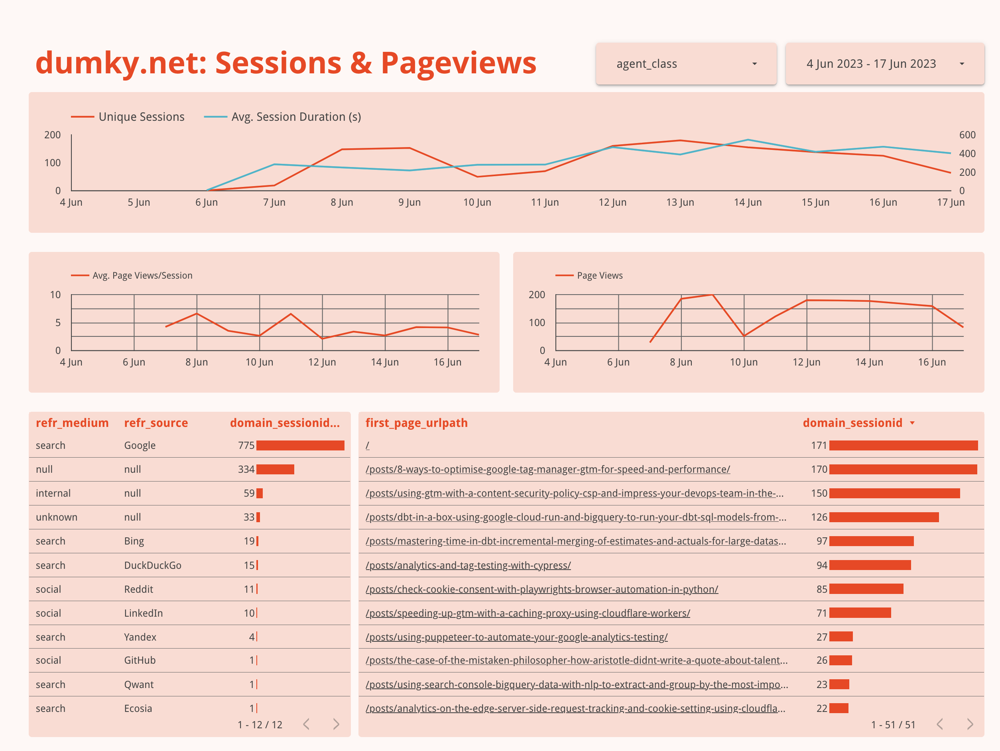

With Google Analytics' sub-par performance over the last few years, you may have been on the lookout for alternatives or just overwhelmed with the amount of LinkedIn posts claiming to have the ultimate list of alternatives. In any case, many of us have stopped a moment to think: "What do I actually want from an analytics tool?" I don't know about you, but I want a cheap, customisable, self-hosted solution for my blog that is pleasant to work with. Let's see if we can use Snowplow for that!

> ⚠️ Heads up for a little warning. This is going to be a long post as we'll cover a lot of ground. First of all It is basically simultaneously an introduction to (web) analytics infrastructure, infrastructure-as-code (Terraform) and data modelling with dbt. Feel free to skip back and forth between parts. Secondly, the €0.02 is only applicable to small blogs with intermittent traffic and intended as a way to play with the actual Snowplow pipeline setup. On large sites with continuous traffic, this setup will cost you more than default setup described in the Snowplow docs.

### What is covered
In this post we'll cover the following topics (click if you'd like to skip ahead).
- [What is an analytics pipeline anyway?](#whats-an-analytics-pipeline-anyway)
- [What are the components of a Snowplow pipeline?](#the-components-of-a-minimal-snowplow-setup)
- [How to use Terraform to set up a minimal Snowplow pipeline?](#lets-terraform-this-baby)
- [How to use dbt to model and transform our raw data?](#transforming-snowplow-data-with-dbt)

You can find all of the code in this [snowplow-serverless repository on Github](https://github.com/dumkydewilde/snowplow-serverless).

### Who is this for? 
You can go very deep and very wide with these topics, but I think this post might be for you if:
- You are a web analyst or marketing analyst who wants to better understand how data is captured and transformed behind the scenes of whatever analytics tool you're working with
- You're an analyst, analytics team lead or marketing manager who's tasked with setting up a new analytics implementation and wants to understand more of the technical options out there to cut through the marketing BS of analytics vendors.
- You're a data engineer who's more or less familiar with Terraform but hasn't worked with web analytics pipelines before.
- You're an analytics engineer who's worked with dbt but wants to better understand Terraform or web analytics pipelines.
- You're a cheap hacker who likes to play with toy data pipelines for fun. (<— that's me 👋)
- You're anywhere in between or beyond and either just enjoy learning or the pain and frustration of working through problems, tools and technologies that you know nothing about.


*You'll end up with a fully customisable dashboard of your web analytics data.*


# What's an analytics pipeline anyway?
I've written before about [why web analytics is a mess](/posts/why-web-analytics-is-still-a-mess-in-2023/) but a big part of the confusion is that a web analytics pipeline just does many things all at once. To name a few:
- Provide trackers for websites, apps, backend-systems
- Collect data that can be highly unpredictable and infrequent with high accuracy
- Filter out the noise that is crawlers, bots and referral spam from the signal of actual humans
- Reliably and cheaply store both terrabytes of raw data for many years, as well as perform sessionisation (that doesn't stop at midnight —looking at you GA3!), user back-stitching, modelling and aggregation for key metrics
- Allow business users to have both custom and standardised reports as well as be able to do deep dives 🤿

Universal Analytics allowed you to do much of the above for free, but we have learned that it doesn't mean there are no costs involved. With new and changing privacy laws, increased complexity of setting up and maintaining analytics tools we've come to appreciate the ability to take matters into our own hands. We want to be able to host our own solutions, while still having the reliability of a well-engineered tool. We want to have the customisation and flexibility to adjust to the uniqueness of our business, while still having efficient, standardised reports. Well, this is exactly what makes Snowplow so damn good. 

But, if you've seen or worked with Snowplow —especially the open source version— your first instinct may be to think that it's just a lot of different instances burning through your cash and not something to use for your own blog for example. And that's partly right, but today we'll look at how to start playing around with Snowplow for €0.02/day on Google Cloud Platform and discuss:
- What are the components of a Snowplow pipeline and which ones do we actually need?
- What are the choices we can make regarding cost/quality/performance and what is the lowest cost we can get away with?
- How can we manage something that's actually costing money in a way that's pleasant and maintainable?
- Why the hell do I need all these weirdly named tools like Docker and Terraform if I'm a web analyst?

# The components of a minimal Snowplow setup
To understand how we can adjust the Snowplow pipeline to our liking we have to understand what the actual components are that we'll be using (in parts). So let's go through them real quick before we dive into the technical details. If you're bored already, just imagine that they are the codenames of a crew that's about to pull off a bank heist.
- **The Tracker**: in our case a piece of JavaScript on our website that collects user data (pageviews, heartbeats, clicks, etc.) and sends them to an endpoint (URL) of our choice.
- **The Collector**: A server that has to be always available to acknowledge incoming requests  and store them for later processing
- **The Enricher**: validates raw events, potentially adding in small enrichments like removing PII, adding geo information, identifying bot traffic, etc. To validate events it has to make use of a schema registry, basically a repository of lists that tell the enricher what to expect of incoming data (for example a URL or user-agent string): what attributes can be expected, how long should they be, should they match a specific type or format, etc.
- **The Loader**: turns raw event data into a format that can be loaded into your data warehouse —in this case BigQuery— and makes sure the database is updated if for example new schemas are used.
- **The Model**:  allows us to easily transform raw event data into meaningful practical statistics like pageviews, sessions, engagement, and users. 

 

*Thanks DALL-E for finally getting the number of people in this bank heist scene right...*

As you can see, all these components have different requirements. We're going to skip over The Tracker as that is [well documented](https://docs.snowplow.io/docs/collecting-data/collecting-from-own-applications/javascript-trackers/javascript-tracker/web-quick-start-guide/) and has no cost impact since it is just JavaScript running on our own site. 

### The Collector
The collector serves the very specific need of being the entry point for outside hits —the cold, dark internet— into our pipeline. The general requirements are something like:
- It should be able to capture HTTP requests and move them on to the next step
- It has to capture X% of events, where X will likely start with one or more 9s.
- It has to scale up and down with traffic and be able to scale to zero, but be available 24/7
- It has to be easy to manage

Considering these requirements we have a couple of different cloud services and strategies we can use as options. First thing we should note is that one of the easiest ways to run our collector (and the other services) is to use the Docker container, in other words, a pre-packaged solution that runs anywhere and only requires us to pass through a few configuration options. We'll use the Google Cloud Platform terminology here, but of course you can easily swap similar services for the AWS alternatives (EC2, Fargate, Lambda, S3, etc.)
- *Load balancer + Compute Engine*: This is the classic Snowplow setup with one or multiple servers and good if you run a worldwide ecommerce business, but definitely not good if you want to minimise costs and complexity.
- *Compute Engine with public IP*: Could work in theory, but a lot harder in terms of scaling and security
- Cloud Run: An easy way to run Docker containers serverless with an HTTP endpoint. That means very little effort in deployment and scaling up and down, but at a potential higher cost.
- *Cloud Functions*: A lighter weight version of Cloud Run with an HTTP endpoint using only a program function instead of the full docker container. A little more complex due to the lack of Docker support and actually has the same pricing (and underlying architecture) as Cloud Run.
- *Pixel + Cloud Storage logs*: You can set up usage logging on Google Cloud Storage allowing you to track GET requests to a pixel. It's cheap, but misses a lot of flexibility and benefits of using the Snowplow JavaScript tracker's POST requests as well as making it more complex to forward these logs to the rest of the Snowplow pipeline.

With roughly 100 minutes and 67000 requests free per day, Cloud Run seems like the obvious choice for our collector, especially since we can use distroless versions of Docker images, that are super small and actually contain only the bare minimum required to run our collector's functions. There is one downside to this set up and that is that Cloud Run does have a cold start of up to 20 seconds. In practice I've seen this vary between 2-20 seconds, but it does mean hits are potentially dropped if it takes too long. Personally I've found this setup reliable enough for the cost benefit, but of course you'll have to make your own trade-offs. 

### The Enricher
Interestingly enough the enricher's requirements are actually quite different from the collector. It doesn't have to be always online. As a matter of fact, this will be one of our biggest cost savers. By only running the enricher (and similarly the loader) in batches at times that are actually useful for us we save an enormous amount of costs. If you don't make decisions in real-time, your pipeline definitely doesn't need to be real-time. Considering that you don't run your personal blog with a globally distributed team of people, you'll likely only need updates to your analytics a few times a day. Expressed in my favourite cron schedule this becomes `23 8-21/5 * * *`,  in other words: run every three hours between 9am and 7pm. If you really want to save you could also exclude weekends (`23 8-21/5 * * 1-5`) although in that case your initial run on Monday morning might take a bit longer. 

Aside from my banter about cron schedules, the requirements for the enricher are something like:
- Process batches of Pub/Sub messages
- Process 100% of events
- Cost effective

Since the enricher needs a little bit more processing power we have basically only two options:
- Cloud Run Jobs: Again, super easy to run Docker containers on Cloud Run and easy scheduling. The jobs version has no HTTP endpoint.
- Compute Engine: Also easy to deploy Docker containers, but VMs have a lot more configuration options which can potentially add more complexity

There's no clear winner here and for now we'll go with Cloud Run Jobs to reduce complexity a bit. However, I do want to point out something interesting. Compute Engine (like EC2 on AWS) has the option to use 'spot' instances. That means that you can pay significantly less for instances when the cloud provider has excess capacity, but with the caveat that this instance might shut down before it has finished. This is very interesting since we run batch processing jobs and we might be ok with the fact that it doesn't process everything all at once.

### The Loader
For the loader we have a similar situation to the enricher, but the workload is likely a bit lighter as there are no in-flight enrichments, just light transformations to fit the BigQuery tables. Considering that the loader also needs a service for mutating the table (e.g. adding columns) when a schema is added or changed as well as repeating inserts that have initially failed because of an added schema we are also going to go with Cloud Run Jobs for all three (loader, mutator, repeater)

### The Model
Our model is a different beast altogether. We will use a [Snowplow-made package](https://docs.snowplow.io/docs/modeling-your-data/modeling-your-data-with-dbt/) with dbt. Dbt is a Python based tool to easily transform data based on good old SQL, but with the software development best practices of using version control and reusability of components. This makes it easy to use a package like the one from Snowplow on standardised components like pageviews, sessions, or media but still have the flexibility to add in custom models, combine with other source data or build reporting tables and aggregations on top of packages.
However, running dbt in our pipeline is not as easy as it looks. I [wrote before](https://www.dumky.net/posts/dbt-in-a-box-using-google-cloud-run-and-bigquery-to-run-your-dbt-sql-models-from-a-docker-container/) about running dbt in a Docker container, but it is not easy to just run a random dbt package on our data. We need to be able to add and configure certain variables and maybe add in some models on top. Therefore we need to at least be able to connect it to a repository with a dbt project. At the same time we'd like to avoid complexity by creating a seperate pipeline for dbt so we'll still run dbt on Cloud Run on the same schedule as the other jobs. 

# Let's Terraform this baby
As I described this setup to someone interested in working with Snowplow, they said: "This is not a Snowplow introduction it's a Terraform introduction." And I will admit: they're not wrong. These days it's hard to avoid any kind of cloud infrastructure if you want to own and govern your own data pipelines. And it's even harder to avoid Terraform if you want to deploy and govern that cloud infrastructure. 
Terraform is to cloud infrastructure what dbt is to data models. And if that sentence doesn't mean anything to you let me summarise it like this: we used to click everything together ("ClickOps") from servers to hard drives to data models and data ingestion pipelines in web interfaces that would change right underneath us, but we've since moved to robust integrations based on version controlled code (DevOps) with the ability to deploy and test across different environments like development and production with ease. In practice all of that means: less downtime, less incidents, higher data quality. Unless of course you are just starting out, because in that case all of these tools may seem overwhelming.

Fear not. We are here today to guide you through setting up your own analytics pipeline infrastructure with Terraform. I'll assume that you have followed the [terraform install instructions](https://developer.hashicorp.com/terraform/tutorials/gcp-get-started/install-cli) for your system, have cloned the project repository with `git clone https://github.com/dumkydewilde/snowplow-serverless.git && cd snowplow-serverless`  and initialized the project with `terraform init`. Furthermore I will also assume that you have installed the [`gcloud` CLI](https://cloud.google.com/sdk/docs/downloads-interactive) because Terraform will use your local Google Cloud credentials to deploy the infrastructure when your run `terraform apply`.


### Basic file and folder structure
Now things get really interesting. Let's first look at some of these files and their purposes.
- `main.tf` — This is the most important file in the repo as it defines all the resources, that is infrastructure, that we want to deploy. As you'll be able to see it defines `resources`, `providers` and `locals` (that is variables local to the file)
- `variables.tf` — Here we define which variables our Terraform project will accept. That makes it easy to customise and swap out configurations for different environments or projects, e.g. by adding in a custom prefix everywhere or definining a custom timeout for Cloud Run Jobs
- `terra.tfvars.example` — These are the variable settings you can customise to your specific project needs that will be fed into our main.tf file, just remove the `.example` part and add in the details of your Google Cloud project (id, location) and other configurations.
- `output.tf` — Here the outputs for our Terraform infrastructure are defined, this makes it easy to capture data we'll need in other places to integrate with our infrastructure. For our project that's mostly the `collector_server_url` to integrate in our Javascript tracker.
- The `config` folder contains all kinds of configuration and template files that we import and feed into the resources.

### Adding in resources
Let's start with something simple. Let's pretend our `main.tf` file was totally empty. It actually takes very little effort to get started. First we define the Google Cloud project we want to work in:
```hcl
provider "google" {
  project = var.project_id
  region  = var.region
}
```

If we run this with `terraform plan`, the command line interface will ask us for the `var`s that we defined. We can fill them out there or we can supply the `terra.tfvars` file that we created above by calling `terraform plan -var-file=terra.tfvars`.  

Next we'll do something very simple and safe: turn on some APIs in our project to start using:
```hcl
resource "google_project_service" "run_api" {
  service = "run.googleapis.com"
}
resource "google_project_service" "schedule_api" {
  service = "cloudscheduler.googleapis.com"
}
```

Just running this and not having to search and click through the UI already makes my life so much more amazing.

Ok, a little bit more excitement than just a replacement for clicking buttons: let's set up a service account. Since the Cloud Run Jobs will not have our credentials we need a service account to determine the access level and permissions that they have.

```hcl
resource "google_service_account" "cloud_run_sa" {
  account_id = "snowplow-ice-terra"
  display_name = "Snowplow Cloud Run Service Account"
}

resource "google_project_iam_member" "cloud_run_sa" {
  for_each = toset([
    "roles/bigquery.dataEditor", 
    "roles/bigquery.jobUser", 
    "roles/pubsub.editor", 
    "roles/run.serviceAgent",
    "roles/run.invoker",
    "roles/logging.logWriter",
    "roles/storage.objectViewer"
    ])
  project = var.project_id
  role = each.value
  member = google_service_account.cloud_run_sa.member
}
```

Notice that there is something that we haven't seen before. A `for_each` statement. This allows us to easily loop over a set of items, in this case permissions, so that we don't have to repeat ourselves all the time like we did with the API resource above. In this case the only difference for our `google_project_iam_member` is the role, so we loop over our list and assign the item value to the role. At the same time we are also referencing the output of the `google_service_account` resource that we define at the top. This has an attribute `member` that will give us the correct value to add to the role resource that we want to connect to the service account. This all gives us a service account with 7 roles assigned to it, that should be able to handle pretty much anything we throw at it.

Finally let's do something really cool: actually create a storage bucket. We create a `google_storage_bucket` resource, and because the name of that needs to be globally unique, we add in a random string to our bucket name. After that we make the bucket public so that it's easy for debugging and accessing our Iglu schemas. Finally we take the set of files in the schema folder and for each of those files we'll add them as an object in our newly created bucket under the `schemas` folder. In other words: you can bring your own schemas and upload them whenever you run `terraform apply`. How cool is that? 🤯

```hcl
resource "random_string" "six_chars" {
  length  = 6
  special = false
  upper   = false
}

resource "google_storage_bucket" "iglu_resolver_bucket" {
  name = "${var.prefix}-iglu-schemas-${random_string.six_chars.result}"
  location = var.region
  project = var.project_id
  uniform_bucket_level_access = true
  force_destroy = true
}

# Make the bucket public
resource "google_storage_bucket_iam_member" "member" {
  bucket = google_storage_bucket.iglu_resolver_bucket.name
  role   = "roles/storage.objectViewer"
  member = "allUsers"
}

resource "google_storage_bucket_object" "schemas" {
  for_each      = fileset("${path.module}/schemas/", "**")
  source        = "${path.module}/schemas/${each.value}"
  name          = "schemas/${each.value}"
  content_type  = "text/plain"
  bucket        = google_storage_bucket.iglu_resolver_bucket.id
}
```

### Pub/Sub message services
One thing we haven't touched on before is that all the services and jobs need to be able to exchange information. For this we use Google Pub/Sub, a so-called message bus able to handle millions of messages where messages get sent through a big pipeline with retry, storage and queueing capabilities based on a 'topic'. Subscribers to those topics will get copies of those messages for further processing.
Again this is where terraform shines because with the big list of different components we can easily create both a topic and a subscription for each by creating a simple list as a local variable. One thing we haven't used before is the `depends_on` argument. This is a list of resources where we can tell Terraform to wait on their creation before creating this resource. In this case we'll get an error trying to create a subscription for a topic that doesn't exist yet, so all we have to do is add the `depends_on` clause.

```hcl
locals {
    topic_names = ["raw", "bad", "enriched", "bq-bad-rows", "loader-types", "failed-inserts"]
}
resource "google_pubsub_topic" "topics" {
  for_each = toset(local.topic_names)
  name = "${var.prefix}-${each.value}-topic"
}

resource "google_pubsub_subscription" "subscriptions" {
  for_each = toset(local.topic_names)
  name  = "${var.prefix}-${each.value}-sub"
  topic =  google_pubsub_topic.topics[each.value].name
  expiration_policy {
    ttl = ""
  }

  depends_on = [ google_pubsub_topic.topics ]
}
```


### Cloud Run Service & Jobs
As we saw above when looking at the components of our analytics pipeline, we have a lot of Cloud Run resources. Basically our collector is a Cloud Run Service, meaning it has a public URL as an endpoint and all the other ones Cloud Run Jobs without endpoints. I won't go through all the different Cloud Run resources as the pattern is very similar, but of course you can [see them all in the repository](https://github.com/dumkydewilde/snowplow-serverless/blob/main/main.tf). Basically the pattern for all is as follows:
- We need to pass through a configuration file with names of other components, things we want to turn on or off, schemas we want to pass through, etc.
- We can set additional configurations for the container like the number of CPUs, maximum number of instances (if for example the workload increases) or whether we want to allow incoming traffic from the internet (we do of course for our collector)
- We need to determine the docker image we want to load for the cloud run container
- We can fire off a custom command (in case we want to override the default command that is set in the image we are loading)

In the collector's Terraform code you can see another powerful feature of Terraform: using template files. The `config.hocon` file is where we determine the configuration for the collector, it has a good and a bad ouput stream that it can write to. We could change the configuration file every time we want to deploy into a new environment, for example changing `dev-raw` to `prod-raw`, but first of all: ain't nobody got time for that. And second of all: we have already defined these values somewhere else, why risk introducing errors? Luckily we can pass these values on to a template file in three easy steps (all good things come in three, right?)
- Add `.tmpl` to the file to define it as a template-file
- Use `${...}` in the file for values to be replaced, so for example `googleProjectId = ${google_project_id}`
- Import the file into Terraform with `templatefile("./my_config.json.tmpl")`

Now we're ready to define our cloud run resource. There are a lot of extra attributes you can add in which you can find in the [Terraform registry documentation of this resource](https://registry.terraform.io/providers/hashicorp/google/latest/docs/resources/cloud_run_v2_service), but the biggest 'custom' thing here that we haven't covered so far is the command we execute when the container actually starts running. Let's go through the steps one by one:
- We tell our container to use the image tagged `snowplow/scala-stream-collector-pubsub`  and look for the `latest` version. Usually you would pin this version (e.g. `1.5.3`) to prevent updates with breaking changes, but I want you to try and use the latest first for yourself and see if it breaks.
- Cloud Run will look for this 'tag' in a set of registries and will find it in [the Docker hub registry](https://hub.docker.com/layers/snowplow/scala-stream-collector-pubsub/latest/images/sha256-8651524f9c698f3da9198694a75a6d91d33362ae6bd3a356083058d675af287e?context=explore) (You can define your own artifact registry in theory, but that adds more complexity) 
-  The image sets a default entry point, which is to execute `/home/snowplow/bin/snowplow-stream-collector`, however if we just run that it wouldn't know how to apply our configuration. Sometimes we can just pass through a base64 version of our configuration as an argument, using "args", but in this case we need to point to the actual file, so we use a "command"
- Our command opens up a shell in the container, takes our base64 encoded templatefile, writes it to a file (`config.hocon`) and then (`&&`) runs the original entrypoint command with and added argument to point to our newly created configuration file.

```hcl
locals {
  config_collector = base64encode(templatefile("${path.module}/configs/collector/config.hocon.tmpl", {
    stream_good = google_pubsub_topic.topics["raw"].name
    stream_bad =  google_pubsub_topic.topics["bad"].name
    google_project_id = var.project_id
  }))
}
resource "google_cloud_run_v2_service" "collector_server" {
    name = "${var.prefix}-collector-server"
    location = var.region
    project = var.project_id

    ingress = "INGRESS_TRAFFIC_ALL"

    template {
        service_account = google_service_account.cloud_run_sa.email
        scaling {
            max_instance_count = 1
        }
        containers {
            name = "${var.prefix}-collector-server"
            image = "snowplow/scala-stream-collector-pubsub:latest"
            command = [
                "/bin/sh",
                "-c",
                "echo '${local.config_collector}' | base64 -d > config.hocon && /home/snowplow/bin/snowplow-stream-collector --config=config.hocon"
            ]   
        }
    }

    traffic {
        type = "TRAFFIC_TARGET_ALLOCATION_TYPE_LATEST"
        percent = 100
    }

    depends_on = [google_project_service.run_api]
}
```

### Triggering and Scheduling Cloud Run
The Cloud Run Service above has its own HTTP endpoint and will start when that's triggered, however all our other jobs have to be triggered independently. For that, and as a final step in our pipeline we use Google Cloud Scheduler. This is nothing more than a simple CRON job that runs every day between 8-21 at an interval of your choice, depending how 'real time' you'd like your analytics to be. The CRON job does however trigger an HTTP endpoint for our jobs ending in `:run` to indicate that they should start running.

Again, we use a `for_each` to attach the trigger to each job, and thus we get:
```hcl
resource "google_cloud_scheduler_job" "jobs_scheduler" {
  for_each = toset([ "repeater-job", "streamloader-job", "mutator-listen-job", "enrichment-job","dbt-transform-job"])
  region           = "europe-west1"
  name             = "${var.prefix}-${each.value}-scheduler"
  description      = "Trigger for ${each.value}"
  schedule         = "23 8-21/5 * * *"
  time_zone        = "Europe/Amsterdam"
  attempt_deadline = "320s"

  retry_config {
    retry_count = 1
  }

  http_target {
    http_method = "POST"
    uri         = "https://${var.region}-run.googleapis.com/apis/run.googleapis.com/v1/namespaces/${var.project_id}/jobs/${var.prefix}-${each.value}:run"
    oauth_token {
      service_account_email = google_service_account.cloud_run_sa.email
      scope = "https://www.googleapis.com/auth/cloud-platform"
    }
  }
}
```


If you've run `terraform apply -var-file=terra.tfvars` and set everything up there's only one manual step left. You'll have to run the `mutator-create-job` once to create the initial BigQuery events table from [the Cloud Run Jobs UI](https://console.cloud.google.com/run/jobs).


# Transforming Snowplow data with dbt
If you haven't heard of dbt before, it's a tool that helps you define data models through SQL. It is basically SQL statements, but the generation of those SQL statements is version controlled and dynamic with a language called Jinja. That means you can use variables and for-loops to generate SQL and create nice lineage graphs between all the models you generate.

That may still sound like mumbo-jumbo, but what it has done is create an ecosystem of tools and packages that help you build meaningful models on top of your raw data from let's say Facebook Ads or Spotify to query them more easily. In this case we can use a dbt package called `snowplow_web` from Snowplow to create pageview and session tables for us.  The package takes care of all the aggregations like average time on page for pageviews or pages per session, that means that out of the box we can go from raw data to a bunch of tables to basically recreate reports around session, users and pageviews that you may be familiar with from Google Analytics.

### Deploying a dbt Cloud Run Job through Terraform
We brushed a bit over the setup of dbt in our workflow above, but in essence it is another container to run a little script called `run-dbt.sh` in our config folder.  The container is simply an image with Python 3.11 pre-installed so that we can easily download and install dbt.  Here's what that looks like in the Terraform `main.tf`.
```hcl
locals {
  dbt_run_script = base64encode(file("${path.module}/configs/dbt/run-dbt.sh"))
}
 
resource "google_cloud_run_v2_job" "dbt_job" {
    name = "${var.prefix}-dbt-transform-job"
    location = var.region
    project = var.project_id

    template {
      template {
        timeout = local.job_timeout
        service_account = google_service_account.cloud_run_sa.email
        containers {
            # unfortunately GCP doesn't allow use to pull the dbt image from ghcr.io directly
            # So we use a base python image and just install dbt-bigquery on it 
            image = "python:3.11"
            env {
              name = "BQ_DATASET"
              value = "${google_bigquery_dataset.bigquery_db.dataset_id}"
            }
            env {
              name = "BQ_LOCATION"
              value = "${var.region}"
            }
            env {
              name = "GOOGLE_PROJECT_ID"
              value = "${var.project_id}"
            }
            command = [
                "/bin/sh",
                "-c",
                "echo ${local.dbt_run_script} | base64 -d > run-dbt.sh && /bin/sh run-dbt.sh '${local.dbt_repo_url}' '${local.dbt_repo_folder_name}'"
            ]      
        }
        max_retries = 1
      }
    }
}
```

Most of it is the same as before, but there's two important parts:
- We are adding in some variables as environment variables so that they can be accessed in our serverless cloud run job through the `env { ... }` parameters.
- We add in a little configuration and setup script to run dbt in the container

The script is what does all the magic, it looks like this.
```bash 
git clone "$1"
cd "$2"
pip install dbt-bigquery
dbt debug
dbt deps
dbt run --selector snowplow_web
```

What it does is that every time the job runs, it will take the first argument —that is a URL to a git repository—, copy it and move into the directory. By default it uses the [dbt repository in the `dbt` folder](https://github.com/dumkydewilde/snowplow-serverless/tree/main/dbt) of the Snowplow Serverless repository, but here's the nice thing: you can swap it out for your own, as we're just using Terraform variables again:
```hcl
run-dbt.sh '${local.dbt_repo_url}' '${local.dbt_repo_folder_name}'
``` 

Next it will install dbt with the BigQuery adapter and run `dbt debug` to test the connection to BigQuery. But, wait? What connection? Well, actually dbt will look for a file called `profiles.yml` that contains a configuration for our connection to BigQuery. Since we have added in a service account, we can use this service account's `GOOGLE_APPLICATION_CREDENTIALS` to easily connect using OAuth. This works by passing through those environment variables from before into the profiles.yml that comes from our git repository. The profiles.yml (we're using a connection called `prod` but you can add your own depending on your environment and requirements) then looks like this.

```yaml
prod:
  dataset: '{{ env_var("BQ_DATASET") }}'
  job_execution_timeout_seconds: 300
  job_retries: 1
  location: '{{ env_var("BQ_LOCATION") }}'
  method: oauth
  priority: interactive
  project: '{{ env_var("GOOGLE_PROJECT_ID") }}'
  threads: 16
  type: bigquery
```

Finally we run `dbt deps` to install the Snowplow package defined in `packages.yml` and the actual dbt models with `dbt run --selector snowplow_web`. If all goes well, you'll end up with a couple of new datasets in your BigQuery project:
```markdown
├── icet_snowplow
│   ├── events
├── icet_snowplow_derived
│   ├── snowplow_web_page_views
│   ├── snowplow_web_sessions
│   ├── snowplow_web_user_mapping
│   ├── snowplow_web_users
├── icet_snowplow_scratch
│   ├── ...
├── icet_snowplow_manifest
│   ├── ...
```

The derived tables are pretty self-explanatory, the scratch and manifest tables contain respectively the base tables to calculate the aggregate derived tables and a state of not just the last time the pipeline was processed, but also a state of ongoing user sessions. That means that sessions will not just restart at midnight as was the case for Google Universal Analytics, but you can be very flexible, create your own session definition and let your user's sessions run for days.

And that's all folks. You have your session tables available, all ready for some fancy visualisations and showing off to your mom how your visitor chart is going up and to the right 📈! Of course the true value of this setup is not just in this data, but customising and combining this data with additional data sources like for example Google Search Console data.

# Continuing the conversation
This has been a massive post, it'd great if you could let me know if you enjoyed it, if you're missing anything or anything else you'd like to share. You can reach out to me on [LinkedIn](https://www.linkedin.com/in/dumkydewilde/) or [Twitter](https://www.twitter.com/dumkydewilde), but what would be even greater is to kindle the discussion on the [Snowplow Discourse](https://discourse.snowplow.io/) which is a great place to discuss everything Snowplow with a group of likeminded people.

# Notes and Resources

- Not seeing anything appear? Make sure you ran the `mutator-create-job` to create the initial table in BigQuery. I am still looking to improve this step.
- Google Cloud Hosting Options overview: https://cloud.google.com/hosting-options
- https://cloud.google.com/storage/docs/access-logs
- You could in theory use the enricher as a collector on Cloud Run, but I have not tried this yet.
- If you want to store your enrichments seperately you could consider either using FUSE to mount a Cloud Storage bucket to a Cloud Run Job, or using some form of long-term disk for Compute Engine
- [Terraform Registry](https://registry.terraform.io/) is where you'll find documentation for most of the resources and [modules](https://registry.terraform.io/browse/modules) (pre-made combinations of resources)
- You can basically only use Docker Hub images for Google Cloud Run unless you want to add them to your own artifact registry.  Github container registry (`ghcr.io` ) images, like the ones from dbt, are not supported.
- You can have a look at the [final dashboard on Looker Studio](https://lookerstudio.google.com/reporting/4933e82f-b45f-4e53-a23f-955f820f7113).