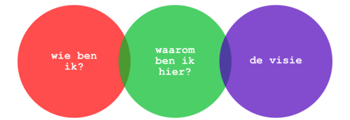
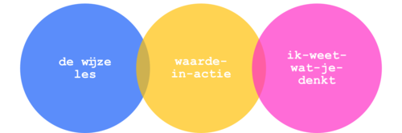

Er is al te veel informatie in deze wereld. Niemand heeft behoefte aan meer feiten. Serieus, TL;DR is ons levensmotto, want ‘Too Long; Didn’t Read’ is al te veel moeite om uit te schrijven. Feiten gaan je niet helpen om een berg te verzetten, dat lukt je alleen met geloof en vertrouwen. Maar waarom zou ik je vertrouwen als ik je niet ken?

Een verhaal geeft je de mogelijkheid om iets ingenieus te doen. Kijk, het lukt je niet altijd om daadwerkelijk te laten zien dat je te vertrouwen bent, maar _the next best thing_ is om je toehoorders mee te nemen in een _simulatie_ van je acties en handelingen: een verhaal. Als je een stukje van jezelf laat zien is het makkelijker voor anderen om zich daar in te herkennen en een band te voelen. Hoe doe je dat? Dat laat Annette Simmons zien in _The Story Factor._

Simmons onderscheid 6 soorten verhalen die je _toolkit_ zijn om te overleven in de buitenwereld —[Bear Grylls](http://beargryllssurvivalacademy.com) zou er jaloers op zijn.

1. **Wie ben ik** Jaja, je bent _Vice-President of Everything_ bij het Ministerie van Belangrijke Zaken, maar serieus, _who cares!?_ Ik wil zien hoe je werkt, wat je doet. _Show, don’t tell._ En dat is wat een verhaal kan doen. Er is een interessant psychologisch effect dat ‘self-disclosure’ heet. Als jij iets over jezelf vertelt dat als ‘zwak’ geïnterpreteerd kan worden, zal ik je sneller vertrouwen. Waarom? Als jij een zwakte toont betekent dat dat je mij vertrouwt, en of ik het nou wil of niet, ik zal je daardoor sneller vertrouwen. Dus wees gewoon eerlijk en zeg “Ik zet me voor 100% in… 80% van de tijd.“
2. **Waarom ben ik hier** Als ik over straat loop en ik hoor: “Mag ik je wat vragen?” zeg ik “Nee, rot op, ik heb al drie kranten en een geadopteerde panda.” Ok, dat zou ik graag willen zeggen, maar dat is natuurlijk wel het gevoel waar het om gaat als we op onbekenden afstappen: “Wat wil je van me?” Iedereen is geïnteresseerd in een goeie deal, dus focus op het voordeel voor de ander, maar een ding is nog belangrijker: Wat is jouw belang? Natuurlijk het is prima als jij er goed aan verdient, maar doe nooit alsof je publiek dom is, want dan onthouden ze maar één boodschap: respectloosheid. Dus hou het simpel: __What’s in it for you, what’s in it for them.__
3. **De Visie** Verdienste voor jou en je toehoorders kan een begin zijn van een grotere visie op wat belangrijk is in deze wereld. Die visie moet je zichtbaar maken. Geen feiten, maar een mentale film die mensen in hun hoofd kunnen zien. “Rauwe vis is superlekker” gaat niemand over de brug trekken. In plaats daarvan kun je beter je ervaring met het eten van sushi bij Jiro in Tokyo beschrijven. Net zo min heb je er iets aan om te zeggen: “Onze visie is om een omzet van 1 miljard te genereren”. Dan is mijn visie om je met _super glue_ in te smeren en je als een wentelteefje door de inhoud van een pin-automaat te rollen. Kijk, daar kunnen we ons tenminste iets bij voorstellen. Het verschil is simpel: leg je stenen neer of bouw je een kathedraal?
4. **De Wijze Les** Hoe leer je iemand dat hij het rode draadje met het groene draadje moet verbinden en niet met het blauwe? Iemand een nieuwe vaardigheid aanleren is niet makkelijk, vooral als je het niet gelijk in de praktijk kunt brengen. Wat je wel kunt doen is iemand zich voor laten stellen wat haar rolmodel zou doen. Zou Maxima haar bord leeg eten?
    
     
    
     
5. **Waarde-in-actie** Ja, daar gaan we, mijn [favoriet](http://www.vumc.nl/afdelingen/over-vumc/missie-visie-kernwaarden/): “Onze missie is om gezien en erkend worden als een innovatieve kwaliteitsorganisatie met een uitstekende reputatie en een krachtig netwerk, waar respect, integriteit en dienstbaarheid voorop staan.” Ik moet de eerste organisatie die passieloos verouderde, ondermaatse, klanten het-leven-zuurmakende producten in de markt wil zetten. Als je daadwerkelijk integriteit wil van je medewerkers moet je laten zien wat integriteit betekent en niet een betekenisloos begrip op een verdwaalde webpagina plaatsen. De waarden kunnen eenvoudig zijn, maar de voorbeelden moeten krachtig zijn. Als je geen voorbeeld kunt bedenken kun je je afvragen hoeveel je ‘waarde’ daadwerkelijk waard is.
6. **Ik-weet-wat-je-denkt** Na de vorige vijf heb je waarschijnlijk niet zo’n zin meer in het zesde verhaal-type. Maar deze is makkelijk. Je kent het wel, je bent op komen draven omdat iemand heeft geregeld dat jij een verhaal mag houden, maar niemand in de ruimte heeft zin om naar je te luisteren. Als je benoemt wat anderen denken ben je al een stap op weg in de goede richting. Wie wil er niet luisteren naar iemand die gedachten kan lezen? Neem de statistiek docent die z’n les begint met “Ik ben een statisticus, dus dit wordt het saaiste uur van je leven.” Daarna kan het alleen maar beter worden. _Excusez-moi_, ik ga even wat verwachtingen _managen_.

Een goed verhaal vertellen begint bij de vraag: Hoe maak ik een verschil? Grappig genoeg betekent dat vaak zo specifiek mogelijk vertellen over wat _jij_ belangrijk vindt. Als je wil dat je toehoorders aan hun moeder denken, kun je het beste over je eigen moeder vertellen. En bedenk dat bijna niemand zit te wachten op meer feiten, maar wel op meer inzicht. Verhalen kunnen inzicht geven, dus gebruik ze goed: _With great power comes great responsibility._
