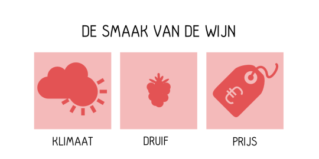

“Wat bepaalt de smaak van de wijn?” Die vraag kreeg ik onlangs, samen met een stel vrienden, op een wijnproeverij. “De druif”, riep iemand. “De grond en weersomstandigheden.” “Het vat!” Allemaal erg belangrijk voor de smaak van de wijn, maar mijn eerste ingeving was: de prijs. Waarom? De smaak van de wijn wordt namelijk niet alleen bepaald door de wijn, maar bovenal door wie hem proeft. En dat is te beïnvloeden. De rauwe input van onze zintuigen wordt op weg door de hersenen in hapklare stukjes gehakt die voor ons te begrijpen zijn. Dat betekent dat we niet overprikkeld raken door geur, smaak, temperatuur, licht, en omgeving, maar dat we de stimuli ervaren als betekenisvolle informatie over de wereld. Onze hersenen helpen ons in het zoeken naar patronen om de wereld begrijpelijk te maken en zo snel actie te kunnen ondernemen.

Handig, zeker als er gevaar dreigt, maar niet altijd. Want wat in het _algemeen_ een grotere kans op overleven geeft —conformeren aan de groep, het koppelen van vergelijkbare beelden en patronen, het volgen van een autoriteit—, hoeft in _specifieke_ situaties niet de beste beslissingen op te leveren. Sterker nog, onze wereld is zo veranderd in de afgelopen eeuwen dat wat vroeger hielp bij het overleven, nu kan leiden tot domme beslissingen. Dat levert bijvoorbeeld de situatie op dat we niet teveel willen opvallen, al helemaal niet op een podium voor een groep mensen, maar dat we wel uniek gevonden willen worden.

We hebben, wat Danny Kahneman noemt, een Systeem 1 in onze hersenen dat direct beslissingen wil nemen, maar een Systeem 2 dat wil reflecteren. Maar wat hebben systemen met de prijs van wijn te maken? We zoeken niet alleen naar patronen, maar ook naar data die voor ons bevestigt met welk patroon of schema we te maken hebben. Stel je voor dat je een puzzel aan het maken bent van de skyline van Amsterdam. Als je een blauw stukje in je hand hebt denk je als eerste aan de lucht, je gaat proberen waar het in de lucht past in relatie tot stukjes die je al hebt. Pas als dat niet lukt ga je misschien verder met een ander stukje of ga je kijken waar het allemaal _niet_ past tot je vindt waar het _wel_ past —overigens snap ik überhaupt niet wat mensen leuk vinden aan het maken van een legpuzzel, maar dat is voor een andere keer. Onze eerste ingeving, Systeem 1, is om te zoeken naar bevestiging. Waarom? Dat is vaak het snelste en makkelijkste, en ik ben, zoals veel mensen, groot fan van snel en makkelijk, helemaal na een dag hard werken.

_“Maar die wijn, die wijn, hoe zit dat nou!?”_ Ok, ik zal _to the point_ te komen. Een slok wijn is geen losstaand feit. Het is niet dat we op een ochtend wakker worden en denken: “Hé, hoe komt die wijn in m’n mond, laat ik het eens goed proeven.” Nee, aan een slok wijn gaat vaak een heel ritueel vooraf: een mooie fles uitkiezen, een goed glas erbij pakken, de wijn ontkurken en decanteren, de glazen nog even schoonmaken. Met een beetje geluk heb je er zelfs nog wat kaarslicht bij wanneer met een hand op de rug de wijn ingeschonken wordt. Met andere woorden wijn is, zoals de natte droom van elke marketeer, een _experience._ Dat betekent niets anders dan dat er een heleboel stimuli —geur, smaak, licht, warmte— bij elkaar komen, in bekende patronen gepast worden en een aangename situatie creëren. De prijs is echter een stimulus die zo’n patroon kan beïnvloeden. Bijvoorbeeld omdat we prijs associeren met kwaliteit (_priming_), of omdat deze prijzige wijn naast die nog veel duurdere opeens een uitstekende optie lijkt (_framing_). Bovendien zijn we vaak erg onder de indruk van de mening van anderen, en als zij de wijn deze prijs waard vinden, dan zal het wel goed zijn (_social proof_).

Zijn we dan dom en is het nutteloos om dure wijn te kopen? Nee, want zoals ik al zei: de smaak van de wijn wordt nou eenmaal niet alleen bepaald door de druif, het vat en het klimaat, maar bovenal door jou, de proever. En dat betekent dat alleen jij weet of je een wijn lekker vindt of niet. En het ritueel dat er bij hoor schept, zoals in elk goed verhaal, verwachtingen waaruit een climax volgt die de slok wijn spannend en interessant maakt. En wat is er leuker dan genieten van de fascinerende, complexe, smaak van een goede wijn? Juist, genieten van _twee_ goede wijnen. Of, zoals Leon Festinger zegt, “Rats and people come to love the things for which they have suffered.”

Dit zijn principes die we goed kunnen gebruiken, niet alleen in de wijnverkoop. Een bekend voorbeeld is natuurlijk het aantrekkelijk maken van de duurdere optie door er een nog duurdere naast te plaatsen. Amazon doet dat met verzendkosten, maar het kan ook met auto’s, wasmachines, _you name it_. De belangrijkste les wat mij betreft is dat we niet alleen focussen op het product, de dienst of het object dat we voor ons hebben, maar vooral op de interactie tussen de _persoon_ en het object.
