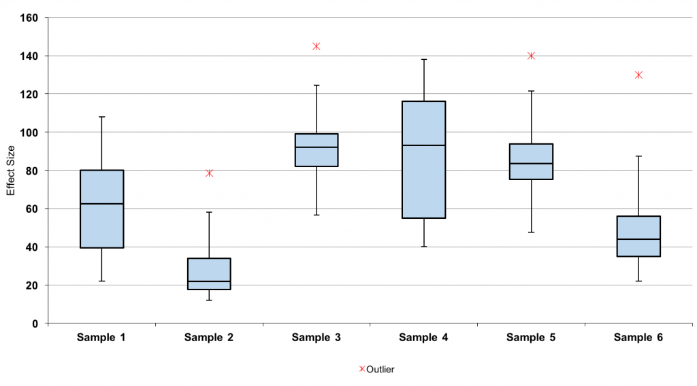
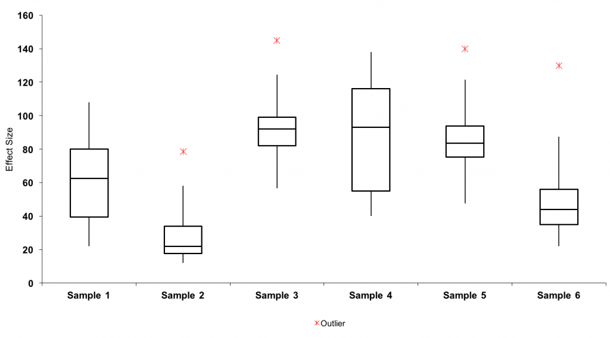
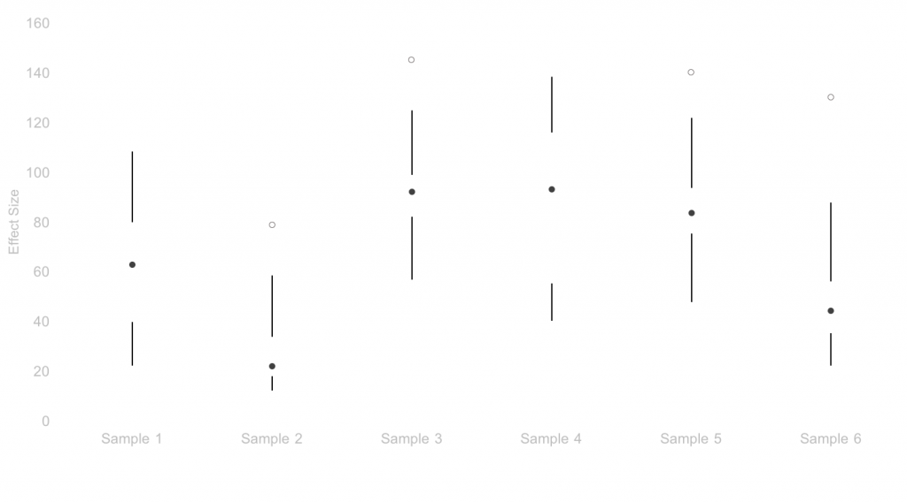
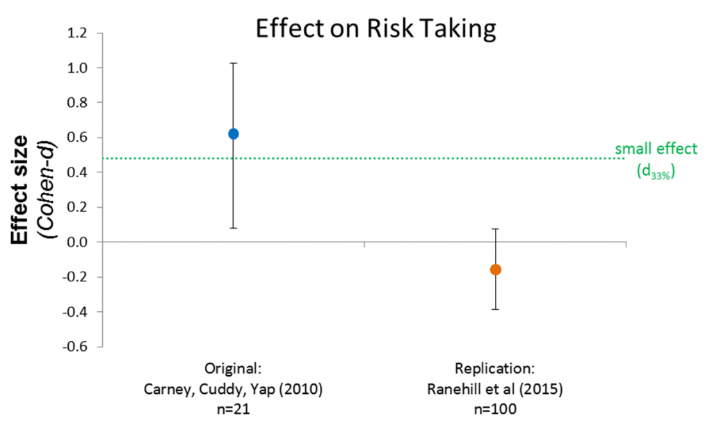

In zijn boek _The Visual Display of Quantative Information_ gaat Edward Tufte in op een aantal best practices in de data visualisatie. Een daarvan is wat hij noemt de data-inkt ratio: hoeveel van de inkt op de pagina draagt daadwerkelijk bij aan het overbrengen van informatie? Heb je die 3D-grafiek met knipperende discokleuren echt nodig? Nee, waarschijnlijk niet, maar hoeveel kun je nou echt weglaten zonder dat er informatie verloren gaat? Meer dan je denkt. Laten we eens stapsgewijs kijken naar een van de voorbeelden van Tufte, de box-plot.

Een standaard box plot bestaat uit de mediaan, twee kwartielen in de 'box', een minimum en maximum en eventueel een _outlier_. Het geeft snel een overzicht van een aantal belangrijke waarden in de sample of data en bovendien een snelle blik op de verdeling van die sample. Zo kunnen we eenvoudig samples met elkaar vergelijken. Het bovenstaande plaatje is de box-plot die je zo'n beetje standaard krijgt. Als je er wat langer naar kijkt zie je al aardig wat afleiding: rode outliers, gekleurde box, horizontale lijnen. De eerste stap is daar iets aan doen.

De vraag die we natuurlijk moeten stellen is: Wat willen we overbrengen? We weten niet echt met wat voor data we te maken hebben, maar we zien wel duidelijk dat we een vergelijking willen maken van verschillende samples. Misschien komt het uit een experiment, misschien zijn het prestaties van verschillende groepen, het gaat in ieder geval om de verschillen tussen de samples. Dat betekent dat absolute waarden minder interessant zijn en dat de focus moet liggen op de onderlinge verschillen. Draagt alles daar nu aan bij? Nog niet helemaal, de outliers springen er bijvoorbeeld nog meer uit dan eerst vanwege het kleurgebruik. Die outliers zijn niet onbelangrijk, maar hoeven zeker niet de eerste focus te hebben. De mediaan en de box zijn in dit geval het belangrijkste om een onderlinge vergelijking te maken. De grap is dat je soms geen inkt nodig hebt om focus te leggen, maar dat ook juist de witruimte focus kan creëren. Hoeveel inkt hebben we nou werkelijk nodig om de data over te brengen? Kijk even mee naar het volgende.

De mediaan heeft duidelijk de hoogste plek in de hiërarchie gekregen doordat het een zwarte punt is, maar de focus die het heeft komt vooral door het minimaliseren van de andere informatie. De outliers zijn er nog steeds, maar minder prominent aanwezig, en de lijnen naar de min en max leggen de focus juist op de ruimte rondom de mediaan en laten daarmee de belangrijkste elementen zien in de plot.

Wat Tufte ons laat zien is dat we veel minder nodig hebben om ons punt over te brengen dan we in eerste instantie dachten. De verleiding is om het standaard plaatje te gebruiken, maar met een beetje werk hebben we een visualisatie voor elkaar 'gebokst' die niet alleen verrassend is, maar vooral ook functioneel. De enige kanttekening die je wellicht kunt maken is dat het verrassingseffect je publiek iets te veel overrompelt. Mensen, en vooral academici zijn gewoontedieren en teveel afwijken van de norm kan een negatief effect hebben. Toch denk ik dat even stilstaan bij de data-inkt ratio je kan helpen om een betere focus in je visualisaties te krijgen.

 

_edit \[24/01/'16\]:_

Een interessante praktijk casus die enigszins deze kant op lijkt te gaan is de vergelijking die is gemaakt naar aanleiding van een replicatiestudie. De oorspronkelijke studie van Amy Cuddy, en haar bijbehorende TED Talk, gaan over het effect van _power poses_ op gedrag in bijvoorbeeld onderhandelingen en de fysiologische veranderingen die daaraan ten grondslag liggen. Een uiteenzetting van de resultaten van de replicatie, en verdere links naar het achterliggende artikel en de publicatie zijn [te vinden in Slate Magazine](http://www.slate.com/articles/health_and_science/science/2016/01/amy_cuddy_s_power_pose_research_is_the_latest_example_of_scientific_overreach.html). Het onderstaande plaatje geeft in ieder geval een mooie weergave van de twee studies naast elkaar met het gevonden effect, en de bijbehorende error. Het kan nog simpeler, maar de boodschap komt over: we moeten twijfelen aan de uitkomsten van de oorspronkelijke studie.

\[caption id="attachment\_248" align="alignnone" width="700"\] _Joe Simmons and Uri Simonsohn, via: Slate.com_\[/caption\]
