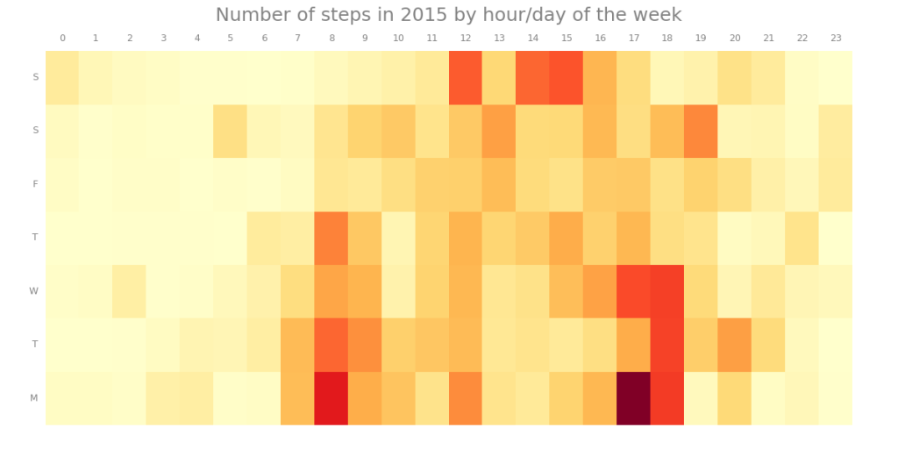
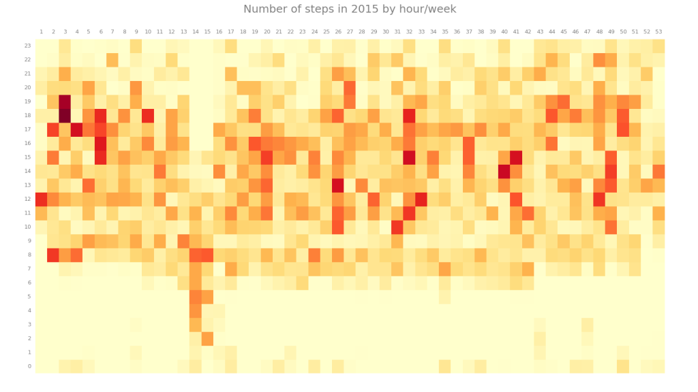

Eind 2014 kocht ik de iPhone 6. Die heeft sinds die tijd stilletjes mijn stappen geteld. En nu 2015 voorbij is heb ik een jaar aan data over mijn activiteit. Een mooi moment om eens terug te kijken. Apple's Health App heeft een mooi gekleurd hartje en een paar leuke grafiekjes, maar heel veel informatie is er niet echt uit te lezen ondanks de belofte van een "innovative new way to use your health and fitness information." Waar ik in geïnteresseerd ben is of er patronen te herkennen zijn in een jaar bewegen.

Tijd dus om zelf aan de slag te gaan. De [motion coprocessor](https://en.wikipedia.org/wiki/Apple_motion_coprocessors) in je iPhone zorgt ervoor dat elke 5 seconden je stappen geregistreerd worden, of elke minuut als je een tijdje niet beweegt. De Health App heeft een export functie die je een xml-bestand levert met die records, in totaal is er ongeveer 200.000 keer activiteit geregistreerd. Met wat moeite is dat uit het xml-bestand te halen en te vertalen naar een CSV met een start-tijd, eind-tijd, aantal stappen en aantal stappen per seconde. Vandaaruit kunnen we met matplotlib een mooie _heatmap_ maken om patronen te zien.

De eerste toont de intensiteit per uur op de dag/dag van de week:

Zoals te zien zijn er maandag tot en met donderdag een duidelijke banen te onderscheiden bij de spitstijden. De zondag is wat actiever met waarschijnlijk wat vaker sporten en op de fiets naar vrienden. Datzelfde geldt voor eten buiten de deur op zaterdagavonden, met af en toe wat latertjes in de nacht van zaterdag op zondag. Al met al een redelijk doorsnee leven. Door naar het jaaroverzicht.

Hier zien we per week/uur van de dag de activiteit. Ook hier zijn wel de 'spits-stroken' te herkennen, maar worden die waarschijnlijk toch veel vertroebeld door onregelmatigheden in de weekenden. Het eerste wat opvalt is de uitschieter in week 14 en 15: vakantie. Wilde nachten? Nee, een andere tijdszone, iets waar ik niet voor gecorrigeerd heb. Het tweede interessante vinden we in de avond van week 3. Wat deed ik voor extreem actiefs in die week? Simpel, een hardloopwedstrijd. Wederom, geen spannend nachtleven, maar een redelijk normaal patroon. Ik had ook eigenlijk niet heel anders verwacht, ik ken mezelf ondertussen.
