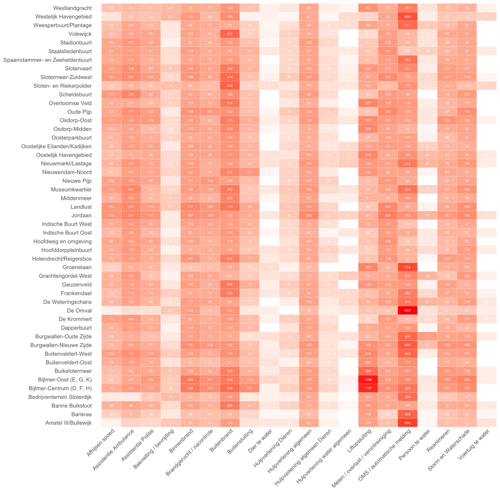

De Gemeente Amsterdam heeft sinds een paar maanden data van de brandweer Amsterdam-Amstelland [beschikbaar gesteld](http://data.amsterdam.nl/dataset/brandmeldingen-2010-2015). Volgens de omschrijving zou de data set alle meldingen van 2010-2015 bevatten, in de praktijk bevat de data meldingen vanaf 31 maart 2005 tot ongeveer halverwege 2015. Bijna 10 jaar aan branden blussen, dieren redden, en liften openen.

Een eerste blik laat zien dat de observaties aardig gedetailleerd zijn. We kunnen onder andere de buurt, het type incident en het exacte tijdstip terugvinden, dat maakt het interessant genoeg om te kijken of er patronen te vinden zijn. Laten we beginnen met een overzicht van de belangrijkste buurten en type incidenten.

Er zijn een aantal cijfers die er gelijk uitspringen. Wat zien we zoal:

- De meeste meldingen zijn afkomstig van automatische meldingen, die —niet heel verrassend— vooral van bedrijventerreinen komen (De Omval, Amstel III/Bullewijk, Westelijk Havengebied).
- Wat ik erg interessant vind is het grote aantal liftopsluitingen in de Bijlmer, natuurlijk wel een gebied met meer hoogbouw (en dus liften) dan in het centrum.
- Ook de toeristen zijn terug te vinden, die springen allemaal het water in op de burgwallen (oude-zijds).

## In de lift

Laten we eens wat beter naar de liftopsluitingen kijken. We kunnen niet alleen per buurt, maar ook op een wat hoger wijkniveau de incidenten bekijken. Als we voor de gehele periode naar liftopsluitingen in de verschillende wijken kijken zien we het volgende.

Het interessante hier is niet zozeer dat in de Bijlmer (Zuidoost) de meeste liftopsluitingen zijn, maar wel dat het aantal zo drastisch afgenomen is. Die afname zien we nog duidelijker in de grafiek hieronder waar we Stadsdeel Zuidoost met het gemiddelde vergelijken. Overigens zijn een aantal pieken te zien, het kan toeval zijn, maar het zou ook een stroomstoring zoals op [29 mei 2006](http://www.trouw.nl/tr/nl/4324/Nieuws/article/detail/1453395/2006/05/29/Stroomstoring-legt-delen-Amsterdam-tijdelijk-plat.dhtml) kunnen zijn.

## Over het water

We zagen al dat er op de burgwallen veel mensen uit de gracht gevist worden. Maar ook voor dieren rijdt de brandweer uit. Laten we beiden eens naast elkaar zetten.

We zien dat er bij de dieren een duidelijk seizoenspiek is: in de zomer veel incidenten, in de winter weinig. Bij personen zien we dat veel minder, zoveel plek om in de zomer aan een Amsterdam’s strand te liggen is er ook niet natuurlijk. Laten we eens kijken of die seizoenspiek echt zo duidelijk is.

Het lijkt er op dat het patroon redelijk consistent is, met niet heel grote afwijkingen als we de gemiddeldes over de jaren heen vergelijken. Het lijkt er op dat we wel nog wat nieuwjaarsduiken en een paar vroege lentezwemmers zien. Ik lees de laatste tijd niet veel thrillers meer, maar ik kan me herinneren dat volgens de boeken de lijken altijd op maandagochtend boven kwamen drijven. Laten we eens kijken of dat klopt.

Er lijkt wel iets meer actie op zondag en maandag ondernomen te worden, maar het is natuurlijk nog maar de vraag waar en of dat ergens door veroorzaakt wordt.

_Speaking of which…_ Hoe ziet de verdeling per dag van de week per maand er eigenlijk uit?

Het lijkt erop dat ook de brandweer oud & nieuw viert… Alhoewel de topdrukte juist in januari lijkt te zijn.

_(Je vindt de code en verdere achtergrond voor dit project [op github](http://amsterdam-fire-department/Dumky de Wilde - Udacity PS4 Project.Rmd))_
