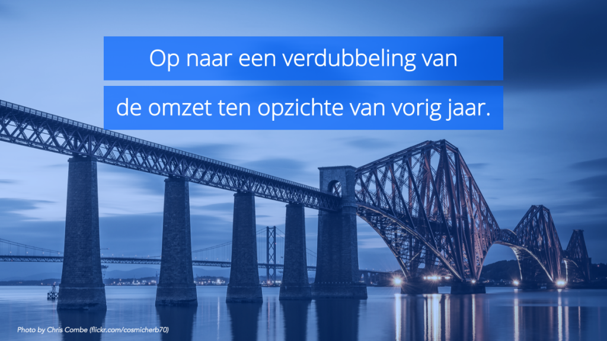
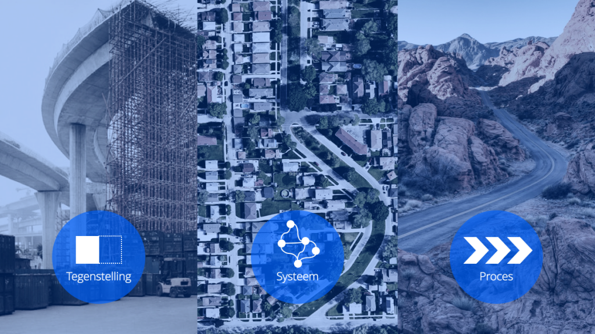

Als ik zeg dat ik een concept voor je heb dat een snelweg naar succes is. Wil je aandacht van je publiek? Hier is een beproefde methode om de code te kraken. Waar denk je aan? Zie je het voor je? Het is de analogie, een van de krachtigste communicatiemiddelen. Aandacht is niet een code, het is mentale staat van mensen. Succes is niet te bereiken via een snelweg of wat voor weg dan ook. Toch snappen we gelijk wat er bedoeld wordt. Ik weet dat een snelweg betekent dat ik sneller kan rijden en sneller op mijn bestemming kan komen. Als ik de ‘bestemming’ succes heb, wil ik daar natuurlijk zo snel mogelijk zijn. De elementen —een weg, een carrière— zijn onderling verschillend, maar ze delen "een gemeenschappelijk patroon van relaties”1. We kunnen ons voorstellen dat succes een beginpunt en een eindpunt heeft en dat we de tijd daartussen zo snel mogelijk af willen leggen om bij ons eindpunt te komen, in dit geval het verschil dat we willen overbruggen —nog zo’n analogie— tussen onze huidige situatie en de gewenste situatie van succes. Een ding valt al gelijk op: Het is lastig om abstracte concepten als succes uit te leggen zonder analogie.

Een analogie bestaat altijd uit twee delen: een doel en een bron. Het doel is dat wat we uit willen leggen of verduidelijken —wel of geen succes— en de bron is het middel waarmee we het verklaren —wegen en reizen. Hoe kun je dat toepassen in een presentatie? De meest eenvoudige manier is om te beginnen met een klein onderwerp. Dat kan een zin zijn of een klein deel van je bredere verhaal. We gebruiken vaak abstracte concepten die zonder analogie moeilijk te begrijpen zijn. Wat betekent “Philips moet zich onderscheiden van de concurrentie”, of “Uber werkt aan een verdubbeling van de omzet ten opzichte van vorig jaar”. Dit zijn kernzinnen die misschien wel vatten wat je probeert te bereiken, maar vaak lastig zijn voor je publiek om te begrijpen. Hoe kunnen we dat begrijpelijker maken?  Een van mijn favoriete zinnen uit Hollywood is “_Show, don’t tell”_. Vertellen wat dat betekent heeft geen zin natuurlijk, daarom zal ik het je laten zien. Of liever gezegd, ik ben lui en daarom vraag ik Tsjechov om het te laten zien: “Vertel me niet dat de maan schijnt; laat me een schittering van haar licht op een glasscherf zien.”  Betekent dat dan dat je een gebroken glas meeneemt naar je presentatie? Nee! Het is een analogie —_What else?_ 

Zoals je de maan kunt laten zien in een glasscherf kun je ook abstracte concepten in je organisatie laten zien met een beeld. Veel van wat er in een organisatie besproken wordt valt te te categoriseren als proces, systeem of tegenstelling. Elke organisatie wil waarde toevoegen en die drie concepten bevatten elk hun eigen manier van waardecreatie.

- Een proces is een opeenvolging van afgesproken stappen om uiteindelijk waarde toe te voegen. Of het nou een productielijn van auto’s is, de werkwijze van een inkoopafdeling om facturen te categoriseren of de manier waarop je buren de kat te eten geven als je op vakantie bent. Allemaal zijn ze gebaseerd op voorbedachte instructies en opeenvolgende stappen.
- Een systeem is de manier waarop verschillende elementen met elkaar samenhangen. Een overzicht van de bedrijven die in dezelfde markt als jij actief zijn, de manier waarop vogels in formatie vliegen, en de relaties tussen je familieleden zijn allemaal voorbeelden van systemen. Een systeem is niet aan tijd gebonden zoals processen dat wel zijn. Het gaat erom dat door de samenhang te beschrijven tussen verschillende elementen (bedrijven, vogels, familieleden) een patroon zichtbaar wordt.
- Een tegenstelling is niets anders dan het verschil laten zien van twee of meerdere processen of systemen. Je kunt denken aan een tegenstelling in de tijd (voor en na), een huidige situatie en een gewenste situatie, of op basis van een principe of oordeel (goed en slecht).

Voor alledrie zijn er verschillende analogieën die goed kunnen werken. Bij een proces kun je je een reis voorstellen waar je verschillende plaatsen passeert. Dat betekent dat je het over treinen en station’s kunt hebben, maar ook over een lopende band of de weg die water aflegt van bron naar de zee. Voor een systeem kun je denken aan natuurlijke systemen zoals de voedselketen, of het zonnestelsel, maar ook een metronetwerk of een doorsnede van een gebouw. Tegenstellingen zijn op allerlei manieren te bedenken. Zeeën en woestijnen, maar ook een kloof die ‘overbrugd’ moet worden, of een weg (obstakel) die overgestoken moet worden.

Deze drie concepten zijn slechts peilers waarop je je verhaal en bijbehorende visualisaties kunt baseren, maar ze kunnen je wel helpen om de juiste visualisatie te kiezen. Door te bedenken of je juist een tegenstelling wil laten zien of een systeem kun je met de juiste visualisatie ook de denkrichting van je publiek de juiste kant opsturen. Dat kan op het gebied van één specifiek onderwerp, maar dat kan ook voor je presentatie als geheel. Je kunt een verhaal als geheel ophangen aan een analogie of metafoor2. Je kan je voorstellen dat je in je presentatie verschillende ‘stations’ aandoet op een ‘treinreis’. Of dat je juist onderdelen uit het ‘netwerk’ laat zien. Het gebruik van zo’n metafoor is niet alleen een manier om het makkelijker te maken voor je publiek om de lijn te volgen, maar het kan ook nieuwe inzichten genereren. “Metphors are generative”, zegt Donald Schon3, in die zin dat ze nieuwe perspectieven en uitleggen opleveren. Een voorbeeld uit het fantastische _Made to Stick,_ een boek over de vraag waarom sommige verhalen wel blijven plakken en andere niet, is dat Disney voor zijn pretparken het niet heeft over medewerkers maar over ‘_cast members’_. Dat betekent bijvoorbeeld dat ze niet solliciteren, maar auditie doen voor een plek in het park. Als ze in het park zijn, zijn ze niet aan het werk maar _on stage_ en ze dragen geen uniform, maar een kostuum. Op die manier geeft de analogie medewerkers ook houvast in de dagelijkse keuzes die ze in hun werk moeten maken: iemand die _on stage_ is gaat niet even z’n vriendin bellen om te vragen wie er boodschappen gaat doen. De kracht van analogieën zit dan ook in het feit dat ze niet alleen een visuele dimensie aan je verhaal kunnen geven, maar er ook voor zorgen dat je publiek een mentale ‘kapstok’ heeft waar je verhaal aan kan blijven hangen.

 

\_\_\_\_\_\_

1\. K. J. Holyoak (2005), _Cambridge Handbook of Thinking and Reasoning_, p. 177

2\. Een metafoor is niet meer dan een speciaal soort analogie waarbij de bron en het doel wat betreft betekenis ver uit elkaar liggen, maar de relaties tussen de elementen juist vermengd zijn.

3\. Dan & Chip Heath (2007), _Made to Stick: Why Some Ideas Survive and Others Die_
