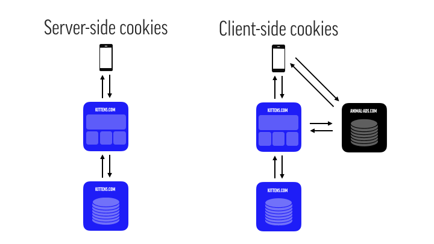
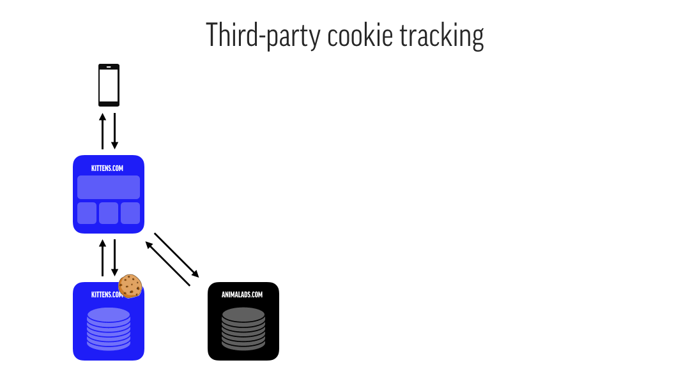

_This post was also published on [the Dept blog](https://www.deptagency.com/fromourdepsters/itp-2-1-why-you-wont-make-your-advertising-targets-but-will-finally-understand-how-cookies-work/) on May 8th, 2019_

I actually believe you will not make the targets for your online ads this year, and I’m not just saying it for the clicks. This is not your fault, or the developer’s fault, or the social or SEA consultant’s fault, or the creative’s fault. You can blame Apple, but don’t be too quick to judge. Last February, Apple introduced version 2.1 of their so-called Intelligent Tracking Prevention (ITP) causing major impact on a number of fields: A/B testing, analytics, affiliate marketing, conversion tracking and most importantly remarketing. The short version is, as you can read in more detail in [various](https://www.simoahava.com/analytics/itp-2-1-and-web-analytics/) [places](https://webkit.org/blog/8613/intelligent-tracking-prevention-2-1/): you won’t be able to target Safari users after seven days. The long version takes us back to the internet in the ‘90s and makes you rethink the results of your online ad spend.

## What's a Cookie Anyway?

Why the ‘90s you say? Well, that’s the dawn of the era of the cookie, that little piece of technology living in your browser that you know and hate from those annoying pop-ups. To understand why Apple — and Firefox alongside them — are trying to, intelligently, block cookies from tracking you, we first have to understand how cookies work.

A cookie stored in your browser solves the simple, though not easy, problem of _keeping state_. Keeping state means a computer remembering events and previous interactions. Cookies are a way to save information specific to _you_ on a website meant for everyone. They’re the reason you don’t have to log in for each visit or set the location on your favourite weather website over and over. Cookies can be set server-side through the server that serves you the website, or through a little piece of JavaScript that runs in your browser (client-side).

It’s the latter implementation, on the client-side, that has left cookies with a bad reputation. Over the years, websites have started using more and more scripts — also known as pixels or tags — from third-parties to facilitate live chat, analytics, social sharing and, yes, tracking and targeting. Say, for example, you were using the tracking tag from animal-ads.com on your puppies.com website and kittens.com also used that same tag. Then, animal-ads.com could use the information stored while visiting the former site to use on the latter. In other words: you would see ads for puppies.com on the kittens.com website. The consequence was that platforms with a ubiquitous presence on other websites could build up massive user profiles. And those user profiles could then be used for retargeting users over and over again.

## Privacy as Marketing Strategy

Enter Apple, as the defender of the helpless and exposed user. With its army of devices but without any advertising income, Apple found that defending privacy is the perfect leverage against other tech giants. And the company has stepped up its game over the last two years. The ‘intelligent’ part in ITP comes from the fact that Apple uses machine learning to identify websites with so-called _cross-domain tracking capability_. Your garden-variety cookies won’t be affected, but basically, all the third-party tools you use for analytics, audience building, targeting, and what have you, will fall under Apple’s ITP regime. That regime started in 2017 with the partitioning of cookies after a 24-hour grace period. Partitioning means that in our example, the animal-ads.com cookie stored on puppies.com is separated from the animal-ads.com cookie on kittens.com. This move effectively prevented the building of elaborate user profiles. Furthermore, those cookies would be deleted after 30 days. Great for the user’s privacy, not so great for advertisers.

ITP has evolved since then, such as removing the 24-hour grace period mid-2018. Over the last two months the latest instalments of ITP 2.1 and ITP 2.2, have given cookies their final blow. Here’s the lowdown:

- First of all, _third-party cookies_ (e.g. on animal-ads.com) are no longer stored unless they use the so-called Storage API. The Storage API is Apple’s way of making sure that information is only stored in Safari’s controlled environment when the user actively interacts with the third-party (e.g. on an embedded video).
- Secondly, _first-party cookies_ have received a blow. Any cookie that is set client-side (e.g. through a piece of JavaScript) is capped at seven days. That means not only your ad tracking (third-party) but also your analytics provider (first-party) will not recognise users as a returning user after seven days.
- On top of that, [with ITP 2.2](https://webkit.org/blog/8828/intelligent-tracking-prevention-2-2/), sites with _cross-domain tracking capability_ are prevented from sending user-identifiable information (like click IDs) through URLs while also capping the expiration for cookies on those sites at one day.

## Is There A Doctor In The Room?

Your first reaction might be: “We need to fix this! How do we make sure we can keep tracking our users!?” Well, there is no solution short of revising your entire advertising strategy. And sure, there are tactics to ensure your analytics and A/B tests will keep recognising users after seven days. This basically boils down to setting these cookies server-side, whether that’s on your own server or on a separate cloud function that you call through a subdomain for example. But all advertising that requires retargeting users or building audiences after seven days is pretty much done for. And that, of course, is precisely what Apple is aiming for. Even if you do find a way around — and believe me, people are actively looking — Apple will likely plug whatever hole you find. That means you have to think again about what retargeting means. Here are some of my thoughts:

- **Create a compelling user experience that requires identification.** Having users actively log in means you have to step up the game in terms of added value. Sometimes simply asking could be enough, sometimes you’ll need to give your UX team some more resources to create a compelling user experience. Of course, you will need to confer with your legal team to make sure you have proper consent for sharing that data.
- **Think about the entire journey.** Maybe there are channels that you’re already using that can identify your user in some way, email is a prime example of that. This will not work for social networks (that’s exactly what IT P2.2 was intentioned for), but it can still work for email. Maybe this is also the right time to see how effective your emails are in retargeting.
- **Rethinking ad effectiveness.** Why were you using a thirty-day look-back window for your campaign in the first place? Is it because your ad platform suggested it or because you believe it’s the most realistic time frame for your marketing to have an impact? This is a great time to go back to your assumptions about what works for your audience and figure out a way to test those assumptions. If you can’t (re)target single users, that doesn’t mean you can’t still target segments groups or try a [controlled experiment](https://www.kaushik.net/avinash/controlled-experiments-measuring-incrementality/) — if the volume of users allows for it.
- **Probabilistic cross-device tracking****_._** Let’s be honest, tracking with cookies was never a catch-all solution in the first place: none of us really buys a product in the same browser where we did our research. Probabilistic cross-device tracking means as much as guessing at targeting the right user by using a plethora of characteristics (device type, OS, screen size, browser extensions, etc.) to create some kind of unique fingerprint.

In the end, there is no one-size-fits-all approach. You’ll have to consider what works for your type of user, your market and your company in addition to how you use the technology — and of course budget— to match your needs.
