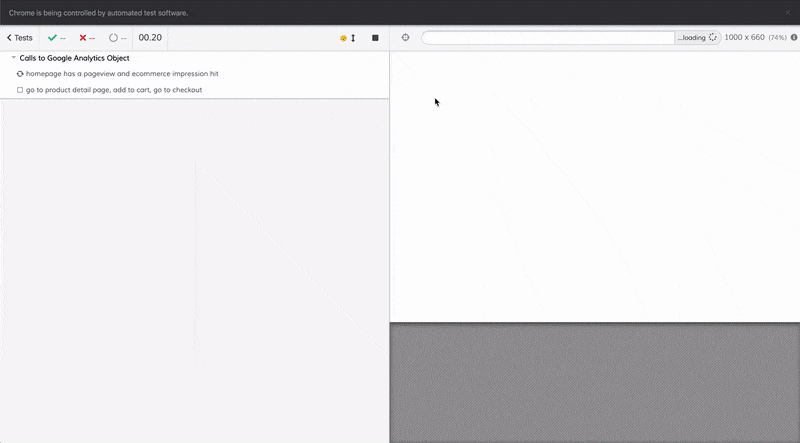

_A note beforehand: though I really like Cypress, you might also want to [think about using Puppeteer](/posts/using-puppeteer-to-automate-your-google-analytics-testing/) for your testing._

One thing that's often overlooked in setting up your analytics is making sure it keeps working. When you add new tags or your developers deploy new versions it's easy to forget about your site tracking until the revenue in your ecommerce reports drops to zero. That's usually the point where accusations fly back and forth past the office chairs and the boardroom starts asking uncomfortable questions.

It doesn't have to be like that. There are a lot of tools in the development world that we can use to our advantage. Some of them will help you do simple —not easy— unit testing or functional testing. Others will help you with end-to-end testing by simulating entire user journeys. We will look at one of those tools, Cypress, and see how we can test some basics like Google Analytics and dataLayer usage.

First step of course is to [install Cypress](https://docs.cypress.io/guides/getting-started/installing-cypress.html#npm-install) into your NodeJS project. With that set up, we can start building out tests. Every test consists of a spec.js file with various standalone tests underneath that are easily readable. For example the following will give us a test that checks for the existence of a dataLayer object and whether Google Tag Manager fires its first event.

```javascript
describe('Basic Data Layer Checks', () => {
  it('has a dataLayer and loads GTM', () => {
    cy.visit('https://www.dumkydewilde.nl')
    cy.window().then((window) => {
      assert.isDefined(window.dataLayer, 
        'window.dataLayer is defined');

      assert.isDefined(
        window.dataLayer.find(x => x.event === "gtm.js"), 
        "GTM is loaded");
    })
  });
});
```

To run this test we can just `npx cypress open` in our terminal and we'll get an interactive screen to select our test file among some default test spec files. Of course you can adjust the file to test any kind of datalayer event you like.

You can also see we execute `cy.visit()`. Cypress allows us to not only visit web pages but also interact with them in many ways. For example to go to a page, add 2 of the same products to our cart we could do the following:

```javascript
cy.visit('/products/item1');
cy.get('#quantityField').type('2');
cy.get('button#addToCart').click()
```

As you can see we can access any DOM element and interact with it. Run a few of these test and you get a mesmerising automated browser run.



## Testing Google Analytics With Cypress

To actually test our Google Analytics setup things get a little more tricky. Since the Google Analytics tracker is basically a function that gets called to track events and pageviews. What we can do is fake, or stub, the GA object and capture every time it's called. To do that we tell Cypress to mock or stub the GA object before the window even gets loaded.

```javascript
Cypress.on('window:before:load', (win) => {
    win.ga = cy.stub().as('ga')
})

describe('Calls to Google Analytics Object', function() {
    beforeEach(function() {
        cy.fixture('config.json').as('cfg');
    })
```

You also see we call something called a 'fixture'. This is nothing more than a default file we can fall back on. In this case it's a JSON file containing some defaults to include in our test, but it could just as well be an image file for testing uploads for example.

```json
{
    "gaTrackerId": "UA-41425441-17",
    "gtmContainerId": "GTM-PF3MZS8",
    "cookies": {
        "accept": "#btn-cookie-allow",
        "decline": "#btn-cookie-reject"
    },
    "pages": {
        "home": "https://enhancedecommerce.appspot.com/",
        "productDetail": "/item/9bdd2"
    }
}
```

Our first test will grab the location of the page from the configuration file, wait for 2 seconds, then check:

- whether the GA tracker has been instantiated with a 'create' call that matches the tracker ID from our configuration file.
- If a send pageview has been called
- If the ecommerce impressions on the page have been added to the tracker

```javascript
it('homepage has a pageview and ecommerce impression hit', function() {
        cy.visit(this.cfg.pages.home)
        cy.wait(2000)

        cy.get('@ga')
            // ensure GA was created with our google analytics ID
            .should('be.calledWith', 'create', this.cfg.gaTrackerId)
            // and ensure that the initial pageview was sent
            .and('be.calledWithMatch', /.+send/, 'pageview')
            // and make sure there's an ecommerce impression hit
            .and('be.calledWithMatch', /.+ec:addImpression/)

    });
```

Our next test navigates to a product detail page, adds a product to the cart and continues to the checkout.

```javascript
    it('go to product detail page, add to cart, go to checkout', function() {
        cy.visit(this.cfg.pages.home + this.cfg.pages.productDetail)
        cy.get('@ga')
            .should('be.calledWithMatch', /.+ec:setAction/, "detail")

        cy.get('#addToCart').click()
        cy.get('#checkout').click()

        cy.get('@ga')
            .should('be.calledWithMatch', /.+ec:setAction/, "checkout")


    });
```

There's a lot you can do with Cypress and it's great for integrating with existing workflows. That's especially true if you already use NodeJS —and if you develop for the web that's basically everyone, right?

I do have one big issue with Cypress (and all of the other testing frameworks out there like [Selenium](https://www.selenium.dev) or [WebdriverIO](https://webdriver.io) for that matter). It's that none of them allow you to track the _actual_ request. That is, the actual hit that is sent to the Google Analytics server (or Facebook or Microsoft server) after it's processed by the tracking script. You could set up a proxy to track those requests along side your testing framework, but that seems way to complicated for me and I don't like complicated. The only solution to solve that problem in a manageable way is to use a truly headless browser like [Puppeteer](https://github.com/puppeteer/puppeteer), but that's a whole different story.
