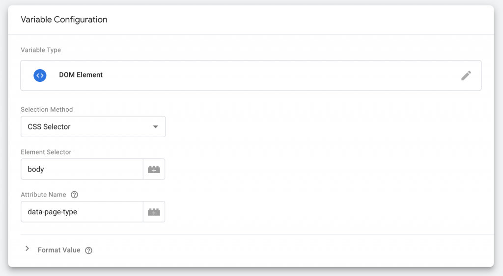

When asking developers to add extra information to a site like a user ID, user login status, page category, product price, SKU's or even product margins the conversation that ensues can be confusing. Do you want everything in a dataLayer push?

If you're not sure what you want thing can get muddy. What's the event name for the data layer push containing the page category? `pageCategoryReady`? That sounds a little weird. And maybe you're already using `<meta>` tags that also have the page category for SEO purposes. But shouldn't you use JSON-LD for that? And what about data attributes? I know, it's all very 🤯.

So let's just go through all your options, their uses, their purposes and you'll be a smart-sounding analytics consultant in no-time. We'll look at:

- Data layer pushes
- Data attributes
- Meta tags
- Micro Data and Schema Markup
- JSON-LD
- Webhooks

Before we dive into the details there's one more distinction I want to be clear about upfront. It's the distinction between events and attributes.

- An **event** is a user interaction like a transaction, a button click or a form submission. Events can of course have properties that give you more information about that event. A pageview event will have a page title property for example.
- An **attribute** is a property that gives you more information about an object like a page or a product. The size, for example, is an attribute of a product as is the price.

### Data Layer Push

A data layer push is nothing more than adding an extra entry to a JavaScript array called `window.dataLayer`. It looks something like this.

```javascript
window.dataLayer.push({
    event: 'signup',
    userId: 'ABC123',
    membershipType: 'Unlimited Special Discount 2 for 1'
});
```

The magic however is that Google Tag Manager can process its contents and give us a fancy interface around it. Because pushes can not distinguished from each other and GTM recalculates all variables on every push, you should always add an `event` key to your data layer push. This way you can make sure you fire your tags at the right time with the right values for your variables.

Because of this, data layer pushes are more event-based in nature. This makes them more suitable for anything that's not available on page load and is tied to a specific interaction (button click, form submission) or background event (API call, database updates).

### Data Attributes

In a way data attributes are the exact opposite of a data layer push. They are tied to elements on the page and usually available on page load. It looks something like `<body data-page-type="checkout">` or `<div data-product-sku="AB123">`. Data attributes always start with `data` and are set in 'snake case', i.e. using hyphens. What makes them confusing is that they're accessed in camelCase. So to access the page type attribute above we'd do something like:

```javascript
document.querySelector('[data-page-type]').dataset['pageType']
```

The good thing about data attributes is not only that they're tied to the object that they describe, but also that they're attached to the HTML of the page instead of the JavaScript on the page. That's particularly useful when you use server-side rendering. With server-side rendering you generate the HTML of the page before hand so that, for example, you don't have to access the database that contains your blog posts every time a user visits your site. The HTML is generated beforehand and thus can be cached for an extremely fast user experience. And you can easily put those data attributes in there as well.

If you want to access these attributes in GTM all you have to do is add them as a DOM Element Variable.



Sometimes you'll also see entire JSON objects being stuck into a data attribute.

```markup
<div class="product" data-product-info="{'sku' : 'AB123', name: 'Chocolate Ice Cream', 'price' : 12.34 }">
```

That not only looks crowded, it also triggers my OCD. But hey, it's valid HTML and that's all you need in life.

### Meta tags

The good old `<meta>` tag. I consider it dead weight, but yes, it's still used for things like setting the page image for a Facebook post (`og:image`) or the author name `<meta name="author" content="The Dude">`. Honestly, don't spend time on it.

### Micro Data or Schema Markup

Micro data, as [documented on schema.org](https://schema.org/address), is great for helping bots like the Google crawler understand what your site is about and what entities are on it. It's similar to data attributes in that it's attached to the element on the page. It can get a little confusing though because there are very strict naming conventions and ways to structure entities. It also always refers to the underlying schema with a link.

```markup
<div itemscope itemtype="http://schema.org/Person">
  <span itemprop="name">Ari Stotle</span>
  <span itemprop="jobTitle">Professor of Philosophy</span>
</div>
```

You could definitely use this in the same way as data attributes when your SEO colleague has beat you to it and decided on implementing this for say, products, business info or blog posts. There's [a nice testing tool from Google for both micro data and JSON-LD](https://search.google.com/structured-data/testing-tool#).

### JSON-LD

If data layer pushes are the JavaScript brother of data attributes, then JSON-LD is micro data's sister —or something like that... It sounded cool the first time, no really. In any case, JSON-LD is nothing more than the same type of schema.org structured data in a JSON object wrapped in a `<script>` tag.

```markup
<script type="application/ld+json">
{
  "@context": "https://schema.org",
  "@type": "Organization",
  "name": "WW's Chocolate Factory",
  "contactPoint": {
    "@type": "ContactPoint",
    "telephone": "+1 234 567 89",
    "contactType": "Customer service"
  }
}
</script>
```

And therein lies exactly the problem. Search crawlers are set up to digest this stuff, but our tag management solution usually isn't. That means we'd have to grab the contents of the script element and find a way to parse it for use in our tags. Doable, but not trivial.

Funny enough it also works the other way around. We can use Google Tag Manager to generate these snippets and they'll be picked up by the Google Crawler (though likely not by most other crawlers, since not many crawlers parse the JavaScript from Google Tag Manager).

### Webhooks

We've now reached the final part, which is where we talk about the things we _don't_ want to measure on our site —at least not through front-end HTML or JavaScript. Basically a webhook is a dotted line in a CRM or other type of application where you fill in the URL you want to call. It's unlikely to be in direct interaction with a user since it's usually server-side, though it can be triggered by a user interaction.

Take for example Google Analytics. The only thing the GA tracking script on your site produces is a series of URL's containing information about the page, the timestamp, the user's browser, and maybe an event. We can use a webhook to call a similar URL when for example a user registers for an event, or purchase is delivered.

```javascript
https://www.google-analytics.com/collect?
v=1              // Version
&tid=UA-XXXXX-Y  // Tracking ID
&cid=555         // Client ID

&t=event         // Hit type
&ec=purchase     // Event Category
&ea=delivered    // Event Action
```

One thing to keep in mind is that if you want to track off-site events and tie them back to a user's actions on-site, you'll need some kind of ID to match. This could be a user ID if it's a registered user, a Google Analytics client ID or even an ad click ID (`fbclid`, `msclkid` or `gclid`). The most common way to do that is to use a hidden form field to send the ID along with a form submission or transaction.

And that's it really. Now you've got a series of tracking options to add to your implementation toolbox.
