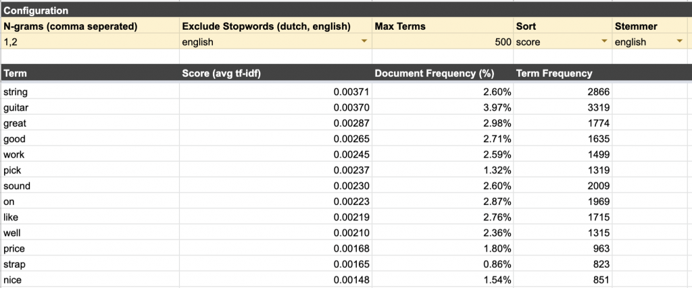
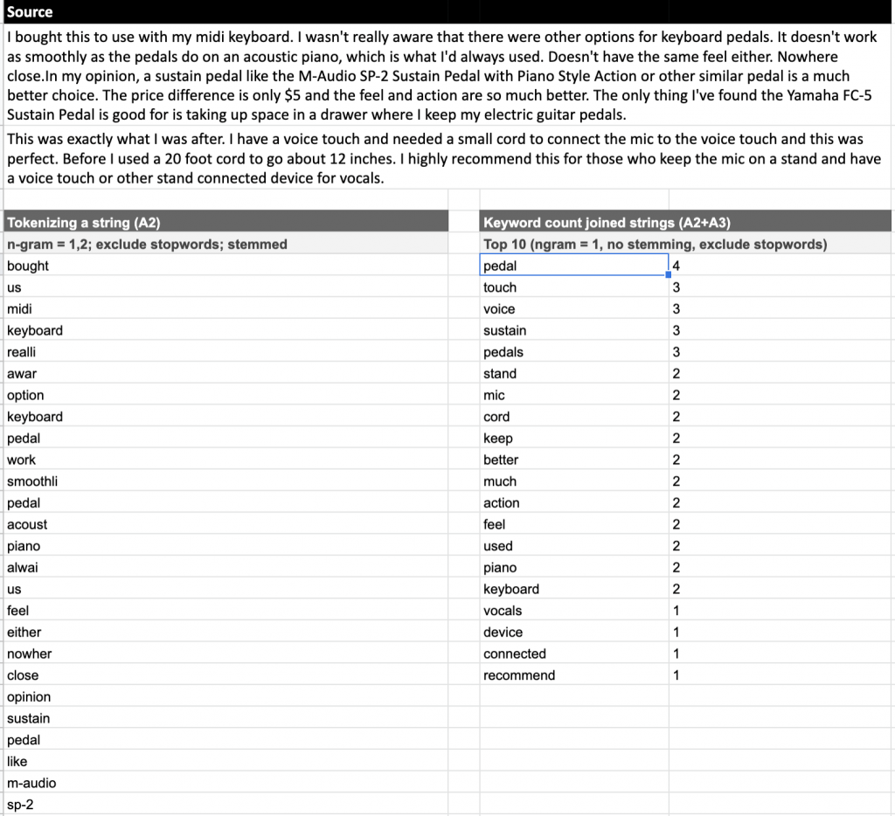

Google Sheets, the online Excel alternative, is basically the Swiss army knife of any modern knowledge worker. We're adding to it's multitude of uses and abuses today by creating a custom Tf-Idf model _in_ Google Sheets. A Tf-Idf model can help us digest large quantities of text like reviews, comments, feedback, chat histories, and even [17th century philosophy books](https://www.dumkydewilde.nl/2017/11/a-visual-leviathan-hobbes-schizophrenic-writing/) with ease.



Our end result will be [this Google Sheet](https://docs.google.com/spreadsheets/d/1qHnRcr-YrO8gV3JVELb3U6krh9SFUmQyDuADfND0hkk/edit#gid=2031883618) — just make a copy for yourself— that can easily handle the Tf-Idf calculation for more than 50.000 documents. If you're thinking about handling really large quantities of text, you might want to consider using Python and the NLTK package. But, hey, you're here now, that means you're probably a nifty hacker looking for a clever Google Sheets hack to impress your colleagues (isn't _everyone_?)

Our sheet will handle the following steps:

- **Tokenisation:** tokenisation is the process of cutting up larger pieces of text into smaller, more digestible pieces. These smaller pieces are so-called n-grams, for example 'guitar' is a 1-gram and 'guitar strings' is a 2-gram. With Tf-Idf calculations, sometimes the combination of two words can be more interesting and have more meaning than a single word. For the tokenisation we discard all punctuation marks and extract only the words, numbers and hyphens
- **Normalisation**: the normalisation process allows you to lowercase all words so they are treated as identical as well as remove diacritics (ü, ì, á, etc...) to improve match rates. On top of that you can also remove often occurring "stop" words, like "and" that have little meaning.
- **Stemming**: for English the [Porter stemmer algorithm](https://en.wikipedia.org/wiki/Stemming) has been implemented. This allows you to combine words with similar meanings, but different endings. E.g. 'playing', 'played' and 'plays' all are transformed to the same stem of 'play'. Contrary to stemming, lemmatisation also uses the _context_ of the word in a sentence (verb, noun, adjective), however implementing that is way too complex for a Google Sheet which is why we've chosen the Porter stemmer.
- T**erm & Document Frequency:** this is the calculation of how often a specific term like 'guitar' occurs in a single document like a review (term frequency) versus how many documents of the entire corpus contain that term regardless of the fact that it might occur multiple times in a single document (document frequency)
- **Tf-Idf:** calculating the term-frequency/inverse document frequency allows you to calculate how relevant a specific term in a document is related to all the other documents. Words that appear in all documents will now have a lower score than words that occur in a lot of documents but not all.
- **Examples:** the 'Examples by term' tab allows you to easily find the selection from the corpus including one of the highest scoring terms from the Tf-Idf result list

## Building the damn thing

Alright, let's get going. If you want Tf-Idf, you need to calculate at least two things:

- The 'Tf' or term-frequency, which is how often a term (word, word part or combination of words) occurs in a document (i.e. a coherent bunch of text)
- The 'df' or document frequency, which is basically how often the above term occurs in the corpus, the collection of documents.

However, because the document frequency just gives us the most _common_ words, we use the _inverse_ document frequency (Idf). The idea is that less commonly used words contain _more_ information because they are rare.

Let's start with the simple part first: term-frequency

```javascript
function termFrequency(doc,term) {
  /* Take an array of words (doc) and calculate the occurrence frequency of a term */
  const occurences = countOccurrences(doc, term);
  return occurences/doc.length
}

const countOccurrences = (arr, val) => arr.reduce((a, v) => (v === val ? a + 1 : a), 0);
```

Now for the inverse document frequency

```javascript
function idf(tokenizedCorpus, terms) {
  /* take an array of arrays (tokenized documents) against an array of terms to calculate the IDF */

  const idfList = terms.map(term => {
  const freq = tokenizedCorpus.reduce((counter, doc) => {
      return doc.indexOf(term) > -1 ? counter + 1 : counter
    },0);
    
    return [term, Math.log(tokenizedCorpus.length / (freq + 1))]
  }).reduce((agg, cur) => { 
    agg[cur[0]] = cur[1];
    return agg}, {})
  return idfList
}
```

And that allows us to calculate the Tf-Idf

```javascript
function tfIdf(idfList, tokenizedCorpus) {
  let freqs = {}
  Object.keys(idfList).forEach(term => {
    const tfIdfAllDocs = tokenizedCorpus.map(doc => {
      return termFrequency(doc, term)*idfList[term]
    })

    const summedTfIdf = tfIdfAllDocs.reduce((a, b) => a + b, 0)

    freqs[term] = summedTfIdf / tfIdfAllDocs.length
  })

  return freqs
}
```

I believe however, that the power of good text analysis is not necessarily in something like a Tf-Idf calculation, but about pre-processing your text in such a way that you condense the meaning as much as possible. Which is why we normalize the words and stem them.



A simple but valuable trick is to lower-case everything but also remove the diacritics (that's the ë, å, ì's). For the latter I found a simple but effective solution.

```javascript
// https://stackoverflow.com/questions/20690499/concrete-javascript-regex-for-accented-characters-diacritics
const cleanUpSpecialChars = (str) => {
    return str
        .replace(/[ÀÁÂÃÄÅ]/g,"A")
        .replace(/[àáâãäå]/g,"a")
        .replace(/[ÈÉÊË]/g,"E")
        .replace(/[éèëê]/g,"e")
        .replace(/[ÓÒÖÔ]/g,"O")
        .replace(/[óòöô]/g,"O")
        .replace(/[ÍÌÏÎ]/g,"I")
        .replace(/[îíìï]/g,"i")
        .replace(/[úùüû]/g,"u")
        // .replace(/[^a-z0-9]/gi,''); // final clean up
}
```

Here's how.

```javascript
function tokenizeDoc(doc, ngram, ignoreCase=true, exclusionList=[], stemmer="english", excludeStopWords="english") {
  // Check if we're tokenizing a single cell or multiple cells
  if(Array.isArray(doc)) {
    return doc.map(d => {
      return tokenizeSingleDoc(d).join(",")
    })
  } else {
    return tokenizeSingleDoc(String(doc))
  }

  function tokenizeSingleDoc(doc) {
    doc = String(doc);
    if(ignoreCase) {
      doc = doc.toLowerCase()
    }

    doc = cleanUpSpecialChars(doc);
    
    // Extract single words
    docTerms = doc.match(/[A-zÀ-ÿ0-9\-]+/g);
    if(docTerms === null) {
      return []
    }
    
    // Filter out words that are in an exclusion list of unwanted words
    if (exclusionList.length > 0) {
      exclusionList.forEach(excl => {
        excl = String(excl);
        if(ignoreCase) {
          excl = excl.toLowerCase();
        }
        docTerms = docTerms.filter(v => v !== excl)
      })
    }

    // Use a global variable containing lists of stop words for various languages to filter out stop words.
    if(Object.keys(STOP_WORDS).indexOf(excludeStopWords) > -1) {
      docTerms = docTerms.filter(function(v) {
        return STOP_WORDS[excludeStopWords].indexOf(v) < 0 
      })
    }

    // I've used an existing JS implementation of the Porter Stemmer for English, found here: https://github.com/words/stemmer
    if(stemmer === "english") {
      docTerms = docTerms.map(term => {
        return stemmerEnglish(term);
      })
    }

    tokenizedDoc = [];

    if (typeof ngram === "string") {
      ngram = ngram.split(",").map(n => { 
        return parseInt(n);});
    }
    
    //Map the n-grams to a single word or combination of words
    ngram.map(n => {
      for (i = 0; i < (docTerms.length - n + 1); i++) {
        tokenizedDoc.push(docTerms.slice(i,i + n).join(" "))
      }
    })

    return tokenizedDoc
  }
}
```

And that's it for now! You can find the entire script in [the Google Sheet I mentioned before](https://docs.google.com/spreadsheets/d/1qHnRcr-YrO8gV3JVELb3U6krh9SFUmQyDuADfND0hkk/edit#gid=2031883618) by going to Tools > Script Editor. There I've also added some extras to make it play nice with Google Sheets and be able to use [custom functions](https://developers.google.com/apps-script/guides/sheets/functions) in Google Sheets.
