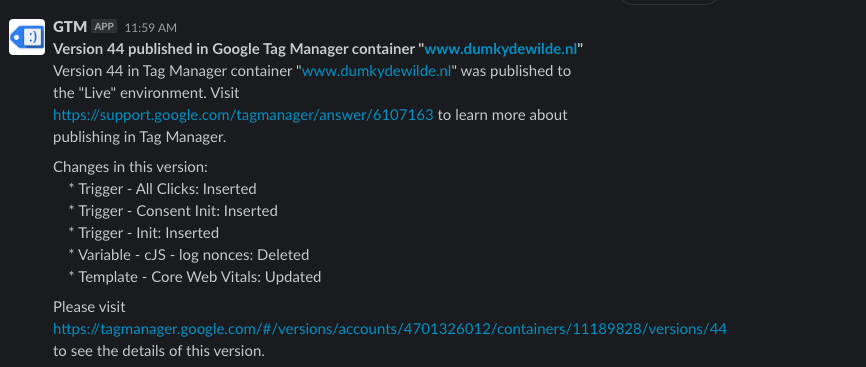
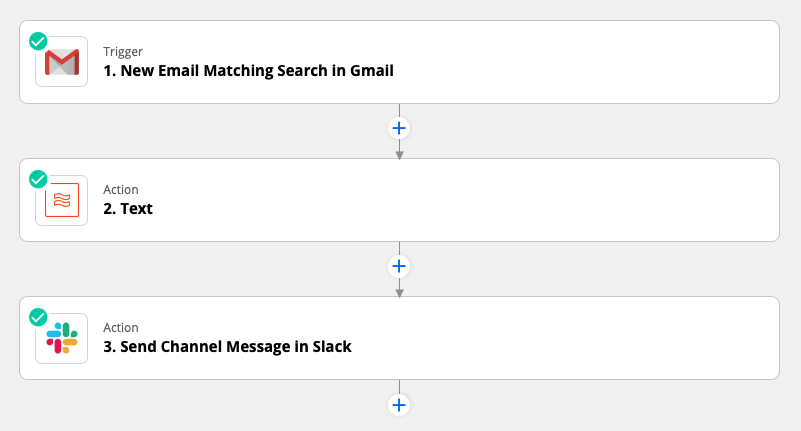
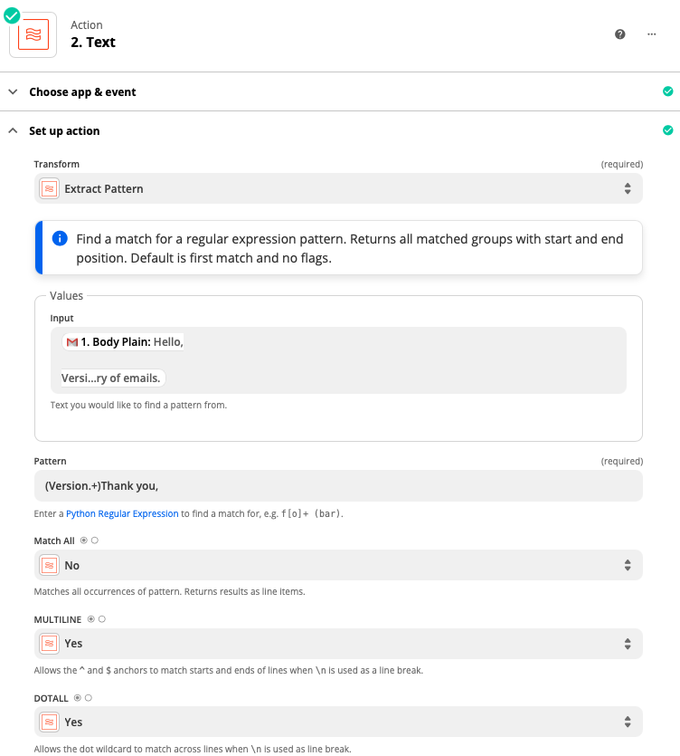
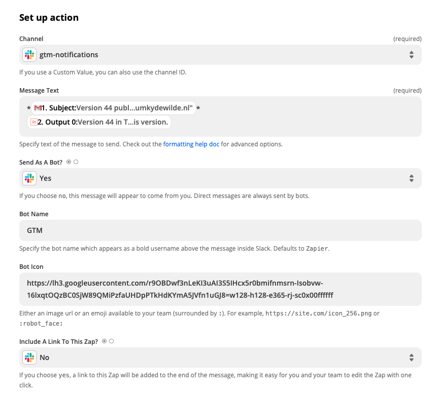
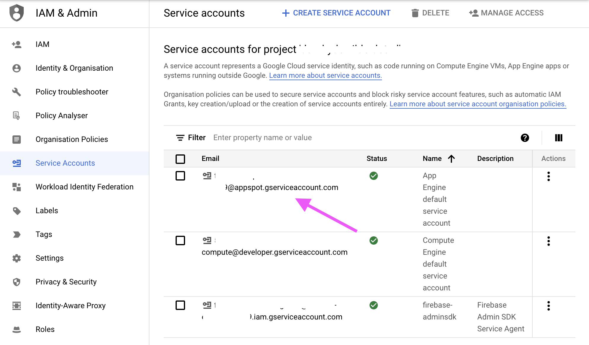
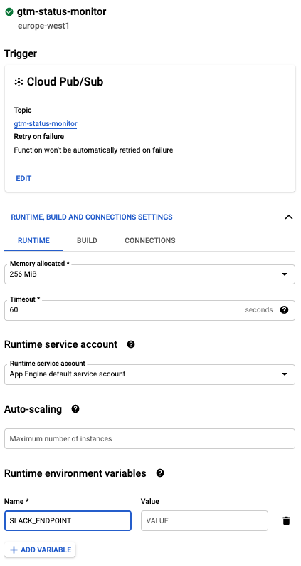
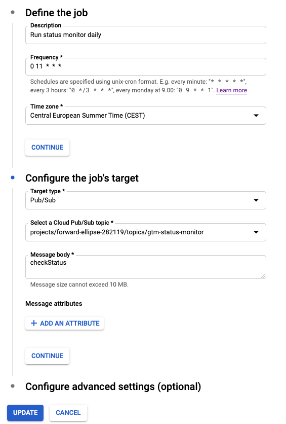
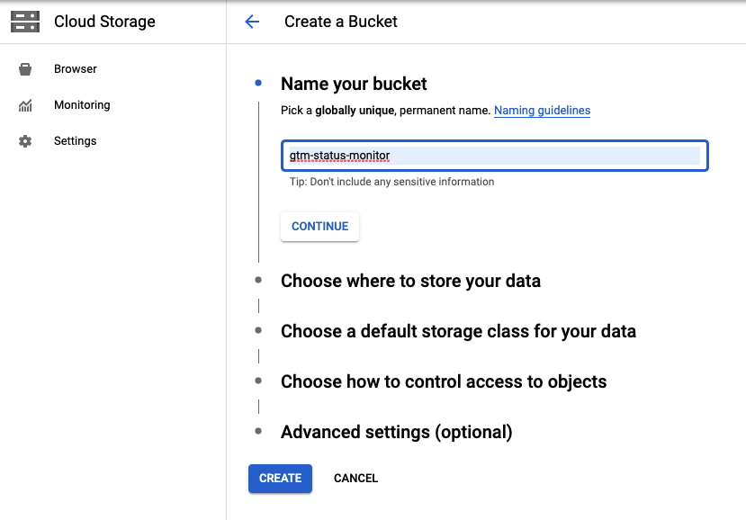

One thing that has bothered me over the years is the weirdness of not having any possibility for setting up a pipeline in Google Tag Manager for when new container versions are published. Wouldn't it be great not only for security reasons to keep an eye on container updates, but also to automatically update documentation, set up notifications in other services, or run some tests. But alas, all we have —and only since recently— is a dropdown that let's a user receive a notification when a new version is published. 

So let's take power into our own hands and get things done. Today we are building a notification system for GTM that allows us to send notifications anywhere with a webhook. A great use case is sending a webhook to Slack so that we can keep track of all the containers of interest that are updated. 



Now there are two paths to nirvana, depending on your requirements and setup. We'll start with the easy path, that is unfortunately also the dirtiest path, and after that we'll set up a more robust solution with Google Cloud Platform (GCP).

## Using Zapier and email to send GTM Publication notifications to Slack

Zapier is a great tool if you want to connect various services together and do all kinds of magic. The problem however with GTM notifications is that going the Zapier route has a few downsides because of the limitations with GTM's notification setup, most importantly:

- You need a Google account attached to an email address to setup notifications for a user. That is, you can't just use any random email address for notifications.

Since you are tied to an actual Google account holder, you will now have to pick between two evils:

- Use your personal email address to either capture GTM emails directly in Zapier or use a forwarder to automatically send them to a Zapier email address. This has the downside of having to attach everything to your personal account and not be able to share this easily (e.g. when you leave the company or client).
- Use a shared email address with a Google account in GTM. This is *not recommended* because shared email addresses are a gigantic security hole waiting to be exploited.

If you go with option 1 you'll further need a Gmail for business (i.e. Google Workspace) account if you want to directly connect your Gmail account to Slack. 

Nonetheless, it can be very useful in some situations, so let's check it out.

### Zapier: Gmail to Slack

The flow consists of two three steps:

- An email coming in
- Cleaning up the email
- Sending a message to Slack



For the first step, as mentioned before, you can use the Gmail integration, or set up a zapiermail.com email address when you choose the *Email by Zapier* trigger. 

For the second step we'll use a regex extraction to get only the part of the email that we want and remove all the unnecessary small talk that's added by Google. The regex is very simple, just capture the part between the word `Version` and `Thank you` and we'll have all the relevant information



For the final Slack message we connect our Slack account, pick a channel, add some markdown to our message (`*bold*`) and add a nice icon. I decided to give the [good ol' tag assistant](https://chrome.google.com/webstore/detail/tag-assistant-legacy-by-g/kejbdjndbnbjgmefkgdddjlbokphdefk?hl=en) icon a new life. Don't forget to also turn off link previews as they can quickly become annoying.



Test your setup and you should see those messages rolling into your Slack channel like a group of high schoolers into a MacDonald's drive through.

## Using a GCP Cloud Function and service account to periodically check for new versions

Since GTM is giving us a hard time getting the information in a useful place. We'll have to do the ground work ourselves. We'll set up a function that checks changes in the container version every 5 minutes or so. We won't get as much information, but at least we'll know if a client has gone and made a wreck of the container on a sunny Friday afternoon. It also has the added benefit of being able to check containers that are not yours if you wanted to.

The setup looks as follows.

- GCP Cloud Scheduler calls a Cloud Function endpoint every x minutes
- The Cloud Function checks the version of the container that is currently live
- If the version is different from the version stored in a previous check a message is sent to a Slack endpoint

### Building our GTM Status Monitor Cloud Function part by part

You can find [the full code for the Cloud Function on Github](https://github.com/dumkydewilde/gtm-status-monitor) but here we'll focus on the key components. Our function needs to be able to do the following.

1. Go over a list of containers we want to check
2. Check the version for that container
3. Get the stored version from a previous check
4. Compare the stored version with the current version
5. If there is a difference: call a function to send a message and set the new version in storage.

So let's start with the basics. Our main function reads a list of containers we want to check from storage. After that it creates a global object for authenticated interaction with the Google Tag Manager API.

```jsx
exports.checkStatus = async(event, context) => {
    console.log('Starting GTM status check');

    // Get list of containers to check
    let checkContainers = await storage.bucket(STORAGE_BUCKET).file(CHECK_CONTAINER_FILE).download()
    checkContainers = JSON.parse(checkContainers.toString('utf-8'))

    // Set up authentication once (don't forget to add your service account to the GTM container)
    const auth = new google.auth.GoogleAuth({
        scopes: ["https://www.googleapis.com/auth/tagmanager.readonly"]
    });
    const authClient = await auth.getClient();
    const tagmanager = google.tagmanager({
        version: 'v2',
        auth: authClient
    });

		await Promise.all(checkContainers.map(async(c) => {

			...

		}));

}
```

After that we get to the meat of our function. We go through our `checkContainers` object one by one —or actually, to be precise we go through them asynchronously, so we could do multiple at the same time— and run a check for every container. There are two ways to check the container version. The first is quite simple. Every GTM container script is public because it is loaded on your site for every visitor. That means we can just grab the script and look for the version in the text. The first lines of every GTM script will look something like this.

```json
var data = {
"resource": {
  **"version":"393",**
  
  "macros":[{
      "function":"__u",
      "vtp_component":"HOST",
      "vtp_enableMultiQueryKeys":false,
      "vtp_enableIgnoreEmptyQueryParam":false
    },
		...
	]

	...
}
```

Getting the version from a URL that contains a script like that requires only a few lines of code.

```jsx
const getVersionFromURL = async(url) => {
    const res = await axios.get(url);
    const re = /resource.+?{.+version.+?([0-9]+)/s;
    return parseInt(res.data.slice(0,400).match(re)[1]);
}
```

We are using a often used library called 'axios' to grab the contents from the url and then a regex to extract the version information from the first few hundred characters.

If we want more information though, we'll need to access the GTM container itself through the API. The code for that is easy enough again when we use the globally authenticated tag manager object we created above.

```jsx
const getLatestContainerVersionInfo = async(tagmanager, accountId, containerId) => {
    const res = await tagmanager.accounts.containers.versions.live({
        parent: `accounts/${accountId}/containers/${containerId}`,
    });

    // Return live version info
    return {
        "containerVersionId" : parseInt(res.data.containerVersionId),
        "containerId" : res.data.containerId,
        "containerInfo" : res.data.container,
        "fingerprint" : res.data.fingerprint,
        "name" : res.data.name,
        "description" : res.data.description,
        "path" : res.data.path,
        "tagManagerUrl" : res.data.tagManagerUrl
    }
}
```

But since we haven't logged in with our own account to GTM, how do we make sure that our Cloud Function can get access to the container? To do that we need a so-called service account. A service account is a way to authenticate server to server communication. GCP creates a few default service accounts for every project and simply adding their email address to the GTM container for read access will give our cloud function access to the containers we need. In this case we'll need the `App Engine default service account` which you can find under IAM & Admin.



With these functions in place we can look at the main part of our function. First we check if we are checking are container through a URL. If so, we'll use the URL to get the live version of the container and then use the URL as an identifier to get the stored version. If there's a difference, we'll set the live version in storage and publish a notification. For the check through the service account, we'll do something similar, except we have a little bit more information about the container to work with that we can publish.

```jsx
if(c.url !== undefined) {            
    console.log(`Checking container '${c.name}' at ${c.url}`);
    const liveVersion = await getVersionFromURL(c.url);
    
    const checkId = Buffer.from(c.url).toString('base64');
    const lastKnownVersion = await getStoredVersionById(checkId);

    if (lastKnownVersion !== liveVersion) {
        //New version detected
        await setStoredVersionById(checkId, liveVersion)
        await publishNotification({
            newVersion: liveVersion,
            lastKnownVersion: lastKnownVersion,
            containerId: c.url.match(/GTM-[A-Z0-9]+/)[0],
            name: c.name
        });
    }
} else {
    console.log(`Checking container '${c.containerId}' for account ${c.accountId}`);
    const checkId = `${c.accountId}-${c.containerId}`;
    const liveVersionInfo = await getLatestContainerVersionInfo(tagmanager, c.accountId, c.containerId);
    const lastKnownVersion = await getStoredVersionById(checkId);

    if (lastKnownVersion !== liveVersionInfo.containerVersionId) {
        await setStoredVersionById(checkId, liveVersionInfo.containerVersionId);

        await publishNotification({
            newVersion: liveVersionInfo.containerVersionId,
            lastKnownVersion: lastKnownVersion,
            containerId: liveVersionInfo.containerInfo.publicId,
            containerInfo: liveVersionInfo.containerInfo,
            versionInfo: liveVersionInfo
        });
    }
}
```

The final part is to send the notification to our Slack endpoint. We define a message with more or less details depending on the amount of information available and then send it to the globally defined endpoint. This endpoint is something you want to keep secret (otherwise anyone can send messages to your channel) so it is read from an environment variable (`const ENDPOINT = process.env.SLACK_ENDPOINT;`).

```jsx
const publishNotification = async(data) => {
    let messageText = "";
    if(data.containerInfo !== undefined) {
        // Detailed message
        messageText = `*Version change detected from version ${data.lastKnownVersion} to ${data.newVersion} for container ${data.containerId} (${data.containerInfo.name})*\nView changes at ${data.versionInfo.tagManagerUrl}\n- Version name: ${data.versionInfo.name}\n- Version fingerprint: ${data.versionInfo.fingerprint}\n- Version description: \n>${data.versionInfo.description}`;
    } else {
        // Simple message
        messageText = `*Version change detected from version ${data.lastKnownVersion} to ${data.newVersion} for container ${data.containerId} (${data.name})*`;
    }

    await axios.post(ENDPOINT, {
            "type" : "mrkdwn",
            "verbatim" : true,
            "text" : messageText
        }).then(res => {
            // console.log(JSON.stringify(res.data));
        }).catch(console.error)
    return
}
```

### Setting up the GTM Status Monitor Cloud Function on Google Cloud Platform (GCP)

Now that we understand our code (again, you can [find the full version on Github](https://github.com/dumkydewilde/gtm-status-monitor)), it's time to put everything together. First off, we create a new GCP Cloud Function. It'll be triggered by a pub/sub message from the Cloud Scheduler that we'll set up later. The pub/sub topic will be `gtm-status-monitor`.  The other important thing to add is the URL for your Slack endpoint in the environment variable. You can find this URL by [creating a Slack App and enabling webhooks](https://api.slack.com/messaging/webhooks). 



### Setting up the Cloud Scheduler Pub/Sub Event on GCP

Setting up our scheduler to call our function is easy peasy. In fact, it doesn't actually call our function, it just sends an 'event' to a 'topic' at the interval we've set, in this case every day at 11 (`0 11 * * *`) but you could just as well do it every hour (`0 0/24 * * *`). The message body doesn't necessary have to be filled since we're not checking that, but you could use it in the future. For example, instead of sending information directly to Slack, we could also send it back to the Pub/Sub topic and have multiple functions use that information. In that case we'd have to only fire our status monitor function when the message body contains `checkStatus`.



### Creating a storage bucket for our GCP Cloud Function

Now there's one final thing we need to do: create a place to store both information about versions as well as the containers we want to check. First up we'll create a bucket called `gtm-status-monitor` in Cloud Storage. Be aware that reading and writing from storage can incur costs if it's, say,  every five minutes of every day for a lot of containers. You can do the cost calculation when creating the bucket, but if it's only a check every few hours you should be totally fine within the free tier.



When we've added our storage bucket we'll have to add two files.

`check_containers.json` contains an array of the containers you want to check with either the account ID and container ID if you're using a service account or the URL and an easy to recognise name of your choice.

```jsx
[
    { 
        "accountId": "12345678",
        "containerId": "12345678"
    },
    {
        "name": "My First Container",
        "url": "https://www.googletagmanager.com/gtm.js?id=GTM-ABCDEFG"
    }
]
```

The other file `container_versions.json` will be empty as it will be filled with the actual versions when the script checks them.

And that's it. You can try and trigger an event from Cloud Scheduler to see if everything works as intended and you should start to receive messages in the Slack channel that you selected when creating your app.