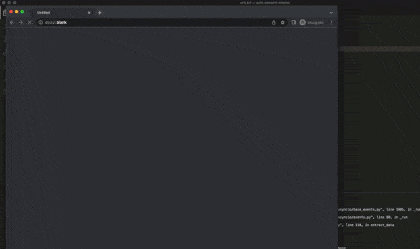


If you enjoy this post. I've developed an easy [package called 'consentcrawl'](https://github.com/dumkydewilde/consentcrawl/) to run a quick check on your site doing nothing more than running `consentcrawl <<my-site.com>>` in your terminal.

There's nothing like watching 20 browser windows pop-up on your screen to make you feel like a proper hacker. So I always grab on to any excuse for a browser automation project. In this case we'll be writing a Python script to do a GDPR consent check with [Microsoft's Playwright](https://playwright.dev/python/) for multiple URLs at the same time. After we're done we should be able to:
- detect which consent manager is used
- which cookies are set before and after consent
- which marketing/analytics requests are sent before and after consent is given



I've used [Puppeteer](https://www.dumky.net/posts/using-puppeteer-to-automate-your-google-analytics-testing/) before, but Playwright does its name justice and one-ups Puppeteer to just leave it in the dust. In contrast to Puppeteer, Playwright allows you to automate not just Chrome, but also Firefox and Safari. And on top of that it not only provides a Node.js API but also Python, Java and .NET. Let's give it a spin!

## Consent and GDPR compliance
To understand the job that lies before us, I'll bore you with two minutes of what consent and the GDPR actually mean for websites before we move on to the fun stuff. The GDPR requires a legal basis for websites serving EU citizens to process data. If you process someone's address to send them the [artisanal peanut butter](https://depindakaaswinkel.nl)[1] they bought, no problemo, that's enough of a legal basis. But if you want to store data on their device (i.e. cookies) or share their data (e.g. browsing behaviour) with third parties, you need their consent. And that consent has to be given unambiguously, that is, it has to be as easy to say yes as it is to say no. 

## Why GDPR compliance is hard
Accepting that the world is not how you'd like it to be is hard for some people. But that's not the only reason why implementing consent is hard. Sure, it may be painful for you at first that your "click for details" greyed-out small-font link has to go because it doesn't make it "as easy to say yes as to say no". And yes, also the "by using this site you accept our use of cookies" can go straight to the trash! But GDPR compliance is hard because:
- It is (a little bit) different in each European country
- You have to store a proof of consent
- You need to educate both your marketing and development teams on what does and what doesn't require consent —and that's not your core business
- You need the technical skills to implement proper consent management
- You need to keep track of changes (legal, technical and marketing-wise) over time

## Automating consent and GDPR compliance checks
Browser automation allows us to interact on pages as if we were an actual user without the need for expensive tooling. That's great for what we need: a way to check storage (i.e. cookies) and data sharing (i.e. third party marketing/analytics requests) before and after giving consent. So let's start with some code. Before we can do anything, we'll have to install Playwright. I'm assuming you already have Python up and running so you can do

`pip install playwright`

After that you'll have to actually install the Playwright browsers by running 

`playwright install`

Now that we have Playwright installed we can get on with our script.  There are a couple of things to note:
- using `asyncio` we can handle multiple requests asynchronously, i.e. we don't have to wait for website A to complete loading before we can load website B. 
- We add a request listener to capture all outgoing requests from our page before we load the page using `page.on('request', <do something with the request>)`
- We load a file containing servers for advertising to identify outgoing requests as 'tracking requests'


```Python
import asyncio
from playwright.async_api import async_playwright
import re
import requests

async def extract_data():
	async with async_playwright() as p:
		browser = p.chromium.launch(headless=False) # start the browser
		browser_context = browser.new_context() # new 'incognito' window
		page = await browser_context.new_page() # open a new tab
		
		# capture any outgoing requests from the URL
		req_urls = []
	    page.on("request", lambda req: req_urls.append(req.url))
	
		# go to the URL and wait until no more new requests are firing
		await page.goto("https://www.dumky.net", wait_until="networkidle")
	
		# take a screenshot
		await page.screenshot()
	
		# filter out all third party requests
		domain_name = "dumky.net"
		thirdparty_requests = list(filter(lambda req_url: not domain_name in req_url, req_urls))
	
		# get all the unique third party domains requested
		third_party_domains_no_consent = list(set(map(lambda r: re.search("https?://(?:www.)?([^\/]+\.[^\/]+)", r).group(1), thirdparty_requests)))
	
		
		# if a third party domain is on the blocklist define it as a 'tracking' domain that requires consent. The blocklist uses a public list from an adblocker
		ad_domains_file = requests.get("https://hosts.anudeep.me/mirror/adservers.txt").text
	    ad_domains = set([line.split('0.0.0.0 ')[-1] 
	        for line in ad_domains_file.split("\n") 
	        if not line.startswith('#')])
		
		# filter based on the blocklist
		tracking_domains_no_consent = list(set([re.search("[^\.]+\.[a-z]+$", d).group(0) for d in third_party_domains_no_consent if d in blocklist]))
	
		# get all browser cookies that are set before consent
		cookies = await browser_context.cookies()
		cookies_no_consent = [{
			"name" : c["name"],
			"domain" : c["domain"],
			"expires" : c["expires"]
		} for c in cookies]

	print(tracking_domains_no_consent)
	print(cookies_no_consent)

# allow 
asyncio.run(extract_data())
	
```

### Finding the opt-in button
With the script above we're able to capture everything we need to determine if we are compliant or not. But of course, we also want to know if and what kind of marketing scripts are actually firing after consenting. Every consent management implementation has a different way of identifying their opt-in button, but using a [list of CSS selectors](https://github.com/dumkydewilde/auto-consent-checks/blob/main/consent_managers.json) we can find some of the more common implementations and in the process also identify the underlying consent manager. 
For example, the CSS selector for the CookieBot accept (allow all) button looks like this:
`#CybotCookiebotDialogBodyLevelButtonLevelOptinAllowAll`

We can now read the file with the list of consent managers and go through the list one by one to try to click them. The last item in the list is a very generic selector to find custom implementations. Be aware that there might still be a valid consent implementation that we are not able to find in this way. Feel free to add it to the list if you find one that hasn't been covered.

```Python
 # read CSS selectors for accepting consent from file
    consent_accept_selectors = {}
    with open('consent_managers.json', 'r') as f:
        consent_accept_selectors = json.load(f)
 
 # try to accept full marketing consent
        consent_manager = "none detected" # default value
        for k in consent_accept_selectors.keys():
            if await page.locator(consent_accept_selectors[k]).count() > 0:
	            # if the count is > 0 we've found our button to click
                consent_manager = k
                # we try to click and explicitly wait for navigation as some pages will reload after accepting cookies
                try:
                    async with page.expect_navigation(wait_until="networkidle", timeout=15000):
                        await page.click(consent_accept_selectors[k], delay=10)
                except Exception as e:
                    print(url, e)
                break
```

And that's all we have to do. Now we can again capture all cookies, third party domains and tracking domains and close the browser context by using  `await browser_context.close()`. After that we can store our results in an object and write them to a file. 

```Python
results = [{
            "url" : url,
            "cookies_all" : cookies_all,
            "cookies_no_consent" : cookies_no_consent,
            "third_party_domains_all" : third_party_domains_all,
            "third_party_domains_no_consent" : third_party_domains_no_consent,
            "tracking_domains_all" : tracking_domains_all,
            "tracking_domains_no_consent" : tracking_domains_no_consent,
            "consent_manager" : consent_manager,
            "screenshot" : screenshot_file
        }]

with open('site_data.json', 'w') as f:
	f.write(json.dumps(results, indent=2))
```

## Wrapping up
Up until now we've only captured the data of one website and it doesn't make sense to use `asyncio` for just the one site. To apply our script at scale we have to do two things. First of all we have to implement the `asyncio` logic to run our data extraction for multiple website simultaneously and secondly we need to create batches of urls so we don't overload our system by running hundreds of browser windows at the same time

To start with the second part, we create a simple function to turn a list into a list of lists of size n. E.g. `[A, B, C, D]` becomes `[[A, B], [C, D]]`

```Python
def batch(iterable, n=1):
    """
    Turn any iterable into a generator of batches of batch size n
    from: https://stackoverflow.com/a/8290508
    """
    l = len(iterable)
    for ndx in range(0, l, n):
        yield iterable[ndx:min(ndx + n, l)]
```

Next up, we first move the starting of the browser out of our function as we'll only need to start one browser instance which we'll pass on to our `extract_data()` function.  We then batch our list of urls and for each batch we run the above `extract_data()`for each URL. You'll see that we've added a few variables to the function so that we can run it dynamically for each URL.

```Python
async with async_playwright() as p:
	browser = await p.chromium.launch(headless=headless)
	
	results = []
	for urls_batch in batch(urls, batch_size):
		data = [extract_data(url, browser, blocklist, consent_accept_selectors, screenshot) for url in urls_batch]
		results.extend([r for r in await asyncio.gather(*data) if r]) # run all urls in parallel
	    
	await browser.close()
```

You can find [the full version of the script on Github](https://github.com/dumkydewilde/auto-consent-checks) with some added sugar so you can actually run it from the command line. You can provide either a single URL or a file with one URL per line.

`python3 main.py "url_list.txt" --batch_size=10`

Or for a single site, showing the actual browser window

`python3 main.py https://www.dumky.net --no_headless`

----
1. Sorry, depindakaaswinkel.nl but you have a shitty consent implementation. Start by not firing Facebook and Google Ads requests without consent...